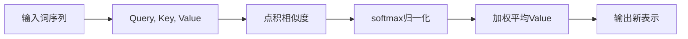
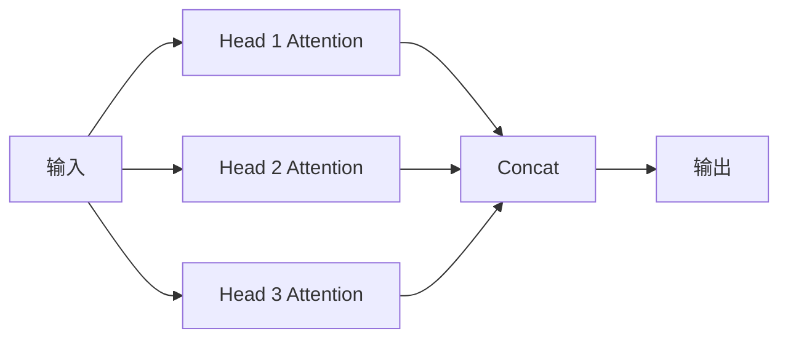

## **📦 一、[[Transformer]]的基本逻辑：不是魔法，是“加权平均”**

你可以把[[Transformer]]架构理解为一种**超级聪明的“看上下文”方式**。核心在于一个机制叫**“注意力机制”（attention）**，这不是“注意力不集中”的注意力，而是：

> **“我在看第一个字时，该有多关注其它哪些字？”**

### **👀 一个例子：**

假设你要翻译这句话：“The animal didn’t cross the street because it was too tired.”

模型在翻译“it”这个词时，它得**判断“it”指的是animal还是street**。这时候，注意力机制就会发挥作用：它会回头看看上下文，对每个词赋予一个“注意力分数”，比如animal的分数高，那“it”就翻译成“动物”。

这就是**注意力**的本质——**赋权重，聚合信息**。它是靠矩阵点积 + softmax算出来的，一切是“数理+概率”的，但效果上却像“理解”。

---

## **🧠 二、模型的生成方式：是“概率”，但不是“随便选”**

你说“模型的生成本质是概率”，确实听起来反直觉。怎么能把生成内容交给概率呢？那不就很“随机”吗？

我们一步一步拆解：

### **✅ 1. [[Transformer]]输出的不是词，而是**

### **一个向量**

它代表当前“下一个词”的概率分布。例如模型看完了：

> “我今天早上喝了一杯…”

它会给词表里每个词算一个“可能是下一个词”的概率，比如：

|**词**|**概率**|
|---|---|
|咖啡|0.47|
|牛奶|0.20|
|啤酒|0.01|
|火锅|0.0001|

然后就看我们**是“取最大”还是“抽签”**：

- **Greedy（贪心）**：直接选概率最大的那个（咖啡）。
    
- **Sampling（采样）**：按概率抽签，可能选中牛奶也可能选中啤酒（但概率小）。

👉 所以它是“确定性 + 概率性”的混合体。生成的内容并非毫无逻辑的随机，而是在一个高度限制下的“选择”。

---

## **📊 三、为什么“生成是概率”是合理的？**

你说“感觉反直觉”，其实我们的大脑也在用类似机制。

想象一下：

> 有人问你：“昨天晚上你吃了什么？”

你可能脑子里快速闪过几个选项——“外卖”“泡面”“不记得了”，然后选一个最合适的回答。这其实也是**在上下文中做概率推断**：哪一个最符合你的记忆、你的语境、你说话的习惯。

[[Transformer]]只是把这个“内心闪念”的过程显性化，用矩阵 + 向量的形式算出来而已。

---

## **🧩 四、总结：用一句话理解[[Transformer]]**

> **[[Transformer]] 是一个能在海量语境中“做选择”的系统，生成的语言不是拍脑袋，是“计算最合理下一个词的概率”。**

---

## **🧠 补充：再高阶一点，为什么这事能work？**

原因是：[[Transformer]]会在训练时**学习人类语言的"统计结构"**，就像学会了语法、常识、逻辑甚至风格。它的"概率"，是学来的、不是乱来的。所以，它才会生成那么像人的语言。

值得注意的是，[[Transformer]]的注意力机制也为[[AI模型可解释性研究]]提供了重要的技术支持，通过可视化注意力权重，我们可以理解模型在处理特定输入时"关注"了哪些部分。

## **📌 一、注意力机制是什么？**

一句话：

**“我在理解这个词的时候，要多看哪些词、少看哪些词。”**

**技术版翻译：**

对输入序列里每个词，模型都会**计算它对其他词的相关性分数**，再根据这个分数加权求和，得到新的表示。

---

## **📚 二、为什么需要注意力？**

在旧式神经网络里（RNN、LSTM），信息是按顺序传递的，处理长句子很慢，还容易忘记前面的词（记忆退化）。

**注意力机制** = 一次性把整句话放到眼前，**自由地决定“看哪里”**。

---

## **🔍 三、它是怎么做的？（稍微数学一点，但不难！）**

[[Transformer]] 用的是 **Scaled Dot-Product Attention**（缩放点积注意力）。核心公式其实很紧凑：

Attention(Q, K, V) = softmax\left( \frac{QK^T}{\sqrt{d_k}} \right) V

别被符号吓到，看我拆解：

|**符号**|**代表啥**|**类比**|
|---|---|---|
|Q（Query）|我当前想问的问题|当前词|
|K（Key）|其他词的“钥匙”|上下文中每个词|
|V（Value）|真正的信息|上下文中每个词的表示|

### **🌟 一句话理解公式：**

1️⃣ 我把当前词的 Query 和其他词的 Key 做点积（算相关性）

2️⃣ 用 softmax 把相关性分数转成概率（更像权重）

3️⃣ 用这个权重对 Value 加权平均，得出新的表示。

---

### **✅ 一个具体例子**

句子：**“The cat sat on the mat.”**

当模型要理解 **“sat”** 时：

- Query：sat 的向量
    
- Key/Value：句子里所有词的向量

它算 sat 跟每个词（The, cat, sat, on, the, mat）的相似度，然后按相似度混合信息。

如果上下文是“The cat sat”，那“sat”会特别关注“cat”（谁坐了）和“mat”（坐在哪）。

---

## **⚙️ 四、Multi-Head Attention 是什么？**

一个头只能学一种“相关性”。现实很复杂，一个词的意思往往有多重联系。

所以 [[Transformer]] 不是只算一次，而是并行搞出好几套 **(Q,K,V)** ，叫做 **多头注意力（Multi-Head Attention）**。

每个头学一套“关注点”，然后把结果拼起来，信息更丰富。

---

## **🧩 五、图示化理解（文字版）**

可以把整个过程看成这样：

多个头同时跑：

---

## **🗝️ 六、核心感受**

- 注意力不是神秘黑箱，核心就是算相似度、归一化、加权平均。
    
- 它给 [[Transformer]] 带来了强大的**并行处理能力**，不再像 RNN 那样一格一格地读。
    
- 也让模型能“远距离跨句联系”，捕捉到长句子的结构。

---

## **🧠 一句话记住**

> **[[Transformer]] 的注意力机制 = 让模型自己“决定看哪儿”，而不是死记顺序传递。**

---

如果你想看，我可以直接帮你画一张**完整的 Scaled Dot-Product Attention + Multi-Head Attention 结构图**，要不要？🎯

## **🎓 Transformer与学习范式的关系**

[[Transformer]]架构的一个重要特性是支持[[Few-shot Learning小样本学习]]，这使得基于Transformer的大语言模型能够通过少量示例快速适应新任务，无需额外训练。这种能力得益于Transformer强大的上下文理解和模式识别能力。