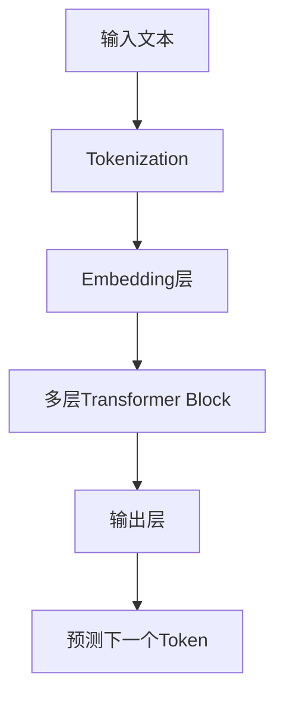
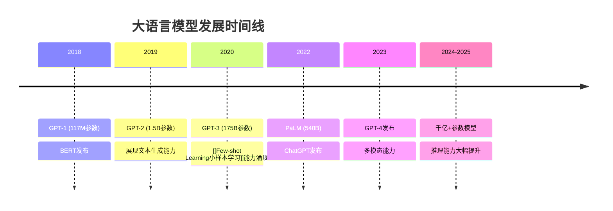

# 大语言模型基础（LLM Fundamentals）

> **作用**：统一解释大语言模型、LLM、GPT等核心概念
> **层级**：K1-基础理论与概念 → AI技术基础
> **关联**：[[Transformer架构原理]]、[[SFT（Supervised Fine-Tuning，监督微调）]]、[[模型评估体系与方法论]]

---

## 📌 核心概念定义

### 🧠 什么是大语言模型（LLM）

**大语言模型（Large Language Model, LLM）**是基于深度学习的自然语言处理模型，具有以下特征：
- **规模巨大**：参数量通常在数十亿到万亿级别
- **数据驱动**：使用海量文本数据进行预训练
- **通用能力**：能处理多种语言任务而无需专门训练
- **涌现能力**：在规模达到一定临界点后表现出意外的能力

### 🏗️ 技术架构基础

大语言模型主要基于[[Transformer架构原理|Transformer]]架构构建：


---

## 🔤 关键术语解释

### **GPT系列**
- **GPT（Generative Pre-trained Transformer）**：OpenAI开发的生成式预训练模型
- **GPT-1/2/3/4**：不同代际的模型，能力逐代提升
- **ChatGPT**：基于GPT架构，经过[[RLHF人类反馈强化学习|RLHF]]优化的对话系统

### **预训练与微调**
- **Pre-training**：在大规模文本语料上的无监督训练阶段
- **Fine-tuning**：针对特定任务的有监督优化，参见[[SFT（Supervised Fine-Tuning，监督微调）|SFT]]
- **Instruction Tuning**：针对指令跟随能力的专门微调

### **模型规模术语**
- **参数量**：模型中可学习权重的总数（如7B、13B、70B）
- **Token**：模型处理的最小文本单位
- **Context Length**：模型能处理的最大输入长度

---

## 🚀 发展历程

### 📈 规模演进


### 🌟 能力涌现现象

随着模型规模增长，会出现**涌现能力（Emergent Abilities）**：
- **数学推理**：解决复杂数学问题
- **代码生成**：编写完整程序
- **多语言理解**：跨语言知识迁移
- **常识推理**：处理隐含推理链

---

## 🔧 训练流程

### 1️⃣ 预训练阶段
```python
# 预训练目标：预测下一个token
def pretraining_objective(model, text_sequence):
    for i in range(len(text_sequence) - 1):
        input_tokens = text_sequence[:i+1]
        target_token = text_sequence[i+1]
        
        prediction = model(input_tokens)
        loss = cross_entropy(prediction, target_token)
        
        return loss
```

**数据来源**：
- 网页文本（Common Crawl等）
- 书籍和文献
- 代码仓库
- 百科全书

### 2️⃣ 后训练阶段
经过[[SFT（Supervised Fine-Tuning，监督微调）|监督微调]]和[[RLHF人类反馈强化学习|人类反馈强化学习]]：
1. **指令微调**：学会遵循人类指令
2. **对齐优化**：确保输出安全有益
3. **能力增强**：提升特定任务表现

---

## 💡 关键能力

### 🎯 核心能力清单
| 能力类别 | 具体表现 | 评估方法 |
|----------|----------|----------|
| **语言理解** | 阅读理解、语义分析 | GLUE、SuperGLUE |
| **文本生成** | 创作、摘要、翻译 | BLEU、ROUGE评分 |
| **推理能力** | 逻辑推理、数学计算 | GSM8K、MATH数据集 |
| **知识问答** | 事实性问题回答 | MMLU、TriviaQA |
| **代码理解** | 程序分析与生成 | HumanEval、MBPP |

### 🔄 上下文学习
LLM的独特能力：**In-Context Learning**
- 无需参数更新
- 通过示例学习新任务
- 体现了强大的模式识别能力

---

## ⚠️ 局限性与挑战

### 🚫 当前限制
1. **幻觉问题**：生成看似合理但实际错误的信息
2. **知识截止**：训练数据的时间限制
3. **推理深度**：在多步推理中易出错
4. **计算成本**：推理和训练开销巨大

### 🛠️ 解决方案
- **检索增强**：通过[[RAG检索增强生成技术详解|RAG]]获取实时信息
- **思维链**：引导模型进行步骤化推理
- **模型评估**：建立全面的[[模型评估体系与方法论|评估体系]]
- **对齐技术**：使用[[Constitutional AI宪法AI|Constitutional AI]]等方法

---

## 🌐 主要模型家族

### 🏢 商业模型
- **OpenAI GPT系列**：GPT-4、GPT-4 Turbo
- **Anthropic Claude系列**：Claude-3、Claude-3.5 Sonnet
- **Google Gemini**：Gemini Pro、Gemini Ultra
- **Meta Llama系列**：Llama 2、Llama 3

### 🔓 开源模型
- **Meta Llama**：完全开源的强力模型
- **Mistral**：欧洲开源模型代表
- **Yi系列**：零一万物开源模型
- **Qwen系列**：阿里云通义千问开源版

---

## 🔮 发展趋势

### 📊 技术演进方向
1. **多模态融合**：文本+图像+音频的统一处理
2. **长上下文**：支持更长的输入序列
3. **推理增强**：结合搜索和计算的混合系统
4. **效率优化**：更小模型实现更强能力

### 🚀 应用拓展
- **AI Agent**：自主执行复杂任务，详见[[AI_Agent与多Agent系统架构全览]]
- **具身智能**：与物理世界交互，参见[[具身智能技术架构]]
- **代码生成**：从需求直接生成完整应用
- **科学研究**：辅助科学发现和理论构建

---

## 📚 学习资源

### 🎓 理论基础
1. 首先理解[[Transformer架构原理]]
2. 学习[[监督学习与无监督学习对比]]
3. 掌握[[Few-shot Learning小样本学习]]概念
4. 了解[[模型评估体系与方法论]]

### 🛠️ 实践项目
1. **使用API**：OpenAI、Anthropic等平台体验
2. **模型微调**：基于开源模型进行[[SFT（Supervised Fine-Tuning，监督微调）|SFT]]
3. **RAG系统**：构建[[RAG检索增强生成技术详解|检索增强]]应用
4. **Agent开发**：创建智能代理系统

---

## 🎯 总结

大语言模型代表了人工智能的重大突破：
- 🧠 **通用智能**：单一模型处理多种任务
- 🔄 **持续进化**：能力随规模和训练方法提升
- 🌟 **应用广泛**：从对话到代码，从创作到推理
- 🔮 **潜力巨大**：向AGI迈进的重要里程碑

理解大语言模型不仅是掌握一项技术，更是理解人工智能发展方向和人类智能本质的重要途径。随着技术不断进步，LLM将继续重塑我们与信息和知识的交互方式。