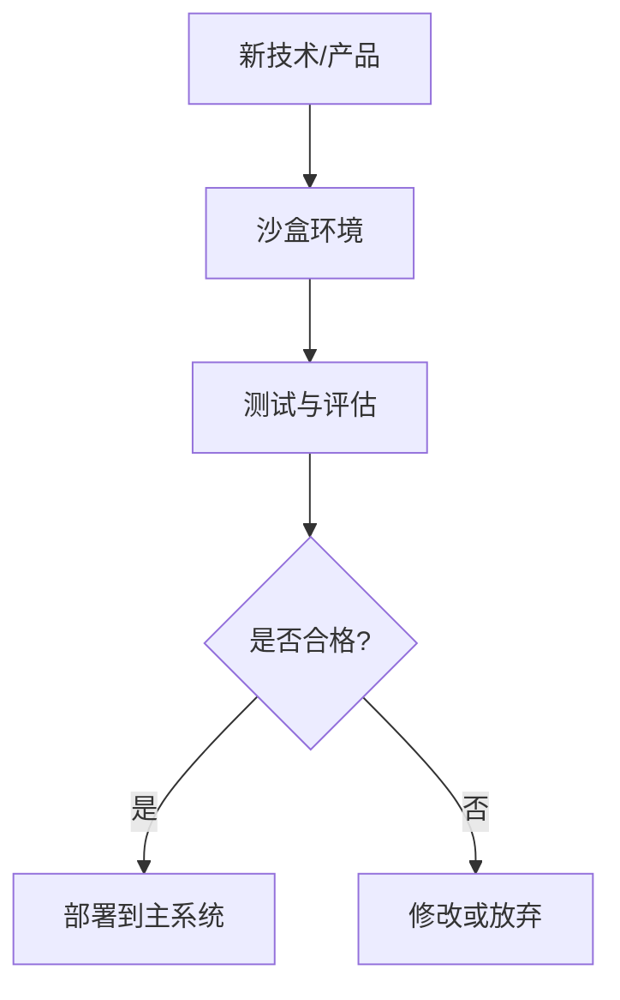

---
tags:
  - 基础概念
  - 沙盒
  - AI技术
  - 创新测试
---
# **📁 基础概念**

## **🔹 Latent Space（[[潜空间]]）**

**定义**：在机器学习中，[[潜空间]]是指通过降维或嵌入技术，将高维数据映射到一个低维空间，使得数据的潜在特征得以表达。

**关键特性**：

- **压缩表示**：保留数据的核心特征，去除冗余信息。
    
- **相似性映射**：在[[潜空间]]中，语义相似的数据点距离更近。
    
- **生成能力**：在生成模型中，从[[潜空间]]采样可以生成新的数据实例。

**应用示例**：

- **变分自编码器（VAE）**：通过编码器将数据映射到[[潜空间]]，再通过解码器重构数据，实现数据生成。VAE是理解[[潜空间]]概念的典型应用。
    
- **生成对抗网络（GAN）**：生成器从[[潜空间]]中采样，生成逼真的数据样本。
    
- **自然语言处理中的词嵌入**：如Word2Vec，将词语映射到[[潜空间]]，捕捉词语之间的语义关系。这也是[[Transformer]]架构中embedding层的基础。

**可视化示意**：

```mermaid
graph LR
A[高维数据] --> B[编码器]
B --> C[[[潜空间]]]
C --> D[解码器]
D --> E[重构数据]
```

_图示说明：高维数据通过编码器映射到[[潜空间]]，再通过解码器重构原始数据。_

---

## **🔹 沙盒（Sandbox）**

**定义**：沙盒是一种隔离的测试环境，允许在不影响主系统的情况下，安全地测试新技术或产品。

**关键特性**：

- **安全隔离**：防止测试过程对主系统造成影响。
    
- ==**创新测试**：允许在受控环境中试验新技术或产品。==
    
- **监管支持**：在金融科技等领域，监管沙盒允许企业在合规的前提下进行创新测试。

**应用示例**：

- **金融科技监管沙盒**：如英国FCA的监管沙盒，允许金融科技公司在受控环境中测试创新产品。
    
- **网络安全测试**：在沙盒环境中运行可疑程序，观察其行为，确保主系统安全。
    
- **软件开发测试**：开发人员在沙盒中测试新功能，避免对生产环境造成影响。

**可视化示意**：



_图示说明：新技术或产品在沙盒环境中进行测试，根据测试结果决定是否部署到主系统。_

---
