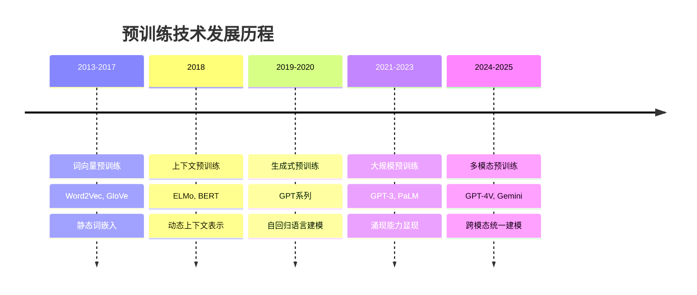
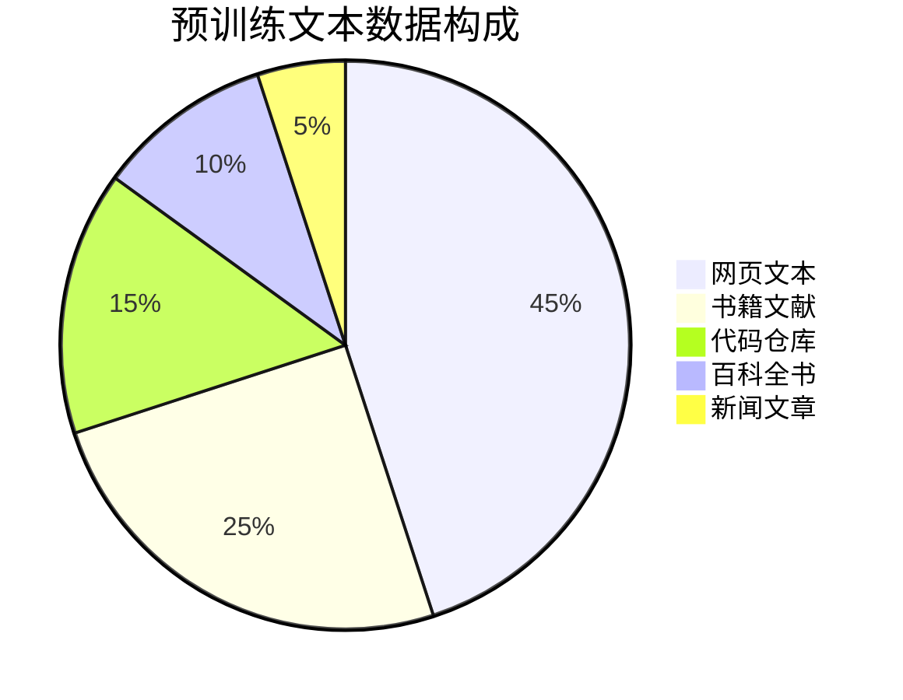

# Pre-Training预训练技术

> **作用**：深度学习模型训练的基础阶段，奠定模型的通用能力基础
> **层级**：K1-基础理论与概念 → 核心概念
> **关联**：[[大语言模型基础]]、[[Transformer架构原理]]、[[Post-Training后训练技术]]

---

## 📌 核心概念定义

### 🎯 什么是预训练（Pre-Training）

**预训练**是指在大规模无标注数据上训练深度学习模型的过程，目标是让模型学习到数据的一般性特征和模式，为后续的特定任务提供强大的基础能力。

**核心特征**：
- **大规模数据**：使用海量无标注或弱标注数据
- **自监督学习**：通过数据内在结构设计训练任务
- **通用表征**：学习可迁移的特征表示
- **基础能力**：为下游任务提供强大的初始能力

### 🔄 预训练范式演进



---

## 🏗️ 预训练技术架构

### 1️⃣ 数据处理流水线

```python
# 预训练数据处理流程
class PretrainingDataPipeline:
    def __init__(self):
        self.tokenizer = Tokenizer()
        self.cleaner = DataCleaner()

    def process(self, raw_data):
        # 1. 数据清洗
        cleaned_data = self.cleaner.clean(raw_data)

        # 2. 去重处理
        deduped_data = self.deduplicate(cleaned_data)

        # 3. 分词处理
        tokenized_data = self.tokenizer.tokenize(deduped_data)

        # 4. 序列打包
        packed_sequences = self.pack_sequences(tokenized_data)

        return packed_sequences
```

### 2️⃣ 自监督学习任务

#### **语言模型任务**
- **自回归语言建模**（GPT系列）
  - 预测序列中下一个token
  - 适合生成任务
  ```python
  # 自回归语言建模目标
  def autoregressive_loss(model, sequence):
      for i in range(len(sequence) - 1):
          context = sequence[:i+1]
          target = sequence[i+1]
          prediction = model(context)
          loss += cross_entropy(prediction, target)
      return loss
  ```

- **掩码语言建模**（BERT系列）
  - 随机掩盖部分token进行预测
  - 适合理解任务
  ```python
  # 掩码语言建模目标
  def masked_language_loss(model, sequence, mask_prob=0.15):
      masked_sequence, targets = mask_tokens(sequence, mask_prob)
      predictions = model(masked_sequence)
      loss = cross_entropy(predictions[masked_positions], targets)
      return loss
  ```

#### **其他预训练任务**
- **句子顺序预测**（NSP/SOP）
- **替换token检测**（ELECTRA）
- **跨度边界预测**（SpanBERT）
- **句子重排序**（BART）

---

## 📊 预训练数据来源与构成

### 🌐 数据来源分类

#### **文本数据**


1. **网页文本**
   - Common Crawl、Web crawl数据
   - 覆盖面广但质量参差不齐
   - 需要大量清洗和过滤

2. **书籍和文献**
   - 高质量的长文本内容
   - 结构化和逻辑性强
   - 版权问题需要考虑

3. **代码仓库**
   - GitHub等开源代码
   - 提升代码理解和生成能力
   - 多种编程语言覆盖

4. **百科全书**
   - Wikipedia、百度百科等
   - 事实性知识丰富
   - 结构化程度高

#### **多模态数据**
- **图像-文本对**：CLIP、DALL-E训练数据
- **视频-文本对**：视频理解和生成
- **音频-文本对**：语音识别和合成

### 🔧 数据质量控制

#### **清洗策略**
```python
class DataCleaner:
    def clean(self, text):
        # 1. 长度过滤
        if len(text) < 50 or len(text) > 100000:
            return None

        # 2. 语言检测
        if not self.is_target_language(text):
            return None

        # 3. 质量评分
        quality_score = self.calculate_quality(text)
        if quality_score < threshold:
            return None

        # 4. 内容过滤
        if self.contains_inappropriate_content(text):
            return None

        return self.normalize_text(text)
```

#### **去重机制**
- **精确去重**：完全相同的文本
- **近似去重**：使用MinHash等算法
- **语义去重**：基于向量相似度

---

## ⚡ 预训练技术优化

### 🚀 计算效率优化

#### **分布式训练**
```python
# 数据并行训练
class DistributedPretraining:
    def __init__(self, model, num_gpus):
        self.model = DataParallel(model, device_ids=range(num_gpus))
        self.optimizer = DistributedOptimizer()

    def train_step(self, batch):
        # 前向传播
        outputs = self.model(batch)
        loss = self.compute_loss(outputs, batch)

        # 反向传播和梯度同步
        loss.backward()
        self.optimizer.step()

        return loss
```

#### **内存优化技术**
- **梯度检查点**：减少中间激活的存储
- **混合精度训练**：使用FP16降低内存占用
- **ZeRO优化器**：分片优化器状态

#### **计算加速**
- **Flash Attention**：高效的注意力计算
- **编译优化**：PyTorch 2.0 compile
- **算子融合**：减少GPU kernel启动开销

### 📈 训练稳定性

#### **学习率调度**
```python
# 预训练学习率调度策略
class PretrainingScheduler:
    def __init__(self, max_lr, warmup_steps, total_steps):
        self.max_lr = max_lr
        self.warmup_steps = warmup_steps
        self.total_steps = total_steps

    def get_lr(self, step):
        if step < self.warmup_steps:
            # 线性预热
            return self.max_lr * (step / self.warmup_steps)
        else:
            # 余弦衰减
            progress = (step - self.warmup_steps) / (self.total_steps - self.warmup_steps)
            return self.max_lr * 0.5 * (1 + np.cos(np.pi * progress))
```

#### **梯度稳定性**
- **梯度裁剪**：防止梯度爆炸
- **权重初始化**：合理的参数初始化
- **批归一化**：稳定训练过程

---

## 🎯 预训练目标设计

### 🧠 语言理解目标

#### **掩码语言建模（MLM）**
- **目标**：预测被掩盖的词汇
- **优势**：学习双向上下文表示
- **适用**：理解类任务（分类、问答等）

#### **替换检测（RTD）**
- **目标**：检测哪些token被替换
- **优势**：所有位置都有学习信号
- **代表**：ELECTRA模型

### 📝 语言生成目标

#### **自回归建模（AR）**
- **目标**：预测序列中的下一个token
- **优势**：直接学习生成能力
- **适用**：生成类任务（对话、创作等）

#### **前缀语言建模（PLM）**
- **目标**：基于前缀预测后续内容
- **优势**：结合理解和生成能力
- **代表**：GLM系列模型

### 🔀 多任务联合目标

```python
# 多任务预训练损失
class MultiTaskPretrainingLoss:
    def __init__(self, task_weights):
        self.task_weights = task_weights

    def compute_loss(self, model_outputs, targets):
        total_loss = 0

        # 语言建模损失
        lm_loss = self.compute_lm_loss(model_outputs.lm_logits, targets.lm_targets)
        total_loss += self.task_weights['lm'] * lm_loss

        # 掩码预测损失
        mlm_loss = self.compute_mlm_loss(model_outputs.mlm_logits, targets.mlm_targets)
        total_loss += self.task_weights['mlm'] * mlm_loss

        # 句子关系预测损失
        nsp_loss = self.compute_nsp_loss(model_outputs.nsp_logits, targets.nsp_targets)
        total_loss += self.task_weights['nsp'] * nsp_loss

        return total_loss
```

---

## 🔬 预训练评估体系

### 📊 内在评估指标

#### **困惑度（Perplexity）**
```python
def compute_perplexity(model, dataset):
    total_loss = 0
    total_tokens = 0

    for batch in dataset:
        with torch.no_grad():
            outputs = model(batch.input_ids)
            loss = F.cross_entropy(
                outputs.logits.view(-1, outputs.logits.size(-1)),
                batch.labels.view(-1),
                ignore_index=-100
            )
            total_loss += loss.item() * batch.labels.numel()
            total_tokens += batch.labels.numel()

    return math.exp(total_loss / total_tokens)
```

#### **BLEU评分**
- 评估生成文本质量
- 对比生成结果与参考文本
- 适用于翻译和摘要任务

### 🎯 外在评估任务

#### **GLUE基准**
- 通用语言理解评估
- 包含多种分类和回归任务
- 测试模型的理解能力

#### **SuperGLUE基准**
- 更具挑战性的理解任务
- 需要更强的推理能力
- 包含常识推理、阅读理解等

### 📈 下游任务性能

```python
# 预训练模型在下游任务的评估
class DownstreamEvaluator:
    def __init__(self, pretrained_model):
        self.pretrained_model = pretrained_model

    def evaluate_on_task(self, task_name, task_dataset):
        # 冻结预训练参数
        for param in self.pretrained_model.parameters():
            param.requires_grad = False

        # 添加任务特定头部
        task_head = self.create_task_head(task_name)

        # 在任务数据上微调
        finetuned_model = self.finetune(task_head, task_dataset)

        # 评估性能
        performance = self.test(finetuned_model, task_dataset.test)

        return performance
```

---

## 🔮 预训练技术趋势

### 🌟 技术发展方向

#### **规模扩展**
- **参数规模**：从百万到万亿参数
- **数据规模**：从GB到PB级数据
- **计算规模**：更大的集群和更长的训练时间

#### **效率优化**
- **稀疏模型**：MoE（Mixture of Experts）架构
- **检索增强**：结合外部知识库
- **增量学习**：持续学习新知识

#### **多模态融合**
- **视觉-语言**：图像理解和生成
- **音频-语言**：语音识别和合成
- **代码-语言**：代码理解和生成

### 🎯 应用驱动优化

#### **任务特化**
- **科学预训练**：针对科学文献和数据
- **代码预训练**：专门的代码理解模型
- **多语言预训练**：跨语言能力增强

#### **部署优化**
- **轻量化模型**：移动端和边缘计算
- **量化技术**：降低推理成本
- **知识蒸馏**：从大模型到小模型

---

## 💼 实际应用案例

### 🏢 工业级预训练

#### **GPT系列预训练**
```python
# GPT预训练配置示例
gpt_config = {
    "model_size": "175B",
    "training_data": "570GB text",
    "compute_budget": "3.14e23 FLOPs",
    "training_time": "several months",
    "hardware": "thousands of GPUs"
}
```

#### **BERT预训练流程**
```python
# BERT预训练任务配置
bert_tasks = {
    "masked_lm": {
        "mask_probability": 0.15,
        "replace_probability": 0.8,
        "random_probability": 0.1
    },
    "next_sentence": {
        "positive_samples": 0.5,
        "negative_samples": 0.5
    }
}
```

### 🎓 学术研究预训练

#### **小规模实验**
- 使用较小的数据集验证方法
- 在有限资源下探索新技术
- 为大规模训练提供指导

#### **消融研究**
- 分析不同组件的贡献
- 优化预训练策略
- 理解模型行为机制

---

## 📚 学习资源与实践

### 🛠️ 预训练工具链

#### **开源框架**
- **Transformers**：Hugging Face生态
- **DeepSpeed**：微软分布式训练
- **FairScale**：Meta扩展性工具
- **Megatron-LM**：NVIDIA大模型训练

#### **数据处理工具**
- **datasets**：数据集加载和处理
- **tokenizers**：高效分词器
- **dataloaders**：数据加载优化

### 🎯 实践项目

#### **小规模预训练**
1. 选择合适的数据集（如WikiText）
2. 设计简化的模型架构
3. 实现基础的预训练循环
4. 在下游任务上验证效果

#### **预训练优化**
1. 实验不同的学习率策略
2. 比较各种数据增强方法
3. 分析不同批大小的影响
4. 优化内存和计算效率

---

## 🎯 总结

预训练技术是现代AI系统的基础，具有以下核心价值：

- 🧠 **通用表征学习**：从大规模数据中学习通用特征
- 🚀 **能力涌现**：规模化带来的质的飞跃
- 🔄 **迁移学习基础**：为下游任务提供强大起点
- 🌟 **技术创新驱动**：推动整个AI领域的发展

理解预训练技术不仅有助于掌握现代AI系统的工作原理，更是进行AI研究和应用开发的重要基础。随着计算资源的不断增长和算法的持续优化，预训练技术将继续推动人工智能向更高水平发展。

---

## 🔗 相关文档链接

- [[Post-Training后训练技术]] - 预训练后的优化技术
- [[大语言模型基础]] - LLM的整体技术框架
- [[Transformer架构原理]] - 预训练模型的核心架构
- [[SFT（Supervised Fine-Tuning，监督微调）]] - 预训练后的首要优化步骤
- [[RLHF人类反馈强化学习]] - 高级对齐技术
- [[模型评估体系与方法论]] - 预训练模型的评估方法