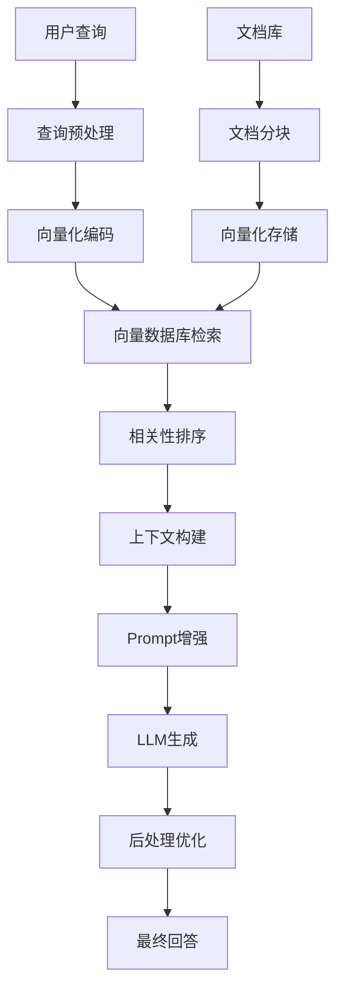
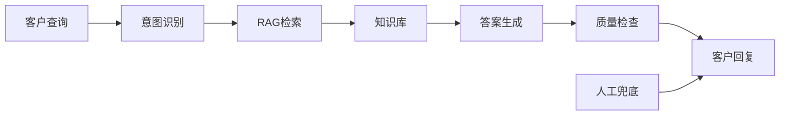

---
tags:
  - 基础概念
  - RAG
  - 检索增强生成
  - 向量检索
  - DeepSearch
  - NLP
---

# RAG检索增强生成技术详解

## 概述

RAG（Retrieval-Augmented Generation，检索增强生成）是当前大语言模型应用中的核心技术，通过结合信息检索与文本生成，显著提升模型的准确性、知识时效性和可解释性。本文系统梳理RAG技术的发展历程、核心概念、技术实现和应用实践。

---

## 一、RAG技术的前世今生

### 1.1 技术背景与发展动机
- **问题根源**：传统大语言模型存在知识更新滞后、生成内容易出现"幻觉"等问题
- **解决思路**：将外部知识库与生成模型结合，实现动态知识获取
- **发展里程碑**：2020年Facebook AI首次提出RAG框架，随后快速发展并广泛应用

### 1.2 技术演进历程
- **RAG 1.0**：基础的检索-增强-生成流程
- **RAG 2.0**：引入多轮检索、动态决策机制  
- **Deep Search + RAG**：结合深度检索能力，支持复杂查询处理

---

## 二、核心概念与技术原理

### 2.1 什么是RAG？

RAG是一种结合信息检索与文本生成的技术框架。其核心思想是在生成回答之前，先从外部知识库中检索相关信息，然后将这些信息与用户查询结合，生成更准确、可追溯的响应。

### 2.2 核心组件与流程

#### 三大核心步骤：

1. **检索（Retrieval）**
   - 将用户查询转换为向量表示
   - 在[[向量数据库技术基础|向量数据库]]中查找最相关的文档片段
   - 使用相似度算法（如余弦相似度）排序结果

2. **增强（Augmentation）**
   - 将检索到的文档与原始查询结合
   - 构建增强的提示（prompt）
   - 提供上下文背景信息

3. **生成（Generation）**
   - 将增强的提示输入到语言模型
   - 基于检索内容生成准确回答
   - 确保答案具有可追溯性

### 2.3 核心优势

- **时效性强**：可以利用最新信息，无需重新训练模型
- **[[可解释性]]高**：回答基于可追溯的文档来源，增强可信度
- **准确性提升**：通过引用真实文档，显著降低生成"幻觉"的风险
- **成本效益**：避免频繁模型重训练，降低计算成本

### 2.4 Deep Search：RAG的进阶形态

Deep Search是对传统RAG的增强扩展，专门处理复杂查询和多层次信息需求。

#### 关键特性：

1. **分阶段检索**
   - 将复杂查询分解为多个子查询
   - 逐步检索相关信息（先概念定义，再具体细节）
   - 构建层次化的知识获取路径

2. **动态决策机制**
   - 根据当前上下文实时判断检索需求
   - 智能决定是否需要进一步检索
   - 自适应信息补充策略

3. **多轮推理与生成**
   - 支持多轮推理循环
   - 逐步构建完整回答
   - 增强复杂问题处理能力

#### 适用场景：
- 复杂技术分析
- 政策解读
- 多维度报告生成
- 学术研究支持

### 2.5 RAG与Deep Search对比分析

| 维度 | 基础RAG | Deep Search |
|------|---------|-------------|
| **检索策略** | 单次检索 | 多阶段动态检索 |
| **处理复杂度** | 简单直接问题 | 复杂多层次问题 |
| **推理能力** | 基础上下文理解 | 多轮推理与决策 |
| **适用场景** | FAQ、基础查询 | 深度分析、报告生成 |
| **实现难度** | 相对简单 | 技术复杂度高 |
| **资源消耗** | 较低 | 较高 |

---

## 三、RAG系统架构与关键组件

### 3.1 系统架构概览



### 3.2 关键技术组件

#### 向量化与检索引擎
- **Embedding模型选择**：BERT、Sentence-BERT、BGE、M3E等
- **向量数据库**：Faiss、Milvus、Pinecone、Chroma等
- **相似度计算**：余弦相似度、欧氏距离、内积等

#### 文档处理策略
- **分块策略**：固定长度、语义分块、重叠分块
- **索引构建**：层次化索引、多级检索、混合检索
- **元数据管理**：文档来源、时间戳、权重等

#### 生成与优化
- **LLM选择**：GPT系列、Claude、LLaMA、ChatGLM等
- **Prompt工程**：模板设计、上下文控制、指令优化
- **后处理**：答案过滤、质量评估、溯源链接

---

## 四、详细实操流程与最佳实践

### 4.1 数据准备阶段

#### 步骤1：文档收集与清洗
```python
# 示例：文档预处理流程
def preprocess_documents(documents):
    cleaned_docs = []
    for doc in documents:
        # 清洗HTML标签、特殊字符
        cleaned = clean_html_and_formatting(doc)
        # 语言检测与过滤
        if detect_language(cleaned) == 'zh':
            cleaned_docs.append(cleaned)
    return cleaned_docs
```

#### 步骤2：文档分块（Chunking）
- **固定长度分块**：每500-1000字符一块
- **语义分块**：按段落、章节等语义单元
- **重叠分块**：设置100-200字符重叠，保持上下文连贯性

#### 步骤3：向量化编码与存储
```python
# 向量化处理示例
def create_embeddings(chunks, model_name="BAAI/bge-large-zh"):
    embedder = SentenceTransformer(model_name)
    embeddings = embedder.encode(chunks)
    return embeddings
```

### 4.2 检索阶段优化

#### 混合检索策略
1. **密集检索**：基于向量相似度的语义检索
2. **稀疏检索**：基于关键词的BM25检索
3. **混合排序**：结合两种方法，权重调优

#### 检索结果优化
- **重排序（Re-ranking）**：使用Cross-Encoder进一步排序
- **多样性控制**：避免检索结果过于相似
- **时效性过滤**：优先返回最新文档

### 4.3 生成阶段实践

#### Prompt工程最佳实践
```python
def build_rag_prompt(query, retrieved_docs, max_context_length=2000):
    context = "\n".join([f"文档{i+1}: {doc}" for i, doc in enumerate(retrieved_docs)])
    
    prompt = f"""请基于以下参考资料回答问题：

参考资料：
{context[:max_context_length]}

用户问题：{query}

请提供准确、详细的回答，并注明信息来源。如果参考资料无法完全回答问题，请明确说明。
"""
    return prompt
```

#### 生成质量控制
- **答案一致性检查**：与检索内容的一致性验证
- **事实性验证**：关键信息的多源验证
- **幻觉检测**：识别并过滤无根据的生成内容

---

## 五、应用实战案例

### 5.1 企业知识库问答系统

#### 应用场景
- 内部文档查询
- 技术规范解答
- 流程制度咨询

#### 实现要点
```python
class EnterpriseRAGSystem:
    def __init__(self, knowledge_base_path):
        self.vector_store = self.build_vector_store(knowledge_base_path)
        self.llm = self.init_llm()
        self.retriever = self.setup_retriever()
    
    def answer_query(self, query):
        # 检索相关文档
        docs = self.retriever.get_relevant_documents(query)
        
        # 构建增强prompt
        prompt = self.build_prompt(query, docs)
        
        # 生成回答
        response = self.llm.generate(prompt)
        
        return response, [doc.metadata for doc in docs]
```

### 5.2 学术研究助手

#### 核心功能
- 文献检索与总结
- 研究趋势分析
- 论文写作支持

#### 技术特色
- 多语言文献处理
- 引用格式标准化
- 学术权威性评估

### 5.3 客户服务智能助手

#### 业务价值
- 24/7自动化服务
- 一致性服务质量
- 人工成本降低

#### 技术架构


---

## 六、技术挑战与解决方案

### 6.1 主要技术挑战

#### 检索准确性问题
- **挑战**：语义理解偏差，检索不准确
- **解决方案**：
  - 使用领域特定的Embedding模型
  - 实施查询扩展和改写策略
  - 采用混合检索方法

#### 上下文长度限制
- **挑战**：LLM输入长度限制，无法处理大量检索结果
- **解决方案**：
  - 智能文档摘要技术
  - 分层检索策略
  - 动态上下文窗口管理

#### 知识更新滞后
- **挑战**：向量库更新不及时，信息陈旧
- **解决方案**：
  - 建立自动化更新机制
  - 实时数据源接入
  - 增量更新策略

### 6.2 性能优化策略

#### 检索性能优化
- **索引优化**：使用HNSW、IVF等高效索引
- **缓存策略**：热点查询结果缓存
- **并行检索**：多路并行检索提升速度

#### 生成质量优化
- **模型选择**：根据任务特点选择合适模型
- **参数调优**：temperature、top-p等参数优化
- **后处理**：答案质量评估与过滤

---

## 七、工具平台与生态系统

### 7.1 开源框架与工具

#### 主流RAG框架
- **LangChain**：功能全面的RAG开发框架
- **LlamaIndex**：专注于数据索引和检索
- **Haystack**：生产级搜索和问答框架
- **AutoGen**：多智能体RAG系统

#### 向量数据库选择
| 数据库 | 特点 | 适用场景 |
|--------|------|----------|
| **Faiss** | 高性能，本地部署 | 研究原型，中小规模 |
| **Milvus** | 分布式，可扩展 | 大规模生产环境 |
| **Pinecone** | 云服务，易用 | 快速开发，中小企业 |
| **Chroma** | 轻量级，易集成 | 原型开发，测试验证 |

#### Embedding模型推荐
- **中文优化**：BGE、M3E、Text2Vec
- **多语言**：E5、Multilingual-E5
- **代码专用**：CodeBERT、GraphCodeBERT
- **领域特化**：BioBERT、FinBERT

### 7.2 云服务平台

#### 国外平台
- **OpenAI Assistants API**：集成GPT的RAG服务
- **AWS Bedrock**：企业级RAG解决方案
- **Google Vertex AI**：谷歌云RAG服务
- **Azure Cognitive Search**：微软认知搜索

#### 国内平台
- **智谱AI**：GLM系列模型RAG服务
- **百度飞桨**：PaddleNLP RAG解决方案
- **阿里云**：通义千问RAG服务
- **腾讯云**：混元大模型RAG能力

---

## 八、行业应用与未来趋势

### 8.1 重点应用领域

#### 金融服务
- **风险评估**：基于法规文件的合规性检查
- **投资研报**：多源信息整合分析
- **客户咨询**：产品服务智能问答

#### 医疗健康
- **临床决策支持**：基于医学文献的诊疗建议
- **药物研发**：文献调研和知识发现
- **患者教育**：健康知识个性化推送

#### 法律服务
- **案例检索**：相似案例智能匹配
- **法规解读**：法律条文精准解释
- **合同审查**：风险点智能识别

#### 教育培训
- **个性化学习**：基于知识图谱的内容推荐
- **智能答疑**：课程内容相关问题解答
- **作业辅导**：学习资料智能检索

### 8.2 技术发展趋势

#### 多模态RAG
- **图文结合**：处理文档中的图表、图像信息
- **语音集成**：支持语音查询和答案播报
- **视频理解**：从视频内容中提取知识

#### 个性化与自适应
- **用户画像**：基于历史行为优化检索策略
- **动态调整**：根据反馈自适应优化系统
- **情境感知**：结合场景信息提供精准服务

#### 安全与隐私保护
- **联邦学习**：保护数据隐私的分布式训练
- **差分隐私**：在保护隐私前提下提供服务
- **访问控制**：细粒度的权限管理机制

---

## 九、评估指标与质量保证

### 9.1 评估维度

#### 检索质量评估
- **Recall@K**：Top-K结果中相关文档比例
- **Precision@K**：检索结果的准确性
- **MRR**：平均倒数排名（Mean Reciprocal Rank）
- **NDCG**：归一化折损累积增益

#### 生成质量评估
- **BLEU/ROUGE**：与参考答案的文本相似度
- **BERTScore**：基于BERT的语义相似度
- **事实准确性**：生成内容与源文档的一致性
- **完整性**：答案对问题的覆盖程度

#### 系统性能评估
- **响应时间**：从查询到返回结果的时间
- **吞吐量**：单位时间处理的查询数量
- **可用性**：系统稳定性和容错能力
- **可扩展性**：处理规模增长的能力

### 9.2 质量保证机制

#### 人工评估
- **专家评分**：领域专家对答案质量打分
- **用户反馈**：收集终端用户满意度
- **A/B测试**：不同方案效果对比

#### 自动化质量控制
```python
class QualityController:
    def __init__(self):
        self.fact_checker = FactChecker()
        self.coherence_checker = CoherenceChecker()
        self.relevance_scorer = RelevanceScorer()
    
    def evaluate_response(self, query, response, sources):
        scores = {
            'factuality': self.fact_checker.check(response, sources),
            'coherence': self.coherence_checker.check(response),
            'relevance': self.relevance_scorer.score(query, response)
        }
        return scores
```

---

## 十、实施建议与最佳实践

### 10.1 项目规划建议

#### 阶段化实施策略
1. **概念验证（PoC）**：小规模试点，验证技术可行性
2. **MVP开发**：核心功能实现，满足基本需求
3. **功能完善**：增加高级特性，优化用户体验
4. **规模化部署**：扩展到全业务场景，确保稳定运行

#### 团队构建要求
- **技术架构师**：整体方案设计和技术选型
- **NLP工程师**：模型调优和算法优化
- **数据工程师**：数据处理和pipeline构建
- **产品经理**：需求分析和用户体验设计

### 10.2 实施最佳实践

#### 数据质量保证
- **数据标准化**：统一格式和编码标准
- **质量检查**：建立数据质量评估机制
- **持续维护**：定期更新和清洗数据

#### 系统架构设计
- **模块化设计**：组件解耦，便于维护升级
- **可观测性**：完善的监控和日志系统
- **容错机制**：优雅的错误处理和降级策略

#### 运维管理
- **版本管理**：模型和数据版本化管理
- **性能监控**：实时监控系统性能指标
- **安全防护**：数据安全和系统安全保障

---

## 总结

RAG技术作为当前大语言模型应用的核心技术路径，通过"检索+生成"的创新模式，有效解决了传统模型的知识更新和准确性问题。从基础RAG到Deep Search的技术演进，展现了该领域的快速发展和巨大潜力。

### 核心价值
- **知识时效性**：动态接入最新信息，保持内容新鲜度
- **答案准确性**：基于真实文档，显著降低"幻觉"风险  
- **应用灵活性**：适应多种业务场景和需求变化
- **成本效益**：避免频繁模型重训练，降低维护成本

### 技术关键
- **高质量数据**：构建领域专业、结构清晰的知识库
- **精准检索**：选择合适的向量化和检索策略
- **智能生成**：优化Prompt工程和模型调参
- **持续优化**：建立完善的评估和迭代机制

### 发展展望
随着多模态融合、个性化服务、安全隐私保护等技术的不断成熟，RAG将在更多领域发挥重要作用，成为构建智能化应用系统的标准范式。

---

🏷 #RAG #NLP #向量检索 #大语言模型 #检索增强生成

> **相关链接**  
> - [[向量数据库技术基础]]
> - [[可解释性]]
> - [[Transformer标准架构详解]]
