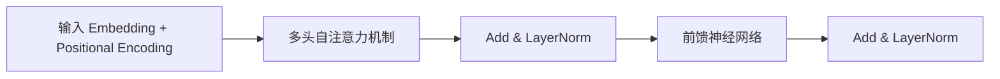
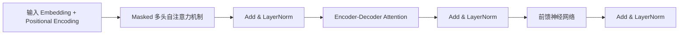

[[Transformer]] 是当前最主流的深度学习模型结构之一，广泛用于自然语言处理（NLP）、计算机视觉（CV）、多模态学习等任务中。由 Vaswani 等人在 2017 年的论文《Attention is All You Need》中首次提出，其核心特点是完全基于注意力机制（self-attention），摒弃了传统的循环神经网络（RNN）结构。

🏷 #入门 #NLP #模型结构

---

### **🔧 [[Transformer]] 的标准结构由两个主要部分构成：**

```
[[Transformer]] = Encoder Stack + Decoder Stack
```

但在如 BERT 等预训练语言模型中，通常只使用 Encoder 部分；而在 GPT 系列中，则只使用 Decoder 部分。以下为完整结构。

---

## **🔹 一、Encoder-Decoder 架构概览**

```
graph TD
    A[输入序列 x1, x2, ..., xn] --> B[Encoder]
    B -->|编码后的向量表示| C[Decoder]
    C --> D[输出序列 y1, y2, ..., ym]
```

---

## **🔸 二、Encoder 结构（每个 Encoder Layer）**

每个 Encoder Layer 包含两个主要模块：

1. **多头自注意力机制（Multi-head Self-Attention）**
    
2. **前馈神经网络（Position-wise Feed-Forward Network）**

每个模块都带有：

- 残差连接（Residual Connection）
    
- 层归一化（Layer Normalization）



---

## **🔸 三、Decoder 结构（每个 Decoder Layer）**

Decoder 与 Encoder 类似，但包含三个子层：

1. **Masked Multi-head Self-Attention**
    
    - 用于防止模型看到未来的词（causal masking）

2. **Encoder-Decoder Attention**
    
    - 将 Encoder 输出与当前生成状态结合

3. **前馈神经网络**



---

## **🔹 四、关键组成模块详解**

|**组件**|**作用**|
|---|---|
|**Embedding + Positional Encoding**|表示词+位置信息|
|**Multi-head Attention**|同时关注多个表示子空间|
|**Feed-Forward Network**|增加非线性表达能力|
|**LayerNorm + Residual**|稳定训练过程，加快收敛|
|**Masking (Decoder)**|避免信息泄露未来词语|

---

## **🔸 五、参数结构（[[Transformer]] Base 配置）**

|**模块**|**参数配置**|
|---|---|
|层数（Layers）|6（Encoder）+ 6（Decoder）|
|隐藏维度（d_model）|512|
|注意力头数（Heads）|8|
|前馈层维度（FFN）|2048|
|总参数规模|~65M|

---

## **📌 总结**

- [[Transformer]] 的核心在于 **注意力机制**，可并行处理序列，效率优于 RNN。
    
- 标准结构包括 Encoder 与 Decoder 各自的多层堆叠。
    
- 变体（如 BERT、GPT）对其做了删减与修改以适配不同任务。
    
- [[Transformer]] 架构也是[[RAG检索增强生成技术详解|RAG（检索增强生成）]]技术的基础，通过结合外部知识检索，可以大幅提升生成内容的准确性和时效性。

