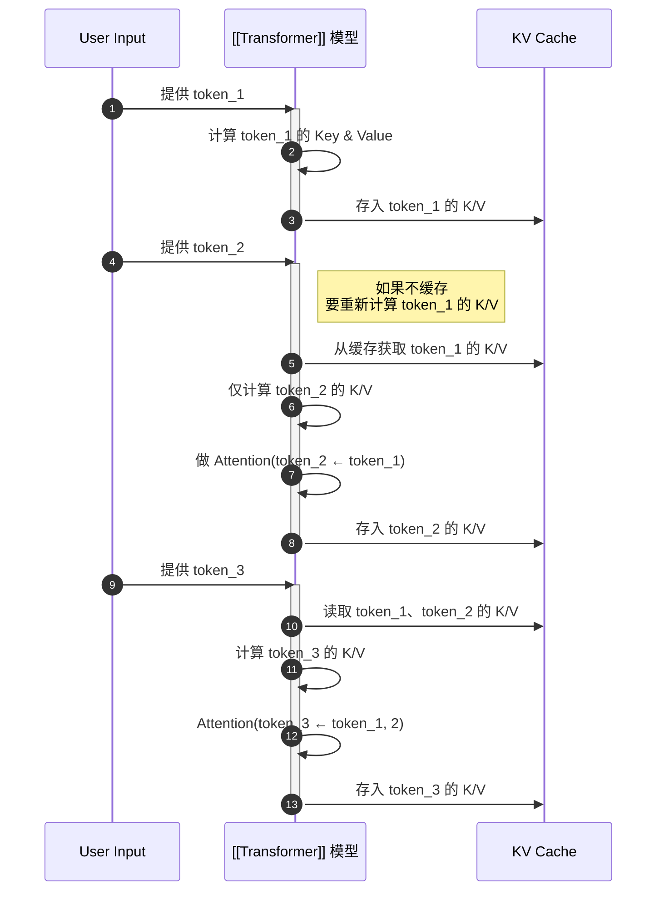

---
tags:
  - 模型推理
  - 系统优化
  - KV缓存
---
# **🔑 核心术语与概念解释**

| **专业词汇**                            | **中文释义**     | **解释说明**                                                  |
| ----------------------------------- | ------------ | --------------------------------------------------------- |
| **长序列语言模型（Long-context LLM）**       | 长上下文语言模型     | 能处理非常长的输入文本（如几千甚至几万token）的模型，典型如Claude 2、Gemini 1.5。      |
| **Memory IO**                       | 内存输入输出       | 处理器访问内存时的读取与写入操作频率与带宽，是模型推理时的性能瓶颈之一。                      |
| **[[Transformer标准架构详解|Transformer架构]]**                   | [[Transformer标准架构详解|Transformer]]  | 一种基于"自注意力"机制的神经网络结构，是当前大模型（如GPT）的主流结构。                    |
| **KV缓存（KV Cache）**                  | 键值缓存         | [[Transformer]]推理时，为了避免重复计算attention，将每步输出的key和value保存在缓存中复用。 |
| **H2O**                             | H2O方案        | 一种KV缓存压缩优化方案，在2024年多个模型中使用。                               |
| **GPU/CPU Co-design**               | GPU/CPU 协同设计 | 将任务在GPU和CPU之间合理分配执行，实现更高效率与更低功耗的系统设计策略。                   |
| **Static KV Compression**           | 静态KV压缩       | 对key/value缓存做静态（不可变）压缩，减少内存消耗和IO带宽压力。                     |
| **Dynamic KV Compression**          | 动态KV压缩       | 动态判断缓存是否需要压缩，可与speculative decoding（推测式解码）配合使用，实现加速。      |
| **Speculated Decoding**             | 推测式解码        | 在生成时对下一个token进行预测并并行解码，以提高吞吐量。                            |
| **LSH（Locality Sensitive Hashing）** | 局部敏感哈希       | 一种近似最近邻搜索技术，用于高效匹配相似向量或子空间。                               |
| **Neuro-symbolic 方法**               | 神经符号学方法      | 结合深度学习（神经网络）与符号逻辑规则的方法，常用于复杂任务的泛化。                        |
| **Co-design**                       | 协同设计         | 硬件、软件、算法等多方面协同优化的设计理念，提升整体系统性能。                           |
| **Context Understanding**           | 上下文理解        | 模型对长段输入内容的结构与语义把握能力，是实现高效对话与问答的关键。                        |
下面是一个说明 **[[Transformer]] 推理过程中 KV 缓存作用** 的流程图，用 Mermaid 绘制，清晰展示了有无 KV Cache 时的对比逻辑：

---

## **🧩 [[Transformer]] 推理时 KV 缓存的作用图示**



---

### **📌 总结图示含义：**

- 每生成一个新 token，模型会：
    
    1. 读取历史缓存的 Key/Value；
        
    2. 仅计算当前 token 的表示；
        
    3. 利用之前的表示完成 attention；
        
    4. 再把这一步的结果继续缓存。

- **避免了重复计算所有历史 token** 的表示，显著加速推理。

---

图示比较「训练 vs 推理」的 attention 计算方式，对入门理解 [[Transformer]] 的运行时模式非常重要。

---

# **🔍 专业术语解析（续）**

| **专业词汇**                               | **中文释义**  | **解释说明**                                           |
| -------------------------------------- | --------- | -------------------------------------------------- |
| **压缩瓶颈**                               | 数据压缩难点    | 指在KV缓存压缩中出现的多重挑战：如压缩比、准确率下降、计算开销增加等。               |
| **推理吞吐（Throughput）**                   | 推理处理速度    | 指单位时间内模型能够完成的推理请求数量，影响服务效率。                        |
| **无损加速**                               | 无精度损失的加速  | 指压缩或优化手段不影响输出准确性的情况下实现计算加速。                        |
| **系统协同设计（System Co-design）**           | 系统协同      | 软件算法、硬件架构、调度策略等统一规划与设计，以获得全链路性能优化。                 |
| **推理端优化（Inference-side optimization）** | 模型推理阶段优化  | 重点在于提升模型在部署后的响应速度与系统资源使用效率。                        |
| **[[Transformer]]能力扩展**                    | 模型结构能力增强  | 研究如何让[[Transformer]]架构更高效地处理超长上下文、更强的执行能力等。            |
| **轻量级索引系统**                            | 简化搜索机制    | 利用近似匹配（如LSH）等方法，对大规模缓存结构做快速检索，减少计算压力。              |
| **三栈协同设计**                             | 三类资源统一规划  | 指GPU、CPU与Memory三者协同，形成资源最大化利用的一体化设计方案。             |
| **跨设备计算分配**                            | 多芯片架构支持   | 将模型不同部分任务分布在不同处理单元（如GPU执行static压缩，CPU处理dynamic压缩）。 |
| **A100/V100**                          | Nvidia加速卡 | 两种高性能GPU硬件型号，广泛用于大模型训练与推理。A100为后续型号，推理更强。          |
| **Context length scaling**             | 上下文长度扩展能力 | 大模型能处理的最大token数量（比如支持8k、32k甚至100k token输入）。        |
| **Prompt缓存/缓存共享**                      | 提示词缓存机制   | 在多个请求中重用相同提示部分，减少重复计算开销。                           |
| **[[01-核心知识库/K2-技术方法与实现/模型架构/Agent]]推理系统**                          | 多步任务执行系统  | 类似JARVIS的执行系统，不仅理解任务意图，还能完成多轮复杂操作。                 |

---

# **📈 拓展方向总结（基于截图第7点）**

```
未来研究方向包括：

- [[Transformer]] 架构能力拓展（如：上下文窗口更长、推理成本更低）
- 系统软件层与硬件层协同优化（例如：跨GPU/CPU资源调度）
- 探索更稳定、低延迟的推理加速方案（如dynamic compression + 推测式解码）
- 深度挖掘长文本理解（long context understanding）对大模型效果的影响与优化空间
```

```mermaid
graph TD
  A[大模型推理优化]
  A --> B[KV缓存机制]
  B --> B1[Static KV Compression]
  B --> B2[Dynamic KV Compression]
  B2 --> B3[Speculative Decoding]

  A --> C[系统协同设计]
  C --> C1[GPU/CPU Co-design]
  C --> C2[三栈协同设计]
  C --> C3[Neuro-symbolic Method]
  C --> C4[LSH 索引加速]

  A --> D[硬件基础]
  D --> D1[A100 GPU]
  D --> D2[V100 GPU]

  A --> E[未来方向]
  E --> E1[[[Transformer]] 能力扩展]
  E --> E2[长文本理解提升]
  E --> E3[Teach Mode类训练方法]
```