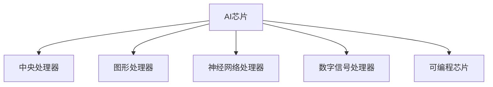

 **🏷 标签：#趋势观察 #边缘计算 #多模态**
端侧AI芯片，指的是**部署在设备端（而非云端）运行AI任务的专用芯片**。它们通常被集成在手机、摄像头、无人机、机器人、汽车等设备中，用于**本地执行AI推理、图像识别、语音处理等任务**，无需依赖云端服务器。

---

## **✅ 一、定义与基本原理**

**端侧（Edge）AI芯片**是一种**高效能、低功耗**的AI芯片，用于在本地处理AI模型的推理任务（如图像分类、人脸识别、语音识别等），主要用于实现**[[存算一体芯片技术/边缘计算|边缘计算]]**能力。

与其对比的概念是：

|**类型**|**部署位置**|**优势**|**典型应用**|
|---|---|---|---|
|云端AI芯片|数据中心|算力强、集中管理|大规模模型训练与推理（如GPT模型）|
|端侧AI芯片|终端设备本地|实时响应、隐私保护、节省带宽|手机拍照AI增强、智能门锁识别、自动驾驶感知模块|

---

## **🧠 二、端侧AI芯片的核心特性**

|**特性**|**说明**|
|---|---|
|✅ 高能效比|在功耗受限条件下完成AI推理任务（如5W内的智能摄像头）|
|✅ 实时响应|无需云端通信，减少延迟|
|✅ 隐私保护|数据本地处理，避免上传敏感数据|
|✅ 离线能力|无网环境下仍可工作，如语音助手、车载感知等|

---

## **🔧 三、芯片架构与主流类型**

端侧AI芯片常见架构包括：

其中**NPU（Neural Processing Unit）**最为关键，专门用于加速深度学习计算，如卷积、矩阵乘法等操作。

---

## **🚀 四、应用场景举例**

|**场景**|**示例**|**芯片作用**|
|---|---|---|
|手机AI摄影|华为麒麟NPU|实时美颜、场景识别|
|智能摄像头|海思3519、地平线旭日系列|人脸识别、入侵检测|
|车载系统|特斯拉FSD、地平线征程芯片|物体检测、轨迹预测|
|智能音箱|亚马逊Inferentia、阿里含光800|离线语音识别与命令响应|

---

## **🏷 五、代表厂商与芯片产品**

|**厂商**|**芯片系列**|**应用方向**|
|---|---|---|
|华为|麒麟、昇腾|手机端AI、边缘服务器|
|苹果|A系列 + Neural Engine|iPhone/iPad AI处理|
|高通|Snapdragon Hexagon DSP|智能手机AI计算|
|地平线|旭日、征程|车载、安防|
|英伟达|Jetson系列|边缘机器人/无人机|
|Intel|Movidius|安防、可穿戴|

---

## **📌 六、发展趋势**

- 模型小型化（如TinyML、MobileNet）
    
- 异构计算架构（NPU + GPU + CPU 协同）
    
- 软件配套生态完善（如TensorRT、ONNX Runtime）
    
- 与5G/IoT融合，推动“端云协同”

---

## **📌 七、典型应用场景与行业落地**

端侧AI芯片的应用场景广泛，涵盖多个行业，以下是主要应用领域及其特点：

### **📷 智慧安防**

- **应用场景**：人脸识别、行为分析、异常检测等。
    
- **优势**：本地处理数据，减少延迟，增强隐私保护。
    
- **市场规模**：2023年中国智慧安防市场规模达1,226亿元，预计2028年将达5,598亿元，年均复合增长率为35.5% 。

### **🚗 智能车载**

- **应用场景**：自动驾驶、驾驶员监控、车内语音助手等。
    
- **优势**：实时响应，提升驾驶安全性和用户体验。
    
- **市场规模**：2023年中国智能车载市场规模为119亿元，预计2028年将达640亿元，年均复合增长率为40% 。

### **🏭 工业制造**

- **应用场景**：设备故障预测、质量检测、生产流程优化等。
    
- **优势**：提高生产效率，降低维护成本。
    
- **案例**：移远通信的“匠心”视觉检测方案，利用端侧AI实现高效的质量检测 。

### **🏥 医疗健康**

- **应用场景**：便携式诊断设备、健康监测、辅助诊疗等。
    
- **优势**：实时数据分析，提升诊疗效率和准确性。
    
- **特点**：在无网络环境下也能提供智能化服务 。

### **🛒 零售与营销**

- **应用场景**：智能货架、顾客行为分析、个性化推荐等。
    
- **优势**：提升客户体验，增加销售额。
    
- **特点**：通过本地数据处理，实现快速响应和个性化服务 。

---

## **🏢 八、代表厂商与芯片产品**

以下是端侧AI芯片领域的主要厂商及其代表产品：

|**厂商**|**芯片系列**|**应用方向**|
|---|---|---|
|华为|麒麟、昇腾|手机端AI、边缘服务器|
|苹果|A系列 + Neural Engine|iPhone/iPad AI处理|
|高通|Snapdragon Hexagon DSP|智能手机AI计算|
|地平线|旭日、征程|车载、安防|
|英伟达|Jetson系列|边缘机器人/无人机|
|Intel|Movidius|安防、可穿戴|
|亿智电子|SA、SH、SV系列|智慧安防、智能车载、智能硬件|
|联发科|天玑系列|智能手机、边缘AI|
|三星|Exynos系列|移动设备AI处理|
|鲲云科技|星空、雨人加速卡|电力、教育、工业检测、智慧城市|

---

## **📈 九、市场趋势与发展方向**

### **📊 市场规模预测**

- **智能安防**：预计2028年中国市场规模将达5,598亿元。
    
- **智能车载**：预计2028年中国市场规模将达640亿元。
    
- **端侧大模型市场**：预计2028年中国市场规模将达79亿元，年均复合增长率为58% 。

### **🔮 发展趋势**

- **模型小型化**：如TinyML、MobileNet等，适应端侧设备的计算能力。
    
- **异构计算架构**：NPU + GPU + CPU协同，提高计算效率。
    
- **软件生态完善**：如TensorRT、ONNX Runtime等，支持多种AI框架。
    
- **与5G/IoT融合**：推动“端云协同”，实现更广泛的应用场景。

---

## **📌 十、技术挑战与应对策略**

### **⚠️ 技术挑战**

- **算力限制**：端侧设备计算能力有限，难以支持复杂模型。
    
- **能耗控制**：需在保证性能的同时，降低能耗。
    
- **模型部署**：模型需适配不同硬件平台，部署复杂。

### **🛠 应对策略**

- **模型压缩**：通过剪枝、量化等技术，减小模型体积。
    
- **硬件优化**：设计低功耗、高性能的AI芯片。
    
- **标准化部署**：推动模型部署标准化，简化部署流程。
