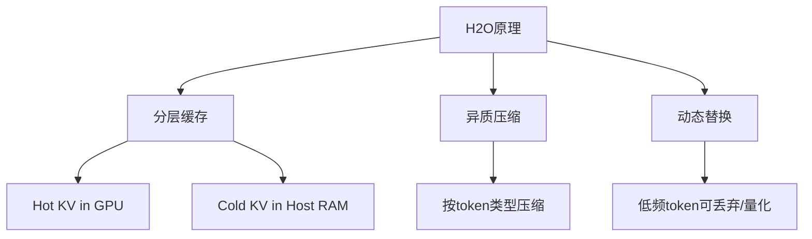

“H2O” 是一个用于优化 **[[Transformer]] 推理阶段的 KV 缓存（Key-Value Cache）存储与访问** 的研究方案，它的核心目标是：

> 在 **几乎不损失模型精度的前提下，压缩KV缓存的内存占用，提高推理吞吐**。

---

# **💡 简要定义**

**H2O = Hierarchical and Heterogeneous KV Cache Optimization**

H2O 本质是一个分层结构的 KV 缓存方案，**结合了高速缓存（SRAM/显存）与低速内存（如主存）**，对不同 token 的 KV 信息 **采用不同存储/压缩策略**，以此来降低内存压力并提升推理效率。

---

# **🧠 H2O 的核心原理可以分为 3 个关键机制：**

## **✅ 1.分层缓存结构（Hierarchical Cache）**

- H2O 将 KV 缓存划分为：
    
    - **热缓存（Hot Cache）**：保存最近访问的 token 的 K/V（放在GPU显存）
        
    - **冷缓存（Cold Cache）**：老旧但可能还需要用的 K/V（放在主存或用压缩方式保存）

👉 类似于 CPU 的 L1/L2 缓存机制，根据访问频率做数据冷热分离。

---

## **✅ 2.**异质压缩（Heterogeneous Compression）**

- 不同类型的 token（比如：
    
    - prompt token vs.
        
    - user query token）对生成的影响不同。

H2O 对不同 token 的 K/V 采用不同压缩策略，比如：

|**Token 类型**|**是否重要**|**压缩策略**|
|---|---|---|
|Prompt token（提示词）|稳定、重要|保持高精度|
|中间 token（上下文）|可压缩|用量化或低秩表示|
|长尾 token（几百 token 前）|很少使用|可丢弃或极限压缩|

---

## **✅ 3.**动态替换与裁剪策略**

- 系统根据模型运行时的实际访问模式（token位置、频率、重要性）**动态决定哪些K/V保留、哪些压缩甚至丢弃**。

---

# **📈 效果如何？**

H2O 的目标是实现：

- **3x~5x 的 KV 缓存压缩率**
    
- 几乎不降低准确率（lossless compression in practice）
    
- 显著减少 GPU 显存使用（critical for long-context LLM）
    
- 推理吞吐量提升高达 **2倍以上**

---

# **🔍 对比图（思维导图形式）**

---

# **📎 总结**

|**特性**|**含义**|
|---|---|
|层次结构|类似 L1/L2 cache，热的KV放显存，冷的放内存|
|动态裁剪|根据 token 使用频率动态决定保留策略|
|高压缩比|用量化、稀疏矩阵、分片等压缩手段|
|吞吐提升|减少IO和KV写入读取，显著提高速度|
 