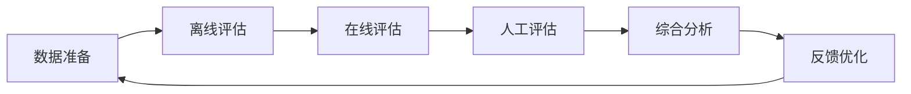

# 模型评估体系与方法论

> **作用**：建立科学、全面的AI模型评估框架，确保模型质量和可靠性
> **层级**：K2-技术方法与实现 → 优化方法
> **关联**：[[SOTA最新技术水平评估]]、[[SFT（Supervised Fine-Tuning，监督微调）]]、[[RLHF人类反馈强化学习]]、[[DPO直接偏好优化]]、[[K1-基础理论与概念/核心概念/损失函数与训练调优术语名词库|术语名词库（大白话对照）]]

---

## 📌 概念定义

**模型评估体系**是一套系统化的方法论，用于全面评估AI模型的性能、质量、鲁棒性和实用性。它不仅关注模型的准确性，更重视模型在实际应用中的表现、安全性、公平性和可解释性。

### 🎯 评估目标
- **性能验证**：确认模型达到预期性能指标
- **质量保证**：发现并解决模型缺陷
- **风险控制**：识别潜在的失败模式
- **持续改进**：为模型优化提供数据支持

---

## 🏗️ 评估框架

### 🔄 评估流程


### 📊 评估维度

#### 1️⃣ 基础性能评估

| 维度 | 指标 | 适用场景 |
|------|------|----------|
| **准确性** | Accuracy、F1-Score、AUC | 分类任务 |
| **生成质量** | BLEU、ROUGE、Perplexity | 文本生成 |
| **效率** | 推理时间、内存占用、吞吐量 | 所有模型 |
| **稳定性** | 方差、置信区间、失败率 | 生产环境 |

#### 2️⃣ 高级评估指标

##### **鲁棒性评估**
```python
# 对抗样本测试示例
def robustness_test(model, data, perturbation_types):
    results = {}
    for perturb_type in perturbation_types:
        perturbed_data = apply_perturbation(data, perturb_type)
        accuracy = evaluate_model(model, perturbed_data)
        results[perturb_type] = accuracy
    return results
```

##### **公平性评估**
- 群体公平性（Demographic Parity）
- 机会均等（Equal Opportunity）
- 个体公平性（Individual Fairness）

##### **可解释性评估**
- 特征重要性分析
- 注意力可视化
- 反事实解释
- LIME/SHAP分析

---

## 🧪 评估方法

### 1️⃣ 离线评估

#### **静态测试集评估**
- 标准benchmark测试
- 领域特定测试集
- 长尾分布测试

#### **交叉验证**
```python
# K-fold交叉验证
from sklearn.model_selection import KFold

def cross_validate(model, data, k=5):
    kf = KFold(n_splits=k, shuffle=True)
    scores = []
    
    for train_idx, val_idx in kf.split(data):
        train_data = data[train_idx]
        val_data = data[val_idx]
        
        model.fit(train_data)
        score = model.evaluate(val_data)
        scores.append(score)
    
    return np.mean(scores), np.std(scores)
```

### 2️⃣ 在线评估

#### **A/B测试**
- 流量分配策略
- 统计显著性检验
- 长期效应观察

#### **多臂老虎机**
- Thompson采样
- UCB算法
- 动态流量调整

### 3️⃣ 人工评估

#### **专家评估**
适用于需要专业判断的任务：
- 医疗诊断准确性
- 法律文本理解
- 创意内容质量

#### **众包评估**
大规模人工标注：
- 对话质量评分
- 翻译准确性
- 内容安全性

---

## 🔗 与训练方法的关系

### 🤝 评估驱动优化

1. **[[SFT（Supervised Fine-Tuning，监督微调）|SFT]]阶段**
   - 关注：任务准确性、泛化能力
   - 指标：损失函数、验证集性能
   - 方法：标准监督学习评估

2. **[[RLHF人类反馈强化学习|RLHF]]阶段**
   - 关注：人类偏好对齐
   - 指标：奖励模型分数、人工评分
   - 方法：偏好比较、排序评估

3. **[[DPO直接偏好优化|DPO]]优化**
   - 关注：效率与对齐平衡
   - 指标：偏好满足率、计算效率
   - 方法：直接偏好测试

4. **[[Constitutional AI宪法AI|Constitutional AI]]**
   - 关注：原则遵守程度
   - 指标：违规率、安全性分数
   - 方法：规则检查、自动审计

---

## 📈 LLM特定评估

### 🧠 大语言模型评估框架

#### **能力评估**
| 能力类别 | 评估方法 | 代表性基准 |
|----------|----------|------------|
| 语言理解 | 阅读理解、问答 | MMLU、SuperGLUE |
| 推理能力 | 数学、逻辑推理 | GSM8K、BigBench |
| 知识掌握 | 事实性问答 | TriviaQA、NaturalQuestions |
| 代码能力 | 编程任务 | HumanEval、MBPP |
| 多语言 | 跨语言任务 | XTREME、XGLUE |

#### **安全性评估**
```python
# 安全性测试框架
class SafetyEvaluator:
    def __init__(self, model, safety_categories):
        self.model = model
        self.categories = safety_categories
    
    def evaluate(self, test_prompts):
        results = {cat: [] for cat in self.categories}
        
        for prompt in test_prompts:
            response = self.model.generate(prompt)
            
            for category in self.categories:
                if self.check_violation(response, category):
                    results[category].append({
                        'prompt': prompt,
                        'response': response,
                        'severity': self.get_severity(response, category)
                    })
        
        return results
```

### 🎯 评估陷阱与解决方案

| 常见陷阱 | 描述 | 解决方案 |
|----------|------|----------|
| **过拟合benchmark** | 模型专门优化测试集 | 使用私有测试集、动态更新 |
| **单一指标依赖** | 只看准确率忽视其他 | 多维度综合评估 |
| **分布偏移** | 测试数据与实际不符 | 持续收集真实数据 |
| **评估污染** | 测试数据泄露到训练 | 严格数据隔离、时间切分 |

---

## 🛠️ 评估工具生态

### 📦 开源框架
- **LM Evaluation Harness**：统一的LLM评估框架
- **HELM**：全面的语言模型评估
- **OpenAI Evals**：可扩展的评估框架
- **BigBench**：众包的能力评估

### 🔧 评估平台
- **Weights & Biases**：实验跟踪与可视化
- **MLflow**：模型生命周期管理
- **Neptune.ai**：元数据管理
- **ClearML**：端到端ML平台

---

## 🚀 最佳实践

### ✅ 评估策略设计

1. **分层评估**
   ```
   单元测试 → 集成测试 → 系统测试 → 用户测试
   ```

2. **持续评估**
   - 自动化评估pipeline
   - 定期回归测试
   - 实时监控告警

3. **评估数据管理**
   - 版本控制测试集
   - 定期更新和扩充
   - 保持数据多样性

### 📊 评估报告模板

```markdown
## 模型评估报告

### 基本信息
- 模型名称：[Model Name]
- 版本：[Version]
- 评估日期：[Date]
- 评估人员：[Evaluator]

### 性能指标
| 指标 | 分数 | 基准对比 | 备注 |
|------|------|----------|------|
| Accuracy | X% | +Y% | - |

### 鲁棒性测试
- 对抗样本：[Results]
- 分布偏移：[Results]

### 安全性评估
- 有害内容：[Pass/Fail]
- 偏见测试：[Results]

### 建议与改进
1. [Recommendation 1]
2. [Recommendation 2]
```

---

## 🔮 未来发展趋势

### 🌟 新兴方向

1. **自动化评估**
   - AI评估AI
   - 自适应测试生成
   - 智能化指标选择

2. **实时评估**
   - 流式数据评估
   - 在线学习验证
   - 动态基准更新

3. **可信AI评估**
   - 可解释性量化
   - 公平性认证
   - 隐私保护验证

4. **多模态评估**
   - 跨模态一致性
   - 模态间协同效果
   - 统一评估框架

---

## 📚 学习资源

### 🎓 推荐阅读
1. 《Evaluating Large Language Models: A Comprehensive Survey》
2. 《Beyond Accuracy: Behavioral Testing of NLP Models》
3. [[SOTA最新技术水平评估|SOTA评估方法]]
4. 各大模型的技术报告（GPT-4、Claude、PaLM等）

### 🔧 实践项目
1. 构建自己的评估框架
2. 参与开源评估项目
3. 设计领域特定benchmark
4. 开发自动化评估工具

---

## 🎯 总结

模型评估体系是AI开发的关键环节：
- 📊 **多维度**：不只是准确率，更要全面评估
- 🔄 **持续性**：评估贯穿整个生命周期
- 🛡️ **安全性**：特别关注模型的风险和偏见
- 🚀 **演进性**：评估方法随技术发展不断进步

只有建立科学、完善的评估体系，才能确保AI模型真正安全、可靠、有效地服务于人类。
