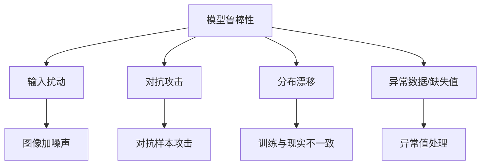

> **关联**：[[K1-基础理论与概念/核心概念/损失函数与训练调优术语名词库|术语名词库（大白话对照）]]

**模型鲁棒性（Model Robustness）是指机器学习或深度学习模型在面对输入扰动**、**不确定性**或**变化环境**时，仍然能够保持良好性能和稳定性的能力。简单来说，鲁棒的模型不容易“被干扰”，在真实世界中也能稳定工作。

## **✅ 一、从不同维度理解模型鲁棒性：**

### **📌 1. 输入扰动鲁棒性（Input Perturbation Robustness）**

- 指模型能否在输入数据发生轻微变化（如加噪声、旋转、拼写错误）时，仍然给出正确输出。
    
- 典型示例：图片分类模型在图片轻微模糊或颜色变化时仍能识别物体。

### **📌 2. 对抗鲁棒性（Adversarial Robustness）**

- 指模型能否抵御“对抗攻击”，即故意添加细小扰动以欺骗模型。
    
- 例如：在图像中添加人眼难以察觉的扰动，使得模型将“熊猫”错误分类为“长臂猿”。

### **📌 3. 分布外鲁棒性（Out-of-Distribution Robustness）**

- 指模型在测试数据与训练数据分布不一致（分布漂移）时是否仍能正常工作。
    
- 举例：天气识别模型在“白天”训练，能否适应“夜晚”照片？

### **📌 4. 缺失与异常值鲁棒性（Missing/Noisy Data Robustness）**

- 模型是否能处理缺失数据、极端值或噪声数据。
    
- 例如：医疗数据中病人部分指标缺失，模型能否依旧判断病情？

---

## **✅ 二、为什么鲁棒性很重要？**

|**应用场景**|**鲁棒性带来的价值**|
|---|---|
|自动驾驶|面对雨天、光照变化等环境干扰仍能正确识别交通信号|
|金融风控|对异常交易数据不敏感，避免误判风险|
|医疗图像识别|小噪声、扫描模糊不影响诊断结果|
|安全相关应用（如刷脸支付）|防止黑客通过对抗样本攻击系统|

---

## **✅ 三、鲁棒性增强方法举例：**

|**方法类别**|**示例**|
|---|---|
|数据增强|加入旋转、缩放、裁剪、加噪声等变化|
|对抗训练|用对抗样本进行训练，提升模型免疫能力|
|正则化技术|Dropout、L2 正则等防止过拟合，提高泛化能力|
|模型集成|多个模型投票或平均输出，降低单点失误影响|
|不确定性建模|使用贝叶斯方法、置信度估计输出可信区间|

---

## **✅ 四、可视化：鲁棒性概念图（Mermaid 图）**

---

## **✅ 五、总结（一句话记住）**

> **一个鲁棒的模型，就像一辆好车，不管你是上坡、下雨、还是拐弯，它都能稳稳开得好。**

如果你想深入某个方向，如“对抗样本”或“鲁棒性测试方法”，我可以进一步展开。
