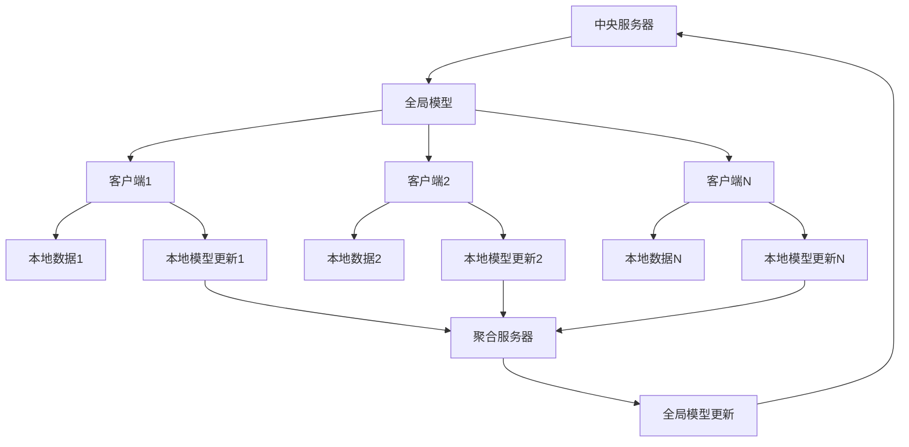

# 联邦学习系统架构

> **定位**：分布式机器学习中保护数据隐私的核心系统架构
> **作者**：Claude
> **创建时间**：2025年8月22日
> **标签**：#联邦学习 #分布式机器学习 #隐私保护 #系统架构

---

## 📝 核心概念

**联邦学习（Federated Learning）** 是一种分布式机器学习范式，它允许多个参与方在不共享原始数据的情况下协同训练机器学习模型，实现"数据不动模型动"的隐私保护计算。

### 🎯 核心价值

1. **隐私保护**：原始数据永远不离开本地设备
2. **合规性**：满足GDPR、CCPA等数据保护法规
3. **网络效率**：仅传输模型参数，减少带宽消耗
4. **计算分布**：利用边缘设备计算能力

---

## 🏗️ 系统架构

### 1️⃣ 总体架构


### 2️⃣ 核心组件

#### 🎛️ 中央协调器
```python
class FederatedCoordinator:
    def __init__(self):
        self.global_model = GlobalModel()
        self.client_manager = ClientManager()
        self.aggregator = ModelAggregator()
        self.round_manager = RoundManager()

    def federated_training_loop(self):
        for round_num in range(self.max_rounds):
            # 1. 客户端选择
            selected_clients = self.client_manager.select_clients(
                fraction=0.1,  # 每轮选择10%的客户端
                min_clients=10
            )

            # 2. 全局模型分发
            global_weights = self.global_model.get_weights()
            client_updates = []

            # 3. 并行本地训练
            for client in selected_clients:
                update = client.local_training(
                    global_weights=global_weights,
                    epochs=5,
                    batch_size=32
                )
                client_updates.append(update)

            # 4. 模型聚合
            new_global_weights = self.aggregator.federated_averaging(
                client_updates
            )

            # 5. 全局模型更新
            self.global_model.set_weights(new_global_weights)

            # 6. 评估和日志
            self.evaluate_global_model(round_num)
```

#### 📱 客户端系统
```python
class FederatedClient:
    def __init__(self, client_id, local_data):
        self.client_id = client_id
        self.local_data = local_data
        self.local_model = LocalModel()
        self.privacy_engine = PrivacyEngine()

    def local_training(self, global_weights, epochs, batch_size):
        # 1. 加载全局模型
        self.local_model.set_weights(global_weights)

        # 2. 本地训练
        for epoch in range(epochs):
            for batch in self.local_data.get_batches(batch_size):
                loss = self.local_model.train_step(batch)

        # 3. 计算模型更新
        local_weights = self.local_model.get_weights()
        weight_update = self.compute_weight_difference(
            global_weights, local_weights
        )

        # 4. 差分隐私保护
        noisy_update = self.privacy_engine.add_noise(
            weight_update,
            epsilon=1.0,  # 隐私预算
            delta=1e-5
        )

        # 5. 返回更新
        return {
            'client_id': self.client_id,
            'weight_update': noisy_update,
            'data_size': len(self.local_data),
            'training_loss': loss
        }

    def compute_weight_difference(self, global_weights, local_weights):
        return [local - global for local, global
                in zip(local_weights, global_weights)]
```

#### 🔄 聚合算法
```python
class ModelAggregator:
    def federated_averaging(self, client_updates):
        """FedAvg: 基于数据量加权平均"""
        total_data_size = sum(update['data_size'] for update in client_updates)

        # 初始化聚合权重
        aggregated_weights = None

        for update in client_updates:
            weight = update['data_size'] / total_data_size
            client_weights = update['weight_update']

            if aggregated_weights is None:
                aggregated_weights = [weight * w for w in client_weights]
            else:
                for i, w in enumerate(client_weights):
                    aggregated_weights[i] += weight * w

        return aggregated_weights

    def federated_proximal(self, client_updates, mu=0.01):
        """FedProx: 加入近端项的聚合算法"""
        # 在FedAvg基础上加入正则化项
        base_aggregation = self.federated_averaging(client_updates)

        # 应用近端正则化
        for i, weight in enumerate(base_aggregation):
            base_aggregation[i] = weight / (1 + mu)

        return base_aggregation

    def byzantine_robust_aggregation(self, client_updates):
        """拜占庭鲁棒聚合算法"""
        # 移除异常更新
        filtered_updates = self.detect_and_remove_outliers(client_updates)

        # 对过滤后的更新进行聚合
        return self.federated_averaging(filtered_updates)
```

---

## 🔐 隐私保护技术

### 1️⃣ 差分隐私
```python
class DifferentialPrivacy:
    def __init__(self, epsilon, delta, sensitivity):
        self.epsilon = epsilon  # 隐私预算
        self.delta = delta     # 失败概率
        self.sensitivity = sensitivity  # 敏感度

    def add_gaussian_noise(self, data):
        """高斯机制"""
        sigma = np.sqrt(2 * np.log(1.25 / self.delta)) * self.sensitivity / self.epsilon
        noise = np.random.normal(0, sigma, data.shape)
        return data + noise

    def add_laplace_noise(self, data):
        """拉普拉斯机制"""
        scale = self.sensitivity / self.epsilon
        noise = np.random.laplace(0, scale, data.shape)
        return data + noise

    def composition_analysis(self, num_rounds):
        """隐私预算组合分析"""
        total_epsilon = num_rounds * self.epsilon
        total_delta = num_rounds * self.delta
        return total_epsilon, total_delta
```

### 2️⃣ 安全多方计算
```python
class SecureAggregation:
    def __init__(self, num_clients):
        self.num_clients = num_clients
        self.secret_shares = {}

    def generate_secret_shares(self, value, threshold):
        """生成秘密分享"""
        shares = []
        coefficients = [value] + [random.randint(0, 2**32)
                                for _ in range(threshold - 1)]

        for i in range(1, self.num_clients + 1):
            share = sum(coef * (i ** j) for j, coef in enumerate(coefficients))
            shares.append((i, share))

        return shares

    def reconstruct_secret(self, shares, threshold):
        """拉格朗日插值重构秘密"""
        def lagrange_interpolation(shares, x=0):
            result = 0
            for i, (xi, yi) in enumerate(shares):
                term = yi
                for j, (xj, _) in enumerate(shares):
                    if i != j:
                        term *= (x - xj) / (xi - xj)
                result += term
            return result

        return lagrange_interpolation(shares[:threshold])

    def secure_sum(self, client_values):
        """安全求和协议"""
        # 1. 每个客户端生成随机掩码
        masks = [random.randint(0, 2**32) for _ in self.num_clients]

        # 2. 客户端发送掩码值
        masked_values = [val + mask for val, mask
                        in zip(client_values, masks)]

        # 3. 计算掩码和的和
        total_masked = sum(masked_values)
        total_mask = sum(masks)

        # 4. 去除掩码得到真实和
        return total_masked - total_mask
```

---

## 🚀 高级算法

### 1️⃣ 个性化联邦学习
```python
class PersonalizedFederatedLearning:
    def __init__(self):
        self.global_model = GlobalModel()
        self.client_models = {}

    def federated_multi_task_learning(self, client_updates):
        """多任务学习方法"""
        # 1. 提取共享特征层
        shared_features = self.extract_shared_features(client_updates)

        # 2. 更新全局共享层
        self.global_model.update_shared_layers(shared_features)

        # 3. 保持客户端个性化层
        for client_id, update in client_updates.items():
            if client_id not in self.client_models:
                self.client_models[client_id] = PersonalizedModel()

            self.client_models[client_id].update_personal_layers(
                update['personal_layers']
            )

    def meta_learning_approach(self, client_updates):
        """元学习方法 (MAML-style)"""
        # 1. 内循环：客户端本地适应
        adapted_models = {}
        for client_id, update in client_updates.items():
            adapted_model = self.global_model.clone()
            adapted_model.adapt(update['support_set'], steps=5)
            adapted_models[client_id] = adapted_model

        # 2. 外循环：全局元更新
        meta_gradients = []
        for client_id, adapted_model in adapted_models.items():
            query_loss = adapted_model.evaluate(
                client_updates[client_id]['query_set']
            )
            meta_grad = compute_gradient(query_loss, self.global_model.parameters)
            meta_gradients.append(meta_grad)

        # 3. 聚合元梯度更新全局模型
        avg_meta_grad = average_gradients(meta_gradients)
        self.global_model.update(avg_meta_grad)
```

### 2️⃣ 异步联邦学习
```python
class AsynchronousFederatedLearning:
    def __init__(self):
        self.global_model = GlobalModel()
        self.staleness_weights = {}
        self.version_control = VersionControl()

    def async_update_handler(self, client_update):
        """异步更新处理"""
        client_id = client_update['client_id']
        model_version = client_update['model_version']
        weight_update = client_update['weight_update']

        # 1. 计算延迟性权重
        current_version = self.version_control.get_current_version()
        staleness = current_version - model_version
        staleness_weight = self.compute_staleness_weight(staleness)

        # 2. 应用延迟性调整
        adjusted_update = [w * staleness_weight for w in weight_update]

        # 3. 更新全局模型
        current_weights = self.global_model.get_weights()
        new_weights = [
            current + adjusted for current, adjusted
            in zip(current_weights, adjusted_update)
        ]

        self.global_model.set_weights(new_weights)
        self.version_control.increment_version()

    def compute_staleness_weight(self, staleness, alpha=0.9):
        """计算延迟性权重"""
        return alpha ** staleness

    def bounded_delay_fedavg(self, client_updates, max_delay=10):
        """有界延迟FedAvg"""
        # 过滤过于陈旧的更新
        valid_updates = [
            update for update in client_updates
            if update['staleness'] <= max_delay
        ]

        # 对有效更新进行聚合
        return self.weighted_aggregation(valid_updates)
```

---

## 🔧 系统优化

### 1️⃣ 通信效率优化
```python
class CommunicationOptimization:
    def gradient_compression(self, gradients, compression_ratio=0.1):
        """梯度压缩"""
        # Top-K稀疏化
        flat_grads = np.concatenate([g.flatten() for g in gradients])
        k = int(len(flat_grads) * compression_ratio)

        # 选择Top-K元素
        indices = np.argpartition(np.abs(flat_grads), -k)[-k:]
        compressed_grads = np.zeros_like(flat_grads)
        compressed_grads[indices] = flat_grads[indices]

        return self.reshape_gradients(compressed_grads, gradients)

    def quantization(self, weights, num_bits=8):
        """权重量化"""
        # 计算量化范围
        w_min, w_max = weights.min(), weights.max()
        scale = (w_max - w_min) / (2**num_bits - 1)

        # 量化
        quantized = np.round((weights - w_min) / scale)

        # 反量化
        dequantized = quantized * scale + w_min

        return dequantized, scale, w_min

    def federated_dropout(self, model_updates, dropout_rate=0.5):
        """联邦Dropout：随机丢弃部分参数"""
        for update in model_updates:
            for layer_weights in update['weight_update']:
                mask = np.random.random(layer_weights.shape) > dropout_rate
                layer_weights *= mask

        return model_updates
```

### 2️⃣ 客户端选择策略
```python
class ClientSelection:
    def __init__(self):
        self.client_profiles = {}

    def update_client_profile(self, client_id, metrics):
        """更新客户端档案"""
        self.client_profiles[client_id] = {
            'data_quality': metrics['data_quality'],
            'computation_capability': metrics['computation_capability'],
            'network_bandwidth': metrics['network_bandwidth'],
            'availability': metrics['availability'],
            'staleness_history': metrics['staleness_history']
        }

    def quality_based_selection(self, num_clients):
        """基于质量的客户端选择"""
        # 计算客户端质量分数
        scores = {}
        for client_id, profile in self.client_profiles.items():
            score = (
                0.3 * profile['data_quality'] +
                0.2 * profile['computation_capability'] +
                0.2 * profile['network_bandwidth'] +
                0.2 * profile['availability'] +
                0.1 * (1 - profile['staleness_history'])
            )
            scores[client_id] = score

        # 选择Top-K客户端
        selected = sorted(scores.items(), key=lambda x: x[1], reverse=True)
        return [client_id for client_id, _ in selected[:num_clients]]

    def diversity_based_selection(self, num_clients):
        """基于多样性的客户端选择"""
        # 使用数据分布多样性选择客户端
        selected_clients = []
        remaining_clients = list(self.client_profiles.keys())

        # 第一个客户端随机选择
        if remaining_clients:
            first_client = random.choice(remaining_clients)
            selected_clients.append(first_client)
            remaining_clients.remove(first_client)

        # 后续客户端基于多样性选择
        while len(selected_clients) < num_clients and remaining_clients:
            max_diversity = -1
            best_client = None

            for candidate in remaining_clients:
                diversity = self.compute_diversity(candidate, selected_clients)
                if diversity > max_diversity:
                    max_diversity = diversity
                    best_client = candidate

            if best_client:
                selected_clients.append(best_client)
                remaining_clients.remove(best_client)

        return selected_clients
```

---

## 📊 评估与监控

### 1️⃣ 性能评估
```python
class FederatedEvaluation:
    def __init__(self):
        self.metrics_history = []

    def evaluate_global_model(self, test_data, round_num):
        """全局模型评估"""
        accuracy = self.global_model.evaluate(test_data)
        loss = self.global_model.compute_loss(test_data)

        metrics = {
            'round': round_num,
            'global_accuracy': accuracy,
            'global_loss': loss,
            'timestamp': time.time()
        }

        self.metrics_history.append(metrics)
        return metrics

    def privacy_accounting(self, epsilon_used, delta_used):
        """隐私预算统计"""
        privacy_metrics = {
            'epsilon_consumed': epsilon_used,
            'delta_consumed': delta_used,
            'privacy_remaining': self.total_epsilon - epsilon_used,
            'rounds_remaining': self.estimate_remaining_rounds(epsilon_used)
        }
        return privacy_metrics

    def communication_cost_analysis(self, round_num):
        """通信成本分析"""
        model_size = self.global_model.get_model_size()
        num_participants = len(self.selected_clients)

        # 下行通信（服务器到客户端）
        downlink_cost = model_size * num_participants

        # 上行通信（客户端到服务器）
        uplink_cost = model_size * num_participants

        total_cost = downlink_cost + uplink_cost

        return {
            'round': round_num,
            'downlink_mb': downlink_cost / (1024 * 1024),
            'uplink_mb': uplink_cost / (1024 * 1024),
            'total_mb': total_cost / (1024 * 1024)
        }
```

---

## 🔗 与其他技术的关系

### 🔗 相关技术栈
- **分布式训练**：技术基础，提供并行计算能力
- **[[向量数据库技术基础]]**：存储分布式特征向量
- **[[端侧AI芯片技术]]**：客户端计算基础设施
- **[[PyTorch深度学习框架]]** / **[[TensorFlow深度学习框架]]**：模型实现框架

### 🔗 应用场景
- **医疗AI**：医院间数据共享，保护患者隐私
- **金融风控**：银行间风险模型训练，遵守监管要求
- **智能手机**：键盘预测、推荐系统等个性化功能
- **自动驾驶**：车辆间共享驾驶经验，保护轨迹隐私

---

## 🎯 学习建议

### 📚 基础路径
1. **分布式系统基础**：理解分布式计算原理
2. **隐私保护技术**：差分隐私、安全多方计算
3. **机器学习算法**：优化算法、聚合方法
4. **系统工程**：通信协议、容错机制

### 🔬 进阶方向
1. **个性化联邦学习**：多任务学习、元学习
2. **异步联邦学习**：延迟容忍、版本控制
3. **跨设备联邦学习**：移动设备、IoT场景
4. **联邦学习安全**：拜占庭攻击防御、投毒攻击检测

### 🛠️ 实践项目
1. **构建简单联邦学习系统**：基于FedAvg算法
2. **实现隐私保护机制**：差分隐私、安全聚合
3. **异构设备联邦学习**：手机、边缘设备
4. **联邦学习平台开发**：完整的生产级系统

---

*联邦学习是隐私计算时代的核心技术，它平衡了数据效用和隐私保护，为分布式AI应用开辟了新的可能性。*