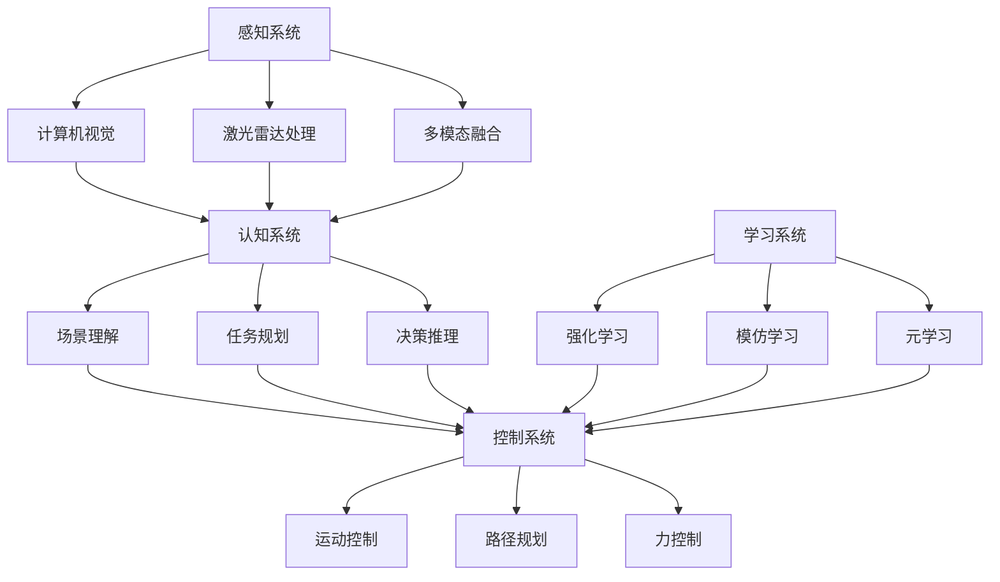

# 机器人系统ML应用

> **定位**：机器学习在机器人系统中的核心应用技术
> **作者**：Claude
> **创建时间**：2025年8月22日
> **标签**：#机器人学习 #具身智能 #强化学习 #计算机视觉 #运动控制

---

## 📝 核心概念

**机器人系统ML应用** 是指将机器学习技术深度集成到机器人的感知、决策、控制和学习系统中，使机器人具备智能化的环境理解、任务规划和自适应能力。

### 🎯 核心价值

1. **智能感知**：通过ML理解复杂环境信息
2. **自主决策**：基于学习的动态任务规划
3. **适应性控制**：根据环境变化调整行为
4. **持续学习**：通过交互不断优化性能

---

## 🏗️ 机器人ML系统架构

### 1️⃣ 总体架构


### 2️⃣ 核心ML组件

#### 🎯 机器人感知系统
```python
class RobotPerceptionSystem:
    def __init__(self):
        self.vision_module = ComputerVisionModule()
        self.lidar_module = LidarProcessingModule()
        self.fusion_module = SensorFusionModule()
        self.scene_understanding = SceneUnderstandingModule()

    def process_multi_modal_input(self, sensor_data):
        """多模态感知处理"""
        # 1. 视觉处理
        visual_features = self.vision_module.process_rgb_image(
            sensor_data['rgb_camera']
        )
        depth_features = self.vision_module.process_depth_image(
            sensor_data['depth_camera']
        )

        # 2. 激光雷达处理
        lidar_features = self.lidar_module.process_point_cloud(
            sensor_data['lidar']
        )

        # 3. 传感器融合
        fused_features = self.fusion_module.fuse_sensor_data({
            'visual': visual_features,
            'depth': depth_features,
            'lidar': lidar_features
        })

        # 4. 高级场景理解
        scene_representation = self.scene_understanding.understand_scene(
            fused_features
        )

        return {
            'raw_features': {
                'visual': visual_features,
                'depth': depth_features,
                'lidar': lidar_features
            },
            'fused_features': fused_features,
            'scene_representation': scene_representation
        }

class ComputerVisionModule:
    def __init__(self):
        self.object_detector = ObjectDetectionModel()
        self.semantic_segmenter = SemanticSegmentationModel()
        self.depth_estimator = DepthEstimationModel()
        self.pose_estimator = PoseEstimationModel()

    def process_rgb_image(self, rgb_image):
        """RGB图像处理pipeline"""
        # 1. 目标检测
        detected_objects = self.object_detector.detect(rgb_image)

        # 2. 语义分割
        semantic_mask = self.semantic_segmenter.segment(rgb_image)

        # 3. 实例分割
        instance_mask = self.instance_segmentation(rgb_image, detected_objects)

        # 4. 姿态估计（如果检测到人体）
        human_poses = []
        for obj in detected_objects:
            if obj['class'] == 'person':
                pose = self.pose_estimator.estimate_pose(
                    rgb_image, obj['bbox']
                )
                human_poses.append(pose)

        return {
            'objects': detected_objects,
            'semantic_mask': semantic_mask,
            'instance_mask': instance_mask,
            'human_poses': human_poses,
            'visual_features': self.extract_visual_features(rgb_image)
        }

    def process_depth_image(self, depth_image):
        """深度图像处理"""
        # 1. 3D点云生成
        point_cloud = self.depth_to_pointcloud(depth_image)

        # 2. 平面检测
        planes = self.detect_planes(point_cloud)

        # 3. 障碍物检测
        obstacles = self.detect_obstacles(point_cloud, planes)

        # 4. 可行走区域分析
        navigable_areas = self.analyze_navigable_areas(point_cloud, obstacles)

        return {
            'point_cloud': point_cloud,
            'planes': planes,
            'obstacles': obstacles,
            'navigable_areas': navigable_areas
        }

class LidarProcessingModule:
    def __init__(self):
        self.point_cloud_processor = PointCloudProcessor()
        self.slam_module = SLAMModule()

    def process_point_cloud(self, lidar_data):
        """激光雷达点云处理"""
        # 1. 点云预处理
        filtered_cloud = self.point_cloud_processor.filter_noise(lidar_data)
        downsampled_cloud = self.point_cloud_processor.downsample(filtered_cloud)

        # 2. 地面分割
        ground_points, non_ground_points = self.segment_ground(downsampled_cloud)

        # 3. 聚类分析
        clusters = self.cluster_objects(non_ground_points)

        # 4. 对象分类
        classified_objects = self.classify_clusters(clusters)

        # 5. SLAM处理
        slam_result = self.slam_module.process_frame(downsampled_cloud)

        return {
            'filtered_cloud': filtered_cloud,
            'ground_segmentation': {
                'ground': ground_points,
                'non_ground': non_ground_points
            },
            'object_clusters': classified_objects,
            'slam_pose': slam_result['pose'],
            'map_update': slam_result['map_update']
        }
```

---

## 🚀 机器人强化学习

### 1️⃣ 机器人控制RL
```python
class RobotReinforcementLearning:
    def __init__(self, robot_config):
        self.robot_config = robot_config
        self.environment = RobotEnvironment(robot_config)
        self.policy_network = PolicyNetwork()
        self.value_network = ValueNetwork()
        self.experience_buffer = ExperienceReplayBuffer()

    def train_robot_policy(self, task_definition):
        """训练机器人策略"""
        # 1. 任务环境设置
        self.environment.setup_task(task_definition)

        # 2. 训练循环
        for episode in range(self.max_episodes):
            state = self.environment.reset()
            episode_reward = 0
            episode_steps = 0

            while not self.environment.is_done() and episode_steps < self.max_steps:
                # 3. 策略采样
                action = self.policy_network.sample_action(state)

                # 4. 环境交互
                next_state, reward, done, info = self.environment.step(action)

                # 5. 存储经验
                self.experience_buffer.store({
                    'state': state,
                    'action': action,
                    'reward': reward,
                    'next_state': next_state,
                    'done': done
                })

                # 6. 策略更新
                if len(self.experience_buffer) > self.batch_size:
                    self.update_policy()

                state = next_state
                episode_reward += reward
                episode_steps += 1

            # 7. 记录训练指标
            self.log_training_metrics(episode, episode_reward, episode_steps)

    def update_policy(self):
        """策略网络更新"""
        # 1. 采样经验
        batch = self.experience_buffer.sample(self.batch_size)

        # 2. 计算目标值
        target_values = self.compute_target_values(batch)

        # 3. 策略梯度计算
        policy_loss = self.compute_policy_loss(batch, target_values)

        # 4. 价值函数损失
        value_loss = self.compute_value_loss(batch, target_values)

        # 5. 网络更新
        self.policy_network.update(policy_loss)
        self.value_network.update(value_loss)

    def multi_task_learning(self, task_list):
        """多任务学习"""
        # 1. 任务嵌入学习
        task_embeddings = self.learn_task_embeddings(task_list)

        # 2. 条件策略网络
        conditional_policy = ConditionalPolicyNetwork(
            self.policy_network, task_embeddings
        )

        # 3. 课程学习
        curriculum = self.design_curriculum(task_list)

        for stage, tasks in enumerate(curriculum):
            print(f"Training stage {stage}: {tasks}")

            for task in tasks:
                # 获取任务嵌入
                task_embedding = task_embeddings[task.name]

                # 训练条件策略
                self.train_conditional_policy(
                    conditional_policy, task, task_embedding
                )

        return conditional_policy

    def sim_to_real_transfer(self, simulation_policy):
        """仿真到现实迁移"""
        # 1. 域随机化
        randomized_simulator = self.create_domain_randomized_sim()

        # 2. 在随机化环境中微调
        adapted_policy = self.fine_tune_policy(
            simulation_policy, randomized_simulator
        )

        # 3. 现实世界适应
        real_world_policy = self.real_world_adaptation(adapted_policy)

        # 4. 安全验证
        safety_verified = self.verify_policy_safety(real_world_policy)

        if safety_verified:
            return real_world_policy
        else:
            return self.apply_safety_constraints(real_world_policy)
```

### 2️⃣ 模仿学习
```python
class RobotImitationLearning:
    def __init__(self):
        self.demonstration_collector = DemonstrationCollector()
        self.behavior_cloning = BehaviorCloningModule()
        self.inverse_rl = InverseReinforcementLearning()

    def collect_demonstrations(self, expert_demonstrations):
        """收集专家演示"""
        processed_demos = []

        for demo in expert_demonstrations:
            # 1. 数据预处理
            cleaned_demo = self.demonstration_collector.preprocess(demo)

            # 2. 状态-动作对提取
            state_action_pairs = self.extract_state_action_pairs(cleaned_demo)

            # 3. 轨迹分割
            segmented_trajectories = self.segment_trajectories(state_action_pairs)

            processed_demos.extend(segmented_trajectories)

        return processed_demos

    def behavior_cloning_training(self, demonstrations):
        """行为克隆训练"""
        # 1. 准备训练数据
        states, actions = self.prepare_training_data(demonstrations)

        # 2. 训练克隆网络
        cloning_network = self.behavior_cloning.train(states, actions)

        # 3. 数据增强
        augmented_data = self.augment_demonstration_data(demonstrations)

        # 4. 重新训练
        enhanced_network = self.behavior_cloning.retrain(
            cloning_network, augmented_data
        )

        return enhanced_network

    def inverse_reinforcement_learning(self, expert_trajectories):
        """逆强化学习"""
        # 1. 特征提取
        trajectory_features = []
        for trajectory in expert_trajectories:
            features = self.extract_trajectory_features(trajectory)
            trajectory_features.append(features)

        # 2. 奖励函数学习
        learned_reward_function = self.inverse_rl.learn_reward_function(
            trajectory_features
        )

        # 3. 最优策略求解
        optimal_policy = self.solve_mdp_with_learned_reward(
            learned_reward_function
        )

        return {
            'reward_function': learned_reward_function,
            'policy': optimal_policy
        }

    def generative_adversarial_imitation(self, expert_demonstrations):
        """生成对抗模仿学习（GAIL）"""
        # 1. 判别器网络
        discriminator = DiscriminatorNetwork()

        # 2. 生成器（策略网络）
        generator_policy = PolicyNetwork()

        # 3. 对抗训练循环
        for iteration in range(self.max_iterations):
            # 生成器采样轨迹
            generated_trajectories = self.sample_trajectories(generator_policy)

            # 判别器训练
            discriminator_loss = discriminator.train(
                expert_demonstrations, generated_trajectories
            )

            # 生成器训练（使用判别器作为奖励）
            generator_loss = self.train_generator_with_discriminator(
                generator_policy, discriminator, generated_trajectories
            )

            # 记录训练进度
            self.log_gail_metrics(iteration, discriminator_loss, generator_loss)

        return generator_policy

    def one_shot_imitation_learning(self, single_demonstration, test_scenarios):
        """一次性模仿学习"""
        # 1. 元学习准备
        meta_learner = MetaLearner()

        # 2. 从单个演示中提取关键信息
        key_features = self.extract_key_features(single_demonstration)

        # 3. 快速适应机制
        adapted_policy = meta_learner.fast_adapt(
            key_features, test_scenarios
        )

        # 4. 零样本泛化测试
        generalization_results = self.test_zero_shot_generalization(
            adapted_policy, test_scenarios
        )

        return {
            'adapted_policy': adapted_policy,
            'generalization_performance': generalization_results
        }
```

---

## 🎯 机器人任务规划

### 1️⃣ 智能路径规划
```python
class IntelligentPathPlanning:
    def __init__(self):
        self.neural_planner = NeuralPathPlanner()
        self.traditional_planner = TraditionalPathPlanner()
        self.hybrid_planner = HybridPlanner()

    def neural_path_planning(self, start, goal, environment_map):
        """神经网络路径规划"""
        # 1. 环境编码
        encoded_environment = self.encode_environment(environment_map)

        # 2. 目标编码
        encoded_goal = self.encode_goal_position(start, goal)

        # 3. 神经网络推理
        planned_path = self.neural_planner.plan_path(
            encoded_environment, encoded_goal
        )

        # 4. 路径后处理
        smoothed_path = self.smooth_path(planned_path)
        validated_path = self.validate_path_safety(smoothed_path, environment_map)

        return {
            'raw_path': planned_path,
            'smoothed_path': smoothed_path,
            'final_path': validated_path,
            'planning_time': self.neural_planner.planning_time
        }

    def learning_based_obstacle_avoidance(self, dynamic_obstacles):
        """基于学习的动态避障"""
        # 1. 障碍物运动预测
        obstacle_predictions = []
        for obstacle in dynamic_obstacles:
            future_trajectory = self.predict_obstacle_motion(obstacle)
            obstacle_predictions.append(future_trajectory)

        # 2. 风险评估
        risk_map = self.compute_collision_risk(obstacle_predictions)

        # 3. 安全路径生成
        safe_path = self.generate_safe_path(risk_map)

        # 4. 实时路径调整
        adaptive_controller = AdaptivePathController()
        real_time_adjustments = adaptive_controller.adjust_path(
            safe_path, dynamic_obstacles
        )

        return real_time_adjustments

    def hierarchical_task_planning(self, high_level_task):
        """分层任务规划"""
        # 1. 高级任务分解
        subtasks = self.decompose_high_level_task(high_level_task)

        # 2. 子任务规划
        subtask_plans = []
        for subtask in subtasks:
            plan = self.plan_subtask(subtask)
            subtask_plans.append(plan)

        # 3. 计划协调
        coordinated_plan = self.coordinate_subtask_plans(subtask_plans)

        # 4. 执行监控
        execution_monitor = ExecutionMonitor()
        monitored_execution = execution_monitor.monitor_plan_execution(
            coordinated_plan
        )

        return {
            'subtasks': subtasks,
            'subtask_plans': subtask_plans,
            'coordinated_plan': coordinated_plan,
            'execution_monitoring': monitored_execution
        }

    def predict_obstacle_motion(self, obstacle):
        """障碍物运动预测"""
        # 1. 历史轨迹分析
        historical_trajectory = obstacle.get_trajectory_history()

        # 2. 运动模式识别
        motion_pattern = self.identify_motion_pattern(historical_trajectory)

        # 3. 未来轨迹预测
        if motion_pattern == 'linear':
            predicted_trajectory = self.predict_linear_motion(obstacle)
        elif motion_pattern == 'circular':
            predicted_trajectory = self.predict_circular_motion(obstacle)
        elif motion_pattern == 'random':
            predicted_trajectory = self.predict_random_motion(obstacle)
        else:
            # 使用神经网络预测复杂运动
            predicted_trajectory = self.neural_motion_prediction(obstacle)

        # 4. 不确定性量化
        prediction_uncertainty = self.quantify_prediction_uncertainty(
            predicted_trajectory
        )

        return {
            'trajectory': predicted_trajectory,
            'uncertainty': prediction_uncertainty,
            'confidence': self.compute_prediction_confidence(prediction_uncertainty)
        }
```

### 2️⃣ 任务与运动规划
```python
class TaskAndMotionPlanning:
    def __init__(self):
        self.task_planner = TaskPlanner()
        self.motion_planner = MotionPlanner()
        self.integrated_planner = IntegratedTAMPPlanner()

    def integrated_tamp_planning(self, task_specification, robot_capabilities):
        """集成任务与运动规划"""
        # 1. 任务图构建
        task_graph = self.build_task_graph(task_specification)

        # 2. 运动约束分析
        motion_constraints = self.analyze_motion_constraints(robot_capabilities)

        # 3. 可行性检查
        feasible_task_sequences = self.check_task_feasibility(
            task_graph, motion_constraints
        )

        # 4. 优化规划
        optimal_plan = self.optimize_integrated_plan(
            feasible_task_sequences, motion_constraints
        )

        return optimal_plan

    def symbolic_geometric_integration(self, symbolic_plan, geometric_constraints):
        """符号-几何集成"""
        # 1. 符号动作展开
        expanded_actions = []
        for symbolic_action in symbolic_plan:
            geometric_actions = self.expand_symbolic_action(
                symbolic_action, geometric_constraints
            )
            expanded_actions.extend(geometric_actions)

        # 2. 几何可行性验证
        feasible_actions = []
        for action in expanded_actions:
            if self.verify_geometric_feasibility(action):
                feasible_actions.append(action)

        # 3. 冲突解决
        conflict_free_plan = self.resolve_geometric_conflicts(feasible_actions)

        return conflict_free_plan

    def learning_assisted_planning(self, planning_experience):
        """学习辅助规划"""
        # 1. 规划经验学习
        planning_model = self.learn_planning_model(planning_experience)

        # 2. 启发式学习
        learned_heuristics = self.learn_planning_heuristics(planning_experience)

        # 3. 规划加速
        accelerated_planner = AcceleratedPlanner(
            self.traditional_planner, planning_model, learned_heuristics
        )

        return accelerated_planner

    def multi_robot_coordination(self, robot_team, shared_workspace):
        """多机器人协调"""
        # 1. 任务分配
        task_allocation = self.allocate_tasks_to_robots(robot_team)

        # 2. 冲突检测
        potential_conflicts = self.detect_potential_conflicts(
            task_allocation, shared_workspace
        )

        # 3. 协调规划
        coordinated_plans = self.plan_coordinated_execution(
            task_allocation, potential_conflicts
        )

        # 4. 分布式执行
        distributed_controller = DistributedController()
        execution_result = distributed_controller.execute_coordinated_plans(
            coordinated_plans
        )

        return execution_result
```

---

## 🔧 机器人学习系统

### 1️⃣ 在线学习与适应
```python
class OnlineLearningSystem:
    def __init__(self):
        self.online_learner = OnlineLearner()
        self.adaptation_controller = AdaptationController()
        self.experience_manager = ExperienceManager()

    def continual_learning(self, robot_experiences):
        """持续学习系统"""
        # 1. 经验流处理
        for experience_batch in robot_experiences:
            # 检测环境变化
            environment_change = self.detect_environment_change(experience_batch)

            if environment_change:
                # 触发适应性学习
                self.trigger_adaptation(experience_batch)

            # 增量学习
            self.online_learner.incremental_update(experience_batch)

            # 记忆管理
            self.experience_manager.manage_memory(experience_batch)

    def meta_learning_for_robots(self, task_distribution):
        """机器人元学习"""
        # 1. 任务分布采样
        sampled_tasks = self.sample_tasks(task_distribution)

        # 2. 元学习训练
        meta_model = MetaLearningModel()

        for meta_iteration in range(self.meta_iterations):
            # 内循环：快速适应
            for task in sampled_tasks:
                support_data = task.get_support_set()
                query_data = task.get_query_set()

                # 快速适应
                adapted_model = meta_model.fast_adapt(support_data)

                # 查询集评估
                query_loss = adapted_model.evaluate(query_data)

                # 元梯度计算
                meta_gradient = self.compute_meta_gradient(query_loss)

            # 外循环：元更新
            meta_model.meta_update(meta_gradient)

        return meta_model

    def self_supervised_learning(self, unlabeled_robot_data):
        """自监督学习"""
        # 1. 自监督任务设计
        ssl_tasks = {
            'next_frame_prediction': self.create_next_frame_task,
            'robot_state_prediction': self.create_state_prediction_task,
            'action_consequence_prediction': self.create_consequence_task,
            'temporal_consistency': self.create_consistency_task
        }

        trained_models = {}

        for task_name, task_creator in ssl_tasks.items():
            # 2. 创建自监督任务
            ssl_task = task_creator(unlabeled_robot_data)

            # 3. 模型训练
            ssl_model = self.train_ssl_model(ssl_task)

            # 4. 特征提取器
            feature_extractor = ssl_model.get_feature_extractor()
            trained_models[task_name] = feature_extractor

        # 5. 特征融合
        fused_representation = self.fuse_ssl_features(trained_models)

        return fused_representation

    def curriculum_learning(self, task_curriculum):
        """课程学习"""
        # 1. 难度评估
        difficulty_assessor = DifficultyAssessor()

        # 2. 课程排序
        sorted_curriculum = difficulty_assessor.sort_by_difficulty(task_curriculum)

        # 3. 渐进式训练
        current_model = None
        for difficulty_level, tasks in enumerate(sorted_curriculum):
            print(f"Training difficulty level {difficulty_level}")

            # 在当前难度级别训练
            level_model = self.train_on_difficulty_level(tasks, current_model)

            # 能力评估
            capability_score = self.assess_capability(level_model, tasks)

            # 决定是否进入下一级别
            if capability_score > self.progression_threshold:
                current_model = level_model
            else:
                # 需要更多训练
                current_model = self.additional_training(current_model, tasks)

        return current_model
```

### 2️⃣ 安全学习机制
```python
class SafeLearningMechanism:
    def __init__(self):
        self.safety_monitor = SafetyMonitor()
        self.constraint_learner = ConstraintLearner()
        self.safe_explorer = SafeExplorer()

    def constrained_reinforcement_learning(self, safety_constraints):
        """约束强化学习"""
        # 1. 安全约束建模
        constraint_models = []
        for constraint in safety_constraints:
            model = self.constraint_learner.learn_constraint(constraint)
            constraint_models.append(model)

        # 2. 安全策略学习
        safe_policy = SafePolicyLearner()

        for episode in range(self.max_episodes):
            state = self.environment.reset()

            while not self.environment.is_done():
                # 生成候选动作
                candidate_actions = safe_policy.generate_candidate_actions(state)

                # 安全性筛选
                safe_actions = self.filter_safe_actions(
                    candidate_actions, state, constraint_models
                )

                if safe_actions:
                    action = safe_policy.select_action(safe_actions)
                else:
                    # 安全回退动作
                    action = self.get_safe_fallback_action(state)

                # 执行动作
                next_state, reward, done, info = self.environment.step(action)

                # 约束违反检查
                constraint_violations = self.check_constraint_violations(
                    state, action, next_state, constraint_models
                )

                # 安全奖励调整
                adjusted_reward = self.adjust_reward_for_safety(
                    reward, constraint_violations
                )

                # 策略更新
                safe_policy.update(state, action, adjusted_reward, next_state)

                state = next_state

        return safe_policy

    def safe_exploration_strategies(self, unknown_environment):
        """安全探索策略"""
        # 1. 保守探索
        conservative_explorer = ConservativeExplorer()

        # 2. 风险感知探索
        risk_aware_explorer = RiskAwareExplorer()

        # 3. 安全边界学习
        safety_boundary_learner = SafetyBoundaryLearner()

        exploration_strategies = {
            'conservative': conservative_explorer,
            'risk_aware': risk_aware_explorer,
            'boundary_learning': safety_boundary_learner
        }

        # 4. 自适应探索策略选择
        adaptive_strategy = self.select_exploration_strategy(
            unknown_environment, exploration_strategies
        )

        return adaptive_strategy

    def safety_verification(self, learned_policy):
        """安全性验证"""
        # 1. 形式化验证
        formal_verification_result = self.formal_safety_verification(learned_policy)

        # 2. 统计验证
        statistical_verification_result = self.statistical_safety_verification(
            learned_policy
        )

        # 3. 仿真验证
        simulation_verification_result = self.simulation_safety_verification(
            learned_policy
        )

        # 4. 综合安全评估
        comprehensive_safety_score = self.compute_comprehensive_safety_score([
            formal_verification_result,
            statistical_verification_result,
            simulation_verification_result
        ])

        return {
            'formal_verification': formal_verification_result,
            'statistical_verification': statistical_verification_result,
            'simulation_verification': simulation_verification_result,
            'overall_safety_score': comprehensive_safety_score,
            'safety_certified': comprehensive_safety_score > self.safety_threshold
        }

    def human_robot_safe_interaction(self, human_presence_detection):
        """人机安全交互"""
        # 1. 人体检测与跟踪
        human_tracker = HumanTracker()
        human_states = human_tracker.track_humans(human_presence_detection)

        # 2. 意图预测
        intention_predictor = HumanIntentionPredictor()
        predicted_intentions = intention_predictor.predict(human_states)

        # 3. 安全距离维护
        safety_controller = SafetyController()
        safe_actions = safety_controller.maintain_safe_distance(
            human_states, predicted_intentions
        )

        # 4. 紧急停止机制
        emergency_stop = EmergencyStopSystem()
        emergency_response = emergency_stop.monitor_and_respond(
            human_states, safe_actions
        )

        return emergency_response
```

---

## 🔗 与其他技术的关系

### 🔗 相关技术栈
- **[[具身智能技术架构]]**：机器人智能的理论基础
- **[[RLHF人类反馈强化学习]]**：人机交互学习
- **[[世界模型技术架构详解]]**：环境建模与仿真
- **[[异构计算平台架构]]**：机器人计算平台

### 🔗 应用场景
- **服务机器人**：家庭服务、医疗护理、酒店服务
- **工业机器人**：智能制造、质量检测、装配作业
- **自主移动**：自动驾驶、无人机、配送机器人
- **探索机器人**：太空探索、深海探测、危险环境作业

---

## 🎯 学习建议

### 📚 基础路径
1. **机器人学基础**：运动学、动力学、控制理论
2. **计算机视觉**：图像处理、目标检测、SLAM
3. **强化学习**：策略梯度、价值函数、探索策略
4. **传感器融合**：多模态数据处理、状态估计

### 🔬 进阶方向
1. **具身智能**：感知-行动循环、环境交互
2. **多智能体系统**：协作机器人、群体智能
3. **人机交互**：意图理解、安全交互
4. **自主学习**：终身学习、自适应控制

### 🛠️ 实践项目
1. **机器人仿真环境**：Gazebo、PyBullet仿真
2. **视觉导航系统**：SLAM、路径规划
3. **强化学习控制**：机械臂控制、移动机器人
4. **人机协作任务**：安全交互、协作装配

---

*机器人系统ML应用代表了人工智能从虚拟世界走向物理世界的关键一步，是实现真正智能机器人的核心技术。*