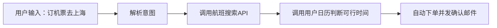

#AI_[[01-核心知识库/K2-技术方法与实现/模型架构/Agent]] #工具调用 #GUI操作

---

## **📌 内容分类概览**

|**模块**|**关键词**|**简介**|
|---|---|---|
|[[01-核心知识库/K2-技术方法与实现/模型架构/Agent]]基础知识|自主性、目标导向|AI [[01-核心知识库/K2-技术方法与实现/模型架构/Agent]]区别于传统AI，具备自主规划、工具调用与学习能力|
|Function Calling机制|API、函数、调度|将自然语言指令结构化转换为可执行任务的关键机制|
|[[MCP协议与AI万物互联\|MCP标准协议]]|Model Context Protocol|统一接口标准，降低多工具接入复杂度|
|GUI [[01-核心知识库/K2-技术方法与实现/模型架构/Agent]]范式|模拟人类操作、无需API|适用于界面操作需求场景|
|通用平台示例|Coze、RabbitOS、MiniMax、Replit [[01-核心知识库/K2-技术方法与实现/模型架构/Agent]]|实际应用平台与使用教程|

---

## **🧠 一、[[01-核心知识库/K2-技术方法与实现/模型架构/Agent]] 基础知识**

### **✅ [[01-核心知识库/K2-技术方法与实现/模型架构/Agent]] 与传统 AI 区别**

|**传统 AI**|**AI [[01-核心知识库/K2-技术方法与实现/模型架构/Agent]]**|
|---|---|
|被动响应|主动执行|
|单任务|多任务、任务拆解|
|无持续学习|可记忆与优化策略|
|仅文字处理|可工具调用、实时交互|

**举例**：传统AI只能告诉你"明天北京天气如何"，[[01-核心知识库/K2-技术方法与实现/模型架构/Agent]]可以主动帮你查天气+建议穿搭+安排出行，并通过[[RAG检索增强生成技术详解|RAG技术]]获取实时信息。

---

## **🛠 二、Function Calling：工具调用的核心**

> **定义**：Function calling 是指将自然语言指令转为 API 调用、脚本执行、工具操作等结构化动作。

### **📈 应用举例：**

---

## **🔌 三、MCP（模型上下文协议）**

### **✅ MCP 结构**

| **组成**     | **说明**             |
| ---------- | ------------------ |
| MCP Server | 提供上下文能力的服务（如日历、邮箱） |
| MCP Client | 调用上下文服务的 [[01-核心知识库/K2-技术方法与实现/模型架构/Agent]] 客户端 |

### **🎯 类比解释**

|**传统API**|**MCP**|
|---|---|
|每个工具需独立对接（钥匙开锁）|一个通用接口兼容多工具（Type-C）|

### **🌍 应用案例：旅游 [[01-核心知识库/K2-技术方法与实现/模型架构/Agent]]**

传统 API 需要分别接入机票、酒店、邮箱、日历，而 MCP 接一次 Server 即可统一调用。

---

## **🧰 四、新范式：GUI [[01-核心知识库/K2-技术方法与实现/模型架构/Agent]]**

### **🧍‍♂️ 模拟人类操作**

|**类型**|**能力描述**|**适用场景**|
|---|---|---|
|API [[01-核心知识库/K2-技术方法与实现/模型架构/Agent]]|调用接口，高效准确|对接有API服务|
|GUI [[01-核心知识库/K2-技术方法与实现/模型架构/Agent]]|鼠标点击、键盘输入|用于没有API但有网页/软件界面|

例如：12306 没开放API，但可以用 GUI [[01-核心知识库/K2-技术方法与实现/模型架构/Agent]] 帮你自动抢票。

---

## **💡 五、通用 [[01-核心知识库/K2-技术方法与实现/模型架构/Agent]] 平台推荐**

### **🌀 Coze空间（字节跳动）**

- 官网：[space.coze.cn](https://space.coze.cn)
    
- **模式**：
    
    - 🧭 探索模式：AI快速执行（适合轻量任务）
        
    - 📋 规划模式：AI拆解流程（适合复杂任务）
- **亮点**：
    
    - MCP插件系统：高德地图、飞书集成
        
    - 多模态输出：网页、PPT、音频播客
        
    - 行业专家[[01-核心知识库/K2-技术方法与实现/模型架构/Agent]]（如：A股助手、问卷分析）

---

### **🐇 RabbitOS**

- 官网：[hole.rabbit.tech/rabbitos](https://hole.rabbit.tech/rabbitos)
    
- 桌面级 AI 操作系统，主打多模态感知、任务流控制

---

### **🔗 MiniMax [[01-核心知识库/K2-技术方法与实现/模型架构/Agent]]**

- 官网：[agent.minimax.io](https://agent.minimax.io/?utm_source=ai-bot.cn)
    
- 中文环境友好，适合初学者使用的 AI 多轮交互平台

---

### **💻 Replit [[01-核心知识库/K2-技术方法与实现/模型架构/Agent]] V2**

> 全栈应用构建 [[01-核心知识库/K2-技术方法与实现/模型架构/Agent]]，用自然语言生成代码与网站

- 官网：[replit.com](https://replit.com)
    
- 使用教程：[Bilibili 教学视频](https://www.bilibili.com/video/BV1M8RVYAE9B)

#### **✅ 功能特性**

|**功能**|**说明**|
|---|---|
|自动生成代码|前后端+数据库结构|
|交互式调试|支持实时错误修复|
|完全云端|无需本地开发环境|
|自定义美术风格|支持上传参考图|

#### **🧪 实战案例：理发店预约系统**

|**模块**|**内容**|
|---|---|
|前端|预约界面（选择服务+时间）|
|后端|数据接收与处理|
|后台|管理员登录、订单管理|

---

## **📚 六、延伸学习资源**

- 李宏毅教授《AI [[01-核心知识库/K2-技术方法与实现/模型架构/Agent]]》公开课件：[ai_agent (v11).pptx.pdf]
- **物理世界应用**：[[具身智能技术架构]] - Agent在机器人等物理实体中的应用
- **高级提示技术**：[[Prompt Engineering提示工程详解]] - 优化Agent交互的核心技能
