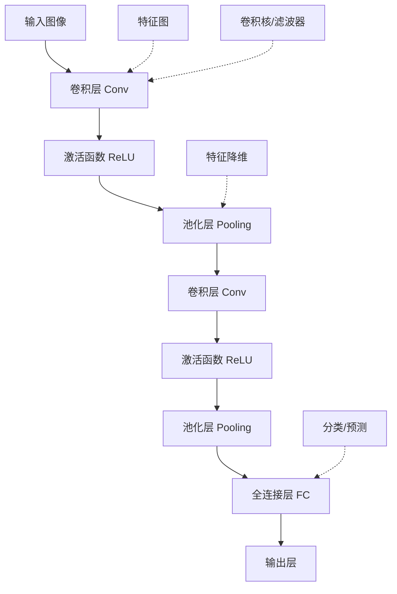

# CNN 卷积神经网络

> **作用**：专门处理网格数据（如图像）的深度学习架构，是计算机视觉的基础
> **层级**：K2-技术方法与实现 → 模型架构  
> **关联**：[[PyTorch深度学习框架]]、[[TensorFlow深度学习框架]]、[[Transformer架构原理]]、[[大语言模型基础]]、[[K1-基础理论与概念/核心概念/损失函数与训练调优术语名词库|术语名词库（大白话对照）]]

---

## 📌 概念定义

**卷积神经网络（Convolutional Neural Network，CNN）**是一种专门用于处理具有网格结构数据的深度神经网络，特别适用于图像识别、计算机视觉任务。CNN通过卷积层、池化层等特殊结构，能够自动学习和提取数据的空间特征。

### 🎯 核心优势
- **空间不变性**：对图像的平移、旋转具有一定的鲁棒性
- **参数共享**：同一卷积核在整个特征图上共享，大幅减少参数量
- **局部连接**：每个神经元只连接输入的局部区域，降低计算复杂度
- **层次特征学习**：从低级边缘特征到高级语义特征的逐层抽象

---

## 🏗️ 架构组件

### 🔧 核心层结构



### 💡 详细组件说明

#### 1️⃣ 卷积层（Convolutional Layer）
```python
import torch
import torch.nn as nn

# PyTorch中的2D卷积层
conv_layer = nn.Conv2d(
    in_channels=3,     # 输入通道数（RGB图像为3）
    out_channels=64,   # 输出通道数（卷积核数量）
    kernel_size=3,     # 卷积核大小 3x3
    stride=1,          # 步幅
    padding=1          # 填充
)

# 卷积操作的数学原理
# 输出特征图大小计算公式：
# Output = (Input + 2*Padding - Kernel_size) / Stride + 1
```

#### 2️⃣ 池化层（Pooling Layer）
```python
# 最大池化
max_pool = nn.MaxPool2d(kernel_size=2, stride=2)

# 平均池化
avg_pool = nn.AvgPool2d(kernel_size=2, stride=2)

# 自适应池化（输出固定尺寸）
adaptive_pool = nn.AdaptiveAvgPool2d(output_size=(7, 7))
```

#### 3️⃣ 激活函数
```python
# 常用激活函数
relu = nn.ReLU()           # 最常用
leaky_relu = nn.LeakyReLU(negative_slope=0.01)
gelu = nn.GELU()           # Transformer中常用
```

---

## 🚀 经典CNN架构

### 🔥 LeNet-5 (1998年)
```python
import torch.nn as nn

class LeNet5(nn.Module):
    def __init__(self, num_classes=10):
        super(LeNet5, self).__init__()
        self.features = nn.Sequential(
            # 第一层：卷积 + 激活 + 池化
            nn.Conv2d(1, 6, kernel_size=5, stride=1),
            nn.ReLU(inplace=True),
            nn.AvgPool2d(kernel_size=2, stride=2),
            
            # 第二层：卷积 + 激活 + 池化
            nn.Conv2d(6, 16, kernel_size=5, stride=1),
            nn.ReLU(inplace=True),
            nn.AvgPool2d(kernel_size=2, stride=2)
        )
        
        self.classifier = nn.Sequential(
            nn.Linear(16 * 5 * 5, 120),
            nn.ReLU(inplace=True),
            nn.Linear(120, 84),
            nn.ReLU(inplace=True),
            nn.Linear(84, num_classes)
        )
    
    def forward(self, x):
        x = self.features(x)
        x = x.view(x.size(0), -1)  # 展平
        x = self.classifier(x)
        return x
```

### 📊 AlexNet (2012年)
```python
class AlexNet(nn.Module):
    def __init__(self, num_classes=1000):
        super(AlexNet, self).__init__()
        self.features = nn.Sequential(
            # Conv1: 输入 224x224x3 → 输出 55x55x96
            nn.Conv2d(3, 96, kernel_size=11, stride=4, padding=2),
            nn.ReLU(inplace=True),
            nn.MaxPool2d(kernel_size=3, stride=2),
            
            # Conv2: 55x55x96 → 27x27x256
            nn.Conv2d(96, 256, kernel_size=5, padding=2),
            nn.ReLU(inplace=True),
            nn.MaxPool2d(kernel_size=3, stride=2),
            
            # Conv3: 27x27x256 → 13x13x384
            nn.Conv2d(256, 384, kernel_size=3, padding=1),
            nn.ReLU(inplace=True),
            
            # Conv4: 13x13x384 → 13x13x384
            nn.Conv2d(384, 384, kernel_size=3, padding=1),
            nn.ReLU(inplace=True),
            
            # Conv5: 13x13x384 → 13x13x256
            nn.Conv2d(384, 256, kernel_size=3, padding=1),
            nn.ReLU(inplace=True),
            nn.MaxPool2d(kernel_size=3, stride=2)
        )
        
        self.classifier = nn.Sequential(
            nn.Dropout(0.5),
            nn.Linear(256 * 6 * 6, 4096),
            nn.ReLU(inplace=True),
            nn.Dropout(0.5),
            nn.Linear(4096, 4096),
            nn.ReLU(inplace=True),
            nn.Linear(4096, num_classes)
        )
```

### 🏆 ResNet (2015年) - 残差网络
```python
class ResidualBlock(nn.Module):
    def __init__(self, in_channels, out_channels, stride=1):
        super(ResidualBlock, self).__init__()
        
        self.conv1 = nn.Conv2d(in_channels, out_channels, 
                              kernel_size=3, stride=stride, padding=1, bias=False)
        self.bn1 = nn.BatchNorm2d(out_channels)
        
        self.conv2 = nn.Conv2d(out_channels, out_channels,
                              kernel_size=3, stride=1, padding=1, bias=False)
        self.bn2 = nn.BatchNorm2d(out_channels)
        
        # 跳跃连接
        if stride != 1 or in_channels != out_channels:
            self.shortcut = nn.Sequential(
                nn.Conv2d(in_channels, out_channels, 
                         kernel_size=1, stride=stride, bias=False),
                nn.BatchNorm2d(out_channels)
            )
        else:
            self.shortcut = nn.Identity()
    
    def forward(self, x):
        residual = x
        
        out = torch.relu(self.bn1(self.conv1(x)))
        out = self.bn2(self.conv2(out))
        
        # 残差连接：解决梯度消失问题
        out += self.shortcut(residual)
        out = torch.relu(out)
        
        return out
```

---

## 🔗 与深度学习框架的集成

### 🤝 [[PyTorch深度学习框架|PyTorch]]实现

#### 完整训练流程
```python
import torch
import torch.nn as nn
import torch.optim as optim
from torch.utils.data import DataLoader
import torchvision.transforms as transforms
import torchvision.datasets as datasets

# 1. 数据预处理
transform_train = transforms.Compose([
    transforms.RandomCrop(32, padding=4),
    transforms.RandomHorizontalFlip(),
    transforms.ToTensor(),
    transforms.Normalize((0.4914, 0.4822, 0.4465), (0.2023, 0.1994, 0.2010))
])

transform_test = transforms.Compose([
    transforms.ToTensor(),
    transforms.Normalize((0.4914, 0.4822, 0.4465), (0.2023, 0.1994, 0.2010))
])

# 2. 加载数据集
train_dataset = datasets.CIFAR10(root='./data', train=True, 
                                download=True, transform=transform_train)
test_dataset = datasets.CIFAR10(root='./data', train=False, 
                               transform=transform_test)

train_loader = DataLoader(train_dataset, batch_size=128, 
                         shuffle=True, num_workers=4)
test_loader = DataLoader(test_dataset, batch_size=100, 
                        shuffle=False, num_workers=4)

# 3. 定义模型、损失函数和优化器
model = ResNet18(num_classes=10)
criterion = nn.CrossEntropyLoss()
optimizer = optim.SGD(model.parameters(), lr=0.1, 
                     momentum=0.9, weight_decay=5e-4)

# 4. 训练循环
device = torch.device('cuda' if torch.cuda.is_available() else 'cpu')
model = model.to(device)

for epoch in range(100):
    model.train()
    for batch_idx, (data, target) in enumerate(train_loader):
        data, target = data.to(device), target.to(device)
        
        optimizer.zero_grad()
        output = model(data)
        loss = criterion(output, target)
        loss.backward()
        optimizer.step()
        
        if batch_idx % 100 == 0:
            print(f'Epoch: {epoch}, Batch: {batch_idx}, Loss: {loss.item():.4f}')
```

### 🛠️ [[TensorFlow深度学习框架|TensorFlow]]实现

#### Keras高级API构建CNN
```python
import tensorflow as tf
from tensorflow import keras
from tensorflow.keras import layers

# 使用函数式API构建ResNet风格模型
def residual_block(x, filters, kernel_size=3, stride=1):
    # 主路径
    fx = layers.Conv2D(filters, kernel_size, strides=stride, 
                      padding='same', use_bias=False)(x)
    fx = layers.BatchNormalization()(fx)
    fx = layers.ReLU()(fx)
    
    fx = layers.Conv2D(filters, kernel_size, strides=1, 
                      padding='same', use_bias=False)(fx)
    fx = layers.BatchNormalization()(fx)
    
    # 跳跃连接
    if stride != 1 or x.shape[-1] != filters:
        x = layers.Conv2D(filters, 1, strides=stride, 
                         padding='same', use_bias=False)(x)
        x = layers.BatchNormalization()(x)
    
    # 残差相加
    out = layers.Add()([fx, x])
    out = layers.ReLU()(out)
    return out

# 构建完整模型
def build_resnet_model(input_shape=(32, 32, 3), num_classes=10):
    inputs = keras.Input(shape=input_shape)
    
    # 初始卷积层
    x = layers.Conv2D(64, 7, strides=2, padding='same')(inputs)
    x = layers.BatchNormalization()(x)
    x = layers.ReLU()(x)
    x = layers.MaxPooling2D(3, strides=2, padding='same')(x)
    
    # 残差块组
    x = residual_block(x, 64)
    x = residual_block(x, 64)
    
    x = residual_block(x, 128, stride=2)
    x = residual_block(x, 128)
    
    x = residual_block(x, 256, stride=2)
    x = residual_block(x, 256)
    
    # 全局平均池化和分类器
    x = layers.GlobalAveragePooling2D()(x)
    outputs = layers.Dense(num_classes, activation='softmax')(x)
    
    model = keras.Model(inputs, outputs)
    return model

# 编译和训练
model = build_resnet_model()
model.compile(
    optimizer='adam',
    loss='sparse_categorical_crossentropy',
    metrics=['accuracy']
)

# 使用回调函数
callbacks = [
    keras.callbacks.EarlyStopping(patience=10, restore_best_weights=True),
    keras.callbacks.ReduceLROnPlateau(factor=0.1, patience=5),
    keras.callbacks.ModelCheckpoint('best_model.h5', save_best_only=True)
]

history = model.fit(
    train_dataset,
    epochs=100,
    validation_data=test_dataset,
    callbacks=callbacks
)
```

---

## 🎯 高级技术与优化

### ⚡ 性能优化技巧

#### 1️⃣ 数据增强（Data Augmentation）
```python
# PyTorch版本
import torchvision.transforms as transforms

transform_augment = transforms.Compose([
    transforms.RandomCrop(32, padding=4),
    transforms.RandomHorizontalFlip(p=0.5),
    transforms.RandomRotation(degrees=15),
    transforms.ColorJitter(brightness=0.2, contrast=0.2, saturation=0.2, hue=0.1),
    transforms.ToTensor(),
    transforms.Normalize(mean=[0.485, 0.456, 0.406], std=[0.229, 0.224, 0.225])
])

# TensorFlow版本
def augment_image(image, label):
    image = tf.image.random_flip_left_right(image)
    image = tf.image.random_brightness(image, max_delta=0.2)
    image = tf.image.random_contrast(image, lower=0.8, upper=1.2)
    image = tf.image.random_saturation(image, lower=0.8, upper=1.2)
    return image, label
```

#### 2️⃣ 批量归一化（Batch Normalization）
```python
# 批量归一化的作用：
# 1. 加速训练收敛
# 2. 允许使用更大的学习率
# 3. 减少对初始化的敏感性
# 4. 具有轻微的正则化效果

class ConvBNReLU(nn.Module):
    def __init__(self, in_channels, out_channels, kernel_size=3, stride=1, padding=1):
        super().__init__()
        self.conv = nn.Conv2d(in_channels, out_channels, kernel_size, stride, padding, bias=False)
        self.bn = nn.BatchNorm2d(out_channels)
        self.relu = nn.ReLU(inplace=True)
    
    def forward(self, x):
        return self.relu(self.bn(self.conv(x)))
```

#### 3️⃣ 正则化技术
```python
# Dropout正则化
class CNNWithDropout(nn.Module):
    def __init__(self, num_classes=10):
        super().__init__()
        self.features = nn.Sequential(
            nn.Conv2d(3, 64, 3, padding=1),
            nn.ReLU(),
            nn.MaxPool2d(2),
            nn.Dropout2d(0.25),  # 2D Dropout for conv layers
            
            nn.Conv2d(64, 128, 3, padding=1),
            nn.ReLU(),
            nn.MaxPool2d(2),
            nn.Dropout2d(0.25),
        )
        
        self.classifier = nn.Sequential(
            nn.Linear(128 * 8 * 8, 512),
            nn.ReLU(),
            nn.Dropout(0.5),     # 标准Dropout for FC layers
            nn.Linear(512, num_classes)
        )

# L2正则化（权重衰减）
optimizer = optim.Adam(model.parameters(), lr=0.001, weight_decay=1e-4)
```

### 🚀 现代CNN技术

#### 1️⃣ 深度可分离卷积（Depthwise Separable Convolution）
```python
class DepthwiseSeparableConv(nn.Module):
    def __init__(self, in_channels, out_channels, kernel_size=3, stride=1, padding=1):
        super().__init__()
        
        # 深度卷积：每个输入通道单独卷积
        self.depthwise = nn.Conv2d(in_channels, in_channels, kernel_size, 
                                  stride, padding, groups=in_channels, bias=False)
        
        # 点卷积：1x1卷积混合通道信息
        self.pointwise = nn.Conv2d(in_channels, out_channels, 1, bias=False)
        
        self.bn1 = nn.BatchNorm2d(in_channels)
        self.bn2 = nn.BatchNorm2d(out_channels)
        self.relu = nn.ReLU(inplace=True)
    
    def forward(self, x):
        x = self.relu(self.bn1(self.depthwise(x)))
        x = self.relu(self.bn2(self.pointwise(x)))
        return x
```

#### 2️⃣ 注意力机制（Attention Mechanism）
```python
class ChannelAttention(nn.Module):
    """通道注意力模块 - 类似SE-Net"""
    def __init__(self, channels, reduction=16):
        super().__init__()
        self.avg_pool = nn.AdaptiveAvgPool2d(1)
        self.max_pool = nn.AdaptiveMaxPool2d(1)
        
        self.fc = nn.Sequential(
            nn.Conv2d(channels, channels // reduction, 1, bias=False),
            nn.ReLU(inplace=True),
            nn.Conv2d(channels // reduction, channels, 1, bias=False)
        )
        self.sigmoid = nn.Sigmoid()
    
    def forward(self, x):
        avg_out = self.fc(self.avg_pool(x))
        max_out = self.fc(self.max_pool(x))
        attention = self.sigmoid(avg_out + max_out)
        return x * attention

class SpatialAttention(nn.Module):
    """空间注意力模块"""
    def __init__(self, kernel_size=7):
        super().__init__()
        self.conv = nn.Conv2d(2, 1, kernel_size, padding=kernel_size//2, bias=False)
        self.sigmoid = nn.Sigmoid()
    
    def forward(self, x):
        avg_out = torch.mean(x, dim=1, keepdim=True)
        max_out, _ = torch.max(x, dim=1, keepdim=True)
        attention = torch.cat([avg_out, max_out], dim=1)
        attention = self.sigmoid(self.conv(attention))
        return x * attention
```

---

## 🎨 应用场景

### 📸 计算机视觉任务

#### 图像分类
```python
# 使用预训练模型进行图像分类
import torchvision.models as models
import torchvision.transforms as transforms

# 加载预训练的ResNet50
model = models.resnet50(pretrained=True)
model.eval()

# 图像预处理
preprocess = transforms.Compose([
    transforms.Resize(256),
    transforms.CenterCrop(224),
    transforms.ToTensor(),
    transforms.Normalize(mean=[0.485, 0.456, 0.406], 
                        std=[0.229, 0.224, 0.225])
])

# 预测
with torch.no_grad():
    input_tensor = preprocess(image).unsqueeze(0)
    predictions = model(input_tensor)
    predicted_class = predictions.argmax(1)
```

#### 目标检测与语义分割
```python
# YOLO风格的检测头
class DetectionHead(nn.Module):
    def __init__(self, in_channels, num_classes, num_anchors=3):
        super().__init__()
        self.num_classes = num_classes
        self.num_anchors = num_anchors
        
        # 预测bbox回归、置信度、类别概率
        self.conv = nn.Conv2d(in_channels, 
                             num_anchors * (5 + num_classes), 
                             kernel_size=1)
    
    def forward(self, x):
        batch_size, _, height, width = x.shape
        
        # 输出形状: [batch, anchors, height, width, 5+num_classes]
        prediction = self.conv(x).view(
            batch_size, self.num_anchors, -1, height, width
        ).permute(0, 1, 3, 4, 2).contiguous()
        
        return prediction
```

### 🔗 与[[Transformer架构原理|Transformer]]的融合

#### Vision Transformer (ViT) 混合架构
```python
class CNNTransformerHybrid(nn.Module):
    def __init__(self, img_size=224, patch_size=16, num_classes=1000):
        super().__init__()
        
        # CNN特征提取器
        self.cnn_backbone = nn.Sequential(
            nn.Conv2d(3, 64, 7, stride=2, padding=3),
            nn.BatchNorm2d(64),
            nn.ReLU(),
            nn.MaxPool2d(3, stride=2, padding=1),
            
            # ResNet-style blocks
            ResidualBlock(64, 128, stride=2),
            ResidualBlock(128, 256, stride=2),
            ResidualBlock(256, 512, stride=2),
        )
        
        # Patch embedding for Transformer
        self.patch_embed = nn.Conv2d(512, 768, patch_size//8, stride=patch_size//8)
        
        # Transformer encoder
        encoder_layer = nn.TransformerEncoderLayer(d_model=768, nhead=12)
        self.transformer = nn.TransformerEncoder(encoder_layer, num_layers=12)
        
        # 分类头
        self.classifier = nn.Linear(768, num_classes)
    
    def forward(self, x):
        # CNN特征提取
        x = self.cnn_backbone(x)
        
        # 转换为patch序列
        x = self.patch_embed(x)  # [B, 768, H/8, W/8]
        b, c, h, w = x.shape
        x = x.flatten(2).transpose(1, 2)  # [B, H*W, 768]
        
        # Transformer处理
        x = self.transformer(x)
        
        # 全局平均池化 + 分类
        x = x.mean(dim=1)
        x = self.classifier(x)
        
        return x
```

---

## 🔮 发展趋势

### 📈 技术演进方向

#### 1️⃣ 轻量化网络
- **MobileNets**：深度可分离卷积
- **ShuffleNet**：通道混洗机制
- **EfficientNet**：复合缩放策略

#### 2️⃣ 神经架构搜索（NAS）
- **AutoML**：自动设计网络结构
- **可微分架构搜索**：梯度优化架构参数
- **硬件感知设计**：针对特定硬件优化

#### 3️⃣ 自监督学习
- **对比学习**：SimCLR, MoCo等方法
- **掩码图像建模**：MAE (Masked Autoencoder)
- **预训练 + 微调**：类似[[大语言模型基础|大语言模型]]的范式

### 🚀 与其他技术的融合

#### CNN + [[Transformer架构原理|Transformer]]
- **ConvNeXt**：现代化的CNN设计
- **Swin Transformer**：分层视觉Transformer
- **CoAtNet**：卷积和注意力的有机结合

#### CNN + 生成模型
- **GAN**：生成对抗网络中的判别器
- **扩散模型**：UNet架构的广泛应用
- **VAE**：变分自编码器的编解码器

---

## 📖 学习路径建议

### 🎓 推荐学习顺序

#### 初级阶段
1. **数学基础**：线性代数、概率论、多元微积分
2. **CNN原理**：卷积、池化、反向传播机制
3. **经典架构**：LeNet, AlexNet, VGG实现
4. **实践项目**：MNIST, CIFAR-10图像分类

#### 进阶阶段
1. **现代架构**：ResNet, DenseNet, MobileNet
2. **优化技术**：数据增强、正则化、超参调优
3. **目标检测**：YOLO, R-CNN系列
4. **语义分割**：FCN, U-Net, DeepLab

#### 高级阶段
1. **注意力机制**：SE-Net, CBAM, Non-local
2. **轻量化设计**：知识蒸馏、模型压缩、量化
3. **架构搜索**：NAS, AutoML
4. **跨模态应用**：结合[[Transformer架构原理|Transformer]]、多模态学习

### 🛠️ 实用资源

#### 在线课程
- **CS231n**：斯坦福大学计算机视觉课程
- **Deep Learning Specialization**：Andrew Ng深度学习专项课程
- **Fast.ai**：实践导向的深度学习课程

#### 实践平台
- **PyTorch Tutorials**：官方教程和示例
- **TensorFlow Model Garden**：预训练模型库
- **Papers with Code**：论文复现代码
- **Kaggle Competitions**：计算机视觉竞赛

---

## 🎯 总结

CNN作为深度学习的基石架构：

- 🏛️ **理论基础**：空间不变性和局部连接的巧妙设计
- 🔧 **实践价值**：计算机视觉任务的核心工具
- 🚀 **发展活力**：不断与新技术融合演进
- 🌐 **应用广泛**：从图像分类到多模态理解

掌握CNN不仅是理解计算机视觉的关键，也为学习[[PyTorch深度学习框架|PyTorch]]、[[TensorFlow深度学习框架|TensorFlow]]等框架奠定基础。随着[[Transformer架构原理|Transformer]]等新架构的兴起，CNN正在与其他技术深度融合，展现出持续的创新活力。

对于AI学习者而言，CNN是连接传统机器学习与现代深度学习的重要桥梁，也是通往[[大语言模型基础|大语言模型]]、多模态AI等前沿技术的必经之路。
