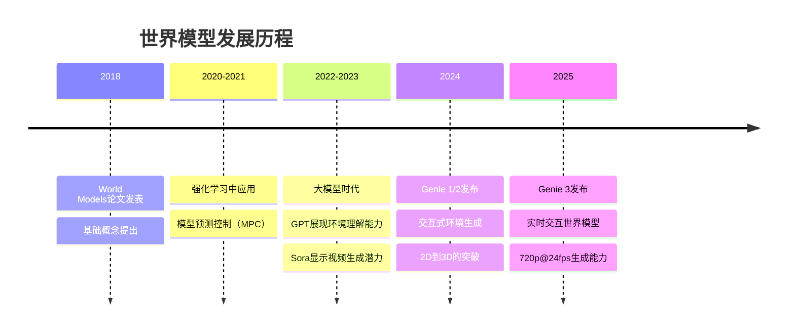
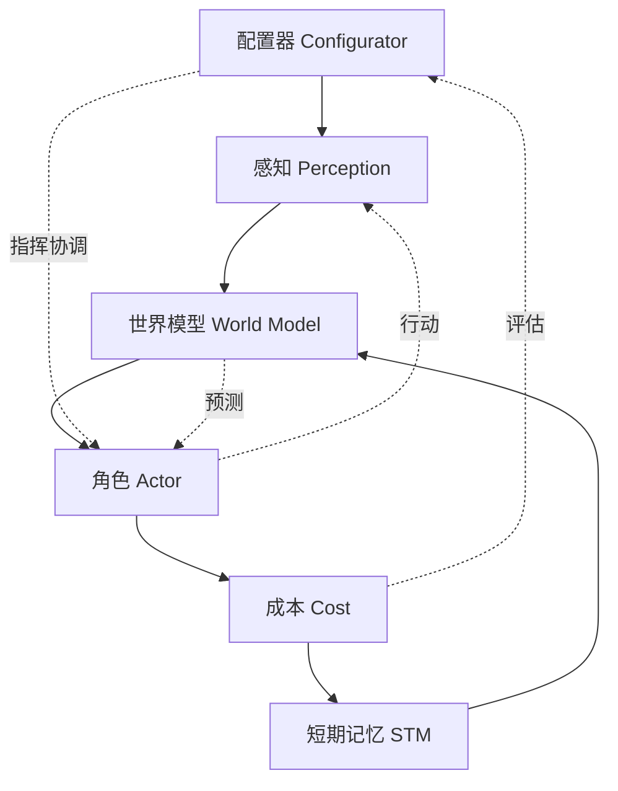
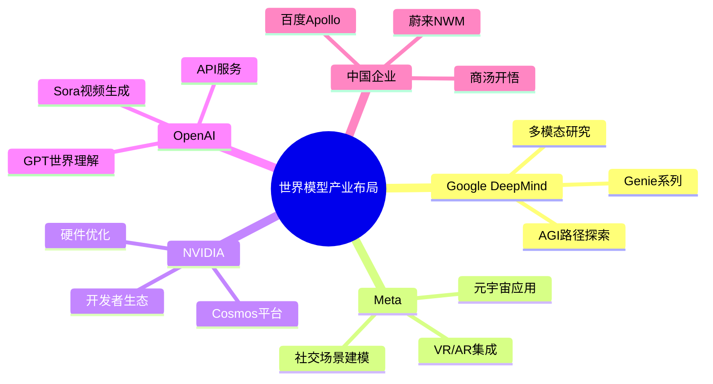

# 世界模型技术架构详解

🏷 #世界模型 #生成式AI #多模态 #环境建模 #AGI

> **标签**: 世界模型 | 生成式模型 | 多模态AI | 环境建模 | 物理仿真  
> **适用场景**: 自动驾驶、机器人控制、游戏引擎、虚拟现实、AGI研究  
> **难度级别**: ⭐⭐⭐⭐⭐

---

## 📋 概述

世界模型（World Models）是AI系统对物理或虚拟环境进行高度抽象与因果理解的内部表征技术。它不仅能感知和记忆环境状态，还能推理行动后果、预测未来变化，实现对世界动态的完整模拟和理解。与传统AI侧重相关性和模式识别不同，世界模型强调因果推理和时空一致性。

## 🧠 术语速查表（大白话 vs 专业解释）

| 大白话 | 专业术语 | 解释 |
|--------|----------|------|
| **虚拟世界生成器** | World Model | AI系统内建的环境模拟引擎 |
| **看图说话** | 多模态感知 | 整合视觉、语言、触觉等多种输入 |
| **预知未来** | 动态预测 | 基于当前状态推测未来变化 |
| **懂因果关系** | 因果推理 | 理解行动与结果的逻辑关系 |
| **实时生成** | Real-time Rendering | 24fps以上的流畅视频生成 |
| **记忆一致性** | Temporal Consistency | 长时间保持世界状态的连贯性 |

## 🔗 相关文档链接

- **基础架构**: [[Transformer架构原理|Transformer架构原理]]、[[RAG检索增强生成技术详解|RAG技术]]
- **生成技术**: [[扩散模型图像生成原理|扩散模型]]、[[VAE变分自编码器原理|VAE]]
- **多模态技术**: [[Embedding向量嵌入技术全面教程|Embedding技术]]
- **智能代理**: [[AI_Agent与多Agent系统架构全览|AI Agent系统]]、[[具身智能技术架构|具身智能]]

---

## 🌍 一、世界模型核心概念

### 1.1 定义与本质

**什么是世界模型？**
- **内部表征**：AI系统对外部世界的内在理解和抽象
- **动态仿真**：能够预测环境变化和行动后果的模拟器
- **因果理解**：不仅知道"是什么"，更理解"为什么"和"会怎样"

**与传统AI的区别**：

| 维度 | 传统AI | 世界模型 |
|------|--------|----------|
| **认知方式** | 模式识别、相关性学习 | 因果理解、物理约束 |
| **时间理解** | 静态分析 | 动态预测 |
| **交互能力** | 被动响应 | 主动仿真 |
| **泛化能力** | 有限场景 | 通用环境理解 |

### 1.2 技术发展脉络



---

## ⚙️ 二、技术原理深度解析

### 2.1 核心技术组件

#### (1) 多模态感知与表征学习

**感知融合架构**：
```python
class MultiModalPerception:
    def __init__(self):
        self.vision_encoder = VisionTransformer()
        self.language_encoder = TextTransformer() 
        self.audio_encoder = AudioTransformer()
        self.fusion_layer = CrossModalAttention()
    
    def encode_world_state(self, visual, text, audio):
        # 多模态特征提取
        v_feat = self.vision_encoder(visual)
        t_feat = self.language_encoder(text)
        a_feat = self.audio_encoder(audio)
        
        # 跨模态融合
        world_repr = self.fusion_layer(v_feat, t_feat, a_feat)
        return world_repr
```

**关键技术要点**：
- **视觉理解**：3D场景重建、物体识别、空间关系理解
- **语言理解**：指令解析、意图识别、概念映射
- **物理感知**：运动轨迹、碰撞检测、重力效应

#### (2) 动态预测与时序建模

**预测模型架构**：
```python
class WorldDynamicsModel:
    def __init__(self):
        self.state_encoder = StateEncoder()
        self.action_encoder = ActionEncoder()
        self.dynamics_predictor = TransformerDecoder()
        self.physics_constraints = PhysicsLayer()
    
    def predict_next_state(self, current_state, action):
        # 状态-动作编码
        state_emb = self.state_encoder(current_state)
        action_emb = self.action_encoder(action)
        
        # 动态预测
        predicted_delta = self.dynamics_predictor(state_emb, action_emb)
        
        # 物理约束
        next_state = self.physics_constraints(
            current_state + predicted_delta
        )
        return next_state
```

#### (3) 因果推理与物理约束

**因果推理机制**：
- **时间因果性**：前序状态决定后续状态
- **空间因果性**：局部交互影响全局状态
- **物理一致性**：遵循重力、碰撞、运动定律

### 2.2 Yann LeCun的自主智能架构

**六大核心模块**：



**各模块功能详解**：

1. **配置器（Configurator）**
   - 协调指挥中心
   - 设定目标和约束
   - 任务规划和资源分配

2. **感知（Perception）**
   - 感知世界状态
   - 提取任务相关信息
   - 多模态信息融合

3. **世界模型（World Model）**
   - 估计未观测的世界信息
   - 预测未来世界状态
   - 维护环境的内部表征

4. **角色（Actor）**
   - 寻找最优行动方案
   - 执行具体操作
   - 与环境进行交互

5. **成本（Cost）**
   - 计算智能体的不适值
   - 评估行动效果
   - 提供优化目标

6. **短期记忆（Short Term Memory）**
   - 跟踪当前世界状态
   - 存储预测结果
   - 维护相关成本信息

---

## 🚀 三、前沿技术突破：Genie系列

### 3.1 Genie演进历程

#### Genie 1 (2024年初)
**技术特点**：
- **生成能力**：2D横版游戏风格
- **分辨率**：256×256像素
- **时长**：几十帧后出现故障
- **意义**：证明了AI生成交互环境的可行性

#### Genie 2 (2024年12月)
**重大突破**：
- **维度升级**：从2D到3D图形
- **视角控制**：支持第一人称和第三人称
- **性能提升**：360p分辨率，15fps帧率
- **时长扩展**：10-20秒连续生成

#### Genie 3 (2025年)
**革命性进展**：

| 指标 | Genie 2 | Genie 3 | 提升幅度 |
|------|---------|---------|----------|
| **分辨率** | 360p | 720p | 4倍像素 |
| **帧率** | 15fps | 24fps | 60%提升 |
| **时长** | 10-20秒 | 数分钟 | 10倍以上 |
| **一致性** | 短期 | 1分钟视觉记忆 | 质的飞跃 |

### 3.2 Genie 3技术亮点

#### (1) 实时交互能力
```python
# Genie 3 实时交互示例
class GenieWorldModel:
    def __init__(self):
        self.world_state = WorldState()
        self.renderer = RealTimeRenderer(fps=24)
        self.memory = VisualMemory(duration=60)  # 60秒视觉记忆
    
    def interactive_generation(self, user_input):
        # 多模态输入处理
        if user_input.type == "text":
            world_change = self.text_to_world(user_input.content)
        elif user_input.type == "sketch":
            world_change = self.sketch_to_world(user_input.image)
        
        # 实时世界更新
        self.world_state.update(world_change)
        
        # 24fps实时渲染
        frame = self.renderer.render(self.world_state)
        return frame
```

#### (2) 多模态输入支持
- **文本指令**："将晴天改为暴风雨"
- **草图输入**：手绘sketch直接转换为3D场景
- **图像引导**：上传照片作为环境参考
- **语音控制**：自然语言实时指令

#### (3) 动态世界编辑
**即时环境变换**：
```python
# 动态世界编辑能力
world_edits = {
    "weather_change": "sunny -> hurricane",
    "character_addition": "add fantasy dragon",
    "portal_creation": "create magical portal",
    "physics_modification": "reduce gravity by 50%"
}

for edit in world_edits:
    world_model.apply_edit(edit, maintain_consistency=True)
```

---

## 🎯 四、技术流派对比

### 4.1 Transformer学派 vs 世界模型学派

| 维度 | Transformer学派 | 世界模型学派 |
|------|----------------|-------------|
| **代表人物** | OpenAI团队 | Yann LeCun |
| **代表作品** | GPT系列、Sora | Genie系列 |
| **核心理念** | 大数据驱动自回归 | 因果理解环境建模 |
| **优势** | 强大的语言能力 | 深度环境理解 |
| **局限** | 缺乏真实世界理解 | 计算复杂度高 |

### 4.2 技术路线分析

#### Transformer路线
**技术特点**：
```python
# Transformer自回归生成
def transformer_generation(prompt, model):
    tokens = tokenize(prompt)
    for i in range(max_length):
        next_token = model.predict_next(tokens)
        tokens.append(next_token)
    return detokenize(tokens)
```

**优势**：
- 训练相对简单
- 大规模数据利用效率高
- 语言理解能力强

**局限**：
- 缺乏真实物理理解
- 长期一致性较差
- 难以处理复杂交互

#### 世界模型路线
**技术特点**：
```python
# 世界模型因果生成
def world_model_generation(initial_state, actions):
    current_state = initial_state
    trajectory = [current_state]
    
    for action in actions:
        # 因果预测下一状态
        next_state = world_model.predict_dynamics(
            current_state, action, 
            physics_constraints=True
        )
        trajectory.append(next_state)
        current_state = next_state
    
    return trajectory
```

**优势**：
- 深度环境理解
- 因果关系建模
- 长期一致性好

**挑战**：
- 计算复杂度极高
- 需要海量多模态数据
- 物理建模困难

---

## 🛠️ 五、实际应用场景

### 5.1 自动驾驶领域

#### 技术应用
**蔚来NWM（NIO World Model）**：
```python
class NIOWorldModel:
    def __init__(self):
        self.spatial_understanding = SpatialEncoder()
        self.temporal_modeling = TemporalPredictor()
        self.rare_scenario_generator = ScenarioSimulator()
    
    def simulate_driving_scenario(self, current_scene):
        # 空间理解
        spatial_repr = self.spatial_understanding(current_scene)
        
        # 时间预测
        future_scenarios = self.temporal_modeling(spatial_repr)
        
        # 罕见事故场景模拟
        rare_events = self.rare_scenario_generator.generate_rare_cases()
        
        return future_scenarios + rare_events
```

**核心能力**：
- **空间理解**：3D场景重建，障碍物识别
- **时间理解**：轨迹预测，行为建模
- **罕见场景**：生成训练数据中缺乏的危险情况

#### 商汤"开悟"世界模型
**技术特色**：
- **物理世界重建**：结合仿真数据与真实数据
- **数据增强**：生成长尾场景训练数据
- **安全验证**：虚拟环境中测试极端情况

### 5.2 机器人控制

**应用优势**：
```python
class RobotWorldModel:
    def __init__(self):
        self.env_model = EnvironmentModel()
        self.object_dynamics = ObjectDynamics()
        self.manipulation_planner = ManipulationPlanner()
    
    def plan_manipulation(self, target_object, goal_state):
        # 环境建模
        env_state = self.env_model.get_current_state()
        
        # 物体动力学预测
        object_behavior = self.object_dynamics.predict(
            target_object, env_state
        )
        
        # 操作规划
        action_sequence = self.manipulation_planner.plan(
            env_state, object_behavior, goal_state
        )
        
        return action_sequence
```

### 5.3 虚拟现实与游戏

#### Genie 3在VR中的应用
**突破性功能**：
- **实时世界生成**：24fps流畅VR体验
- **自然交互**：语音、手势、眼神控制
- **无限扩展**：程序化生成无边界世界

**技术实现**：
```python
class VRWorldGenerator:
    def __init__(self):
        self.genie_model = Genie3WorldModel()
        self.vr_renderer = VRRenderer()
        self.user_tracker = UserInteractionTracker()
    
    def generate_vr_world(self, user_prompt):
        # 基于用户描述生成世界
        world_description = self.genie_model.parse_prompt(user_prompt)
        
        # 实时渲染VR场景
        vr_scene = self.vr_renderer.create_scene(world_description)
        
        # 用户交互追踪
        interactions = self.user_tracker.get_interactions()
        
        # 动态世界更新
        updated_world = self.genie_model.update_world(
            vr_scene, interactions
        )
        
        return updated_world
```

### 5.4 科学研究与仿真

**物理仿真**：
- **分子动力学**：蛋白质折叠预测
- **气候建模**：天气系统仿真
- **材料科学**：新材料性质预测

**优势对比**：

| 传统仿真 | 世界模型仿真 |
|---------|-------------|
| 基于物理公式 | 基于数据驱动 |
| 计算精确但慢 | 近似但极快 |
| 需要专业知识 | 自动学习规律 |
| 难以处理复杂系统 | 擅长复杂动态 |

---

## 🚧 六、技术挑战与局限

### 6.1 当前技术限制

#### (1) 计算复杂度
**挑战描述**：
```python
# 世界模型计算复杂度分析
def compute_complexity_analysis():
    # 多模态输入处理
    perception_cost = O(M * N * P)  # M模态, N分辨率, P时长
    
    # 3D世界状态表征  
    world_repr_cost = O(W * H * D * T)  # W宽, H高, D深, T时间
    
    # 动态预测计算
    dynamics_cost = O(S * A * F)  # S状态, A动作, F未来帧数
    
    # 实时渲染
    rendering_cost = O(R * F)  # R分辨率, F帧率
    
    total_cost = (perception_cost + world_repr_cost + 
                  dynamics_cost + rendering_cost)
    
    return total_cost
```

**资源需求**：
- **GPU内存**：Genie 3需要数百GB GPU内存
- **计算性能**：实时24fps需要强大的并行计算
- **存储空间**：世界状态需要TB级存储

#### (2) 数据需求巨大
**训练数据要求**：
- **多模态数据**：视频+音频+文本+3D扫描
- **高质量标注**：精确的时空标注
- **长时序数据**：分钟级连续交互数据
- **多样性要求**：覆盖各种场景和条件

#### (3) 一致性维护困难
**长期一致性挑战**：
```python
class ConsistencyChallenge:
    def __init__(self):
        self.temporal_drift = "时间漂移问题"
        self.spatial_inconsistency = "空间不一致"
        self.physics_violation = "物理规律违反"
        self.memory_limitation = "记忆容量限制"
    
    def identify_issues(self, world_sequence):
        issues = []
        
        # 检测时间漂移
        if self.detect_temporal_drift(world_sequence):
            issues.append("世界状态随时间累积偏差")
        
        # 检测空间不一致
        if self.detect_spatial_inconsistency(world_sequence):
            issues.append("同一物体在不同视角不一致")
        
        return issues
```

### 6.2 技术瓶颈分析

#### (1) 物理建模精度
**问题领域**：
- **复杂物理现象**：流体力学、弹性变形
- **多体交互**：碰撞、摩擦、约束
- **量子效应**：微观世界行为
- **混沌系统**：天气、生态系统

#### (2) 实时性要求
**性能指标**：

| 应用场景 | 帧率要求 | 延迟要求 | 一致性要求 |
|---------|----------|----------|-----------|
| **VR/AR** | >90fps | <20ms | 完美 |
| **游戏** | >60fps | <50ms | 高 |
| **自动驾驶** | >30fps | <100ms | 极高 |
| **机器人** | >20fps | <200ms | 高 |

#### (3) 可控性与安全性
**风险因素**：
```python
class SafetyRisks:
    def __init__(self):
        self.hallucination_risk = "生成虚假物理现象"
        self.bias_propagation = "训练数据偏差放大"
        self.adversarial_attacks = "对抗样本攻击"
        self.misuse_potential = "恶意使用风险"
    
    def safety_evaluation(self, world_model):
        safety_score = 0
        
        # 评估生成内容真实性
        realism_score = self.evaluate_realism(world_model)
        
        # 评估偏差和公平性
        fairness_score = self.evaluate_fairness(world_model)
        
        # 评估鲁棒性
        robustness_score = self.evaluate_robustness(world_model)
        
        safety_score = (realism_score + fairness_score + 
                       robustness_score) / 3
        
        return safety_score
```

---

## 🔮 七、发展趋势与未来展望

### 7.1 2025年技术趋势

#### (1) 原生多模态大模型
**发展方向**：
- **统一架构**：从训练之初即打通所有模态
- **端到端学习**：输入到输出的完整优化
- **跨模态理解**：深度的模态间语义对齐

#### (2) 神经符号AI融合
**技术融合**：
```python
class NeuralSymbolicWorldModel:
    def __init__(self):
        self.neural_perception = NeuralNetwork()
        self.symbolic_reasoning = SymbolicEngine()
        self.knowledge_graph = WorldKnowledge()
    
    def hybrid_reasoning(self, observation):
        # 神经网络感知
        neural_features = self.neural_perception(observation)
        
        # 符号推理
        symbolic_facts = self.symbolic_reasoning.extract_facts(
            neural_features
        )
        
        # 知识图谱增强
        enhanced_understanding = self.knowledge_graph.enrich(
            symbolic_facts
        )
        
        return enhanced_understanding
```

#### (3) 量子计算集成
**潜在突破**：
- **并行计算**：量子并行处理复杂世界状态
- **概率建模**：量子概率天然适合不确定性建模
- **优化算法**：量子优化算法加速训练

### 7.2 产业化前景

#### (1) 市场规模预测
**增长趋势**：

| 年份 | 市场规模 | 应用领域 | 主要驱动因素 |
|------|----------|----------|-------------|
| **2025** | $10B | 自动驾驶、游戏 | Genie 3等突破 |
| **2027** | $50B | VR/AR、机器人 | 硬件性能提升 |
| **2030** | $200B | 通用AGI应用 | 技术全面成熟 |

#### (2) 关键玩家布局

**科技巨头策略**：



### 7.3 技术发展路线图

#### 短期目标（2025-2026）
- **性能提升**：1080p@60fps实时生成
- **时长扩展**：10分钟以上连续一致性
- **成本降低**：消费级硬件支持

#### 中期目标（2027-2028）
- **通用化**：跨领域世界模型
- **交互升级**：自然语言完整控制
- **物理精度**：接近真实世界水平

#### 长期愿景（2030+）
- **AGI集成**：世界模型作为AGI核心组件
- **现实融合**：虚拟与现实无缝结合
- **创造性生成**：AI独立创造新世界

---

## 🎯 八、最佳实践与建议

### 8.1 技术选型指南

#### (1) 应用场景匹配
```python
def choose_world_model_approach(use_case):
    """根据应用场景选择合适的世界模型方法"""
    
    if use_case == "real_time_gaming":
        return {
            "model": "Genie-3-lite",
            "resolution": "720p",
            "fps": 60,
            "consistency": "medium"
        }
    
    elif use_case == "autonomous_driving":
        return {
            "model": "Physics-constrained-world-model",
            "resolution": "1080p", 
            "fps": 30,
            "consistency": "high",
            "safety": "critical"
        }
    
    elif use_case == "scientific_simulation":
        return {
            "model": "High-precision-physics-model",
            "accuracy": "high",
            "speed": "medium",
            "interpretability": "high"
        }
```

#### (2) 硬件资源规划
**最低配置要求**：

| 应用类型 | GPU内存 | 计算能力 | 存储空间 |
|---------|---------|----------|----------|
| **原型开发** | 24GB | RTX 4090 | 500GB |
| **小规模部署** | 48GB | A100 | 2TB |
| **生产环境** | 80GB | H100 | 10TB |
| **大规模服务** | 多卡集群 | 数据中心 | PB级 |

### 8.2 开发实践建议

#### (1) 数据准备策略
```python
class WorldModelDataPipeline:
    def __init__(self):
        self.data_collectors = {
            "visual": VideoDataCollector(),
            "audio": AudioDataCollector(), 
            "text": TextDataCollector(),
            "3d": SpatialDataCollector()
        }
    
    def prepare_training_data(self):
        # 多模态数据收集
        visual_data = self.data_collectors["visual"].collect(
            sources=["internet_videos", "game_recordings", "simulations"]
        )
        
        # 数据质量过滤
        filtered_data = self.quality_filter(visual_data)
        
        # 时空对齐
        aligned_data = self.temporal_spatial_alignment(filtered_data)
        
        # 标注增强
        annotated_data = self.auto_annotation(aligned_data)
        
        return annotated_data
```

#### (2) 模型训练优化
**训练策略**：
```python
class WorldModelTrainer:
    def __init__(self):
        self.curriculum_learning = CurriculumLearning()
        self.multi_task_learning = MultiTaskLearning()
        self.regularization = ConsistencyRegularization()
    
    def train_world_model(self, data):
        # 课程学习：从简单到复杂
        training_stages = self.curriculum_learning.design_curriculum()
        
        for stage in training_stages:
            # 多任务联合训练
            losses = self.multi_task_learning.compute_losses(
                perception_loss=self.perception_loss,
                dynamics_loss=self.dynamics_loss,
                consistency_loss=self.regularization.consistency_loss
            )
            
            # 优化更新
            self.optimizer.step(losses)
```

#### (3) 评估与测试
**评估框架**：
```python
class WorldModelEvaluator:
    def __init__(self):
        self.metrics = {
            "visual_quality": FID, LPIPS, SSIM,
            "temporal_consistency": TemporalConsistency(),
            "physics_accuracy": PhysicsAccuracy(),
            "user_preference": HumanEvaluation()
        }
    
    def comprehensive_evaluation(self, model, test_data):
        results = {}
        
        for metric_name, metric_fn in self.metrics.items():
            score = metric_fn.evaluate(model, test_data)
            results[metric_name] = score
        
        # 综合评分
        overall_score = self.compute_overall_score(results)
        
        return {
            "individual_scores": results,
            "overall_score": overall_score,
            "recommendations": self.generate_recommendations(results)
        }
```

---

## 🔗 九、相关资源与工具

### 9.1 开源项目
- **World Models**: [原始论文实现](https://github.com/worldmodels/worldmodels.github.io)
- **MuJoCo**: 物理仿真引擎
- **Habitat-Sim**: Facebook AI的3D环境仿真
- **AI2-THOR**: 艾伦研究院的交互环境

### 9.2 研究论文
- **经典论文**: "World Models" by Ha & Schmidhuber (2018)
- **最新进展**: "Genie: Generative Interactive Environments" (2024)
- **理论基础**: LeCun的自主智能架构论文

### 9.3 开发工具
- **训练框架**: PyTorch, JAX, TensorFlow
- **可视化工具**: Weights & Biases, TensorBoard
- **部署平台**: NVIDIA Triton, TorchServe

---

## 🎯 十、总结与展望

世界模型代表了AI技术发展的重要方向，它不仅仅是一个技术概念，更是通向AGI的关键路径之一。从Genie 3的突破性进展可以看出，我们正站在一个技术革命的临界点。

**核心价值**：
- **深度理解**：超越模式识别，实现真正的世界理解
- **创造能力**：不仅理解现有世界，还能创造新的可能
- **交互体验**：实现人与AI的自然、直观交互

**未来机遇**：
- **产业变革**：游戏、教育、训练、设计等行业的根本性变革
- **创新应用**：催生前所未有的新应用和新体验
- **AGI突破**：作为通用人工智能的重要技术基础

世界模型技术仍在快速发展中，我们有理由相信，它将成为下一个改变世界的AI技术突破点。

---

## 🔗 相关文档

- **基础架构**: [[Transformer架构原理|Transformer架构原理]]、[[扩散模型图像生成原理|扩散模型]]
- **智能代理**: [[AI_Agent与多Agent系统架构全览|AI Agent系统]]、[[具身智能技术架构|具身智能]]
- **多模态技术**: [[Embedding向量嵌入技术全面教程|Embedding技术]]、[[RAG检索增强生成技术详解|RAG技术]]
- **开发生态**: [[Hugging Face生态全面指南|Hugging Face生态]]

---

**更新时间**: 2025年1月  
**维护者**: AI知识库团队  
**难度评级**: ⭐⭐⭐⭐⭐ (需要深度的多学科知识和前沿技术理解)