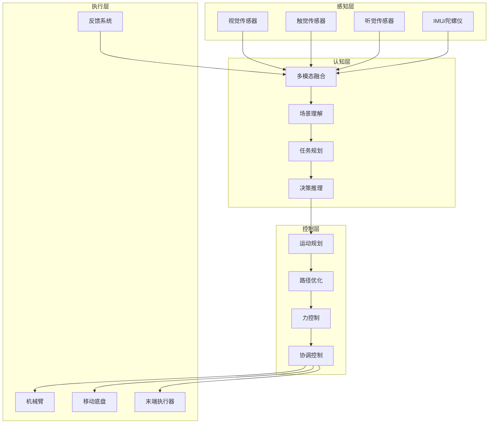

# 具身智能技术架构

> **作用**：让AI能够通过物理身体与真实世界交互，实现感知-理解-行动的闭环
> **层级**：K2-技术方法与实现 → 模型架构
> **关联**：[[AI_Agent与多Agent系统架构全览]]、[[Transformer架构原理]]、[[MCP协议与AI万物互联]]、[[K1-基础理论与概念/核心概念/损失函数与训练调优术语名词库|术语名词库（大白话对照）]]

---

## 📌 概念定义

**具身智能（Embodied Intelligence）**是指AI系统通过物理实体（机器人、虚拟化身等）与环境进行交互，在感知和行动的循环中不断学习和适应的智能形态。它强调智能不仅存在于"大脑"中，更体现在与环境的互动过程中。

### 🎯 核心特征
- **感知-行动闭环**：通过传感器感知环境，通过执行器改变环境
- **多模态融合**：整合视觉、听觉、触觉等多种感知信息
- **实时适应**：根据环境反馈动态调整行为策略
- **物理约束**：必须遵守物理世界的规律和限制

---

## 🏗️ 技术架构

### 🔄 系统架构图


---

## 🧠 核心技术

### 1️⃣ 多模态感知融合

#### **视觉理解**
- 3D场景重建
- 物体检测与识别
- 深度估计
- 运动预测

#### **触觉感知**
- 力/力矩传感
- 纹理识别
- 滑动检测
- 柔性抓取

#### **融合算法**
```python
# 伪代码示例
class MultiModalFusion:
    def __init__(self):
        self.vision_encoder = VisionTransformer()
        self.tactile_encoder = TactileNet()
        self.fusion_layer = CrossAttention()
    
    def fuse_modalities(self, vision_data, tactile_data):
        v_features = self.vision_encoder(vision_data)
        t_features = self.tactile_encoder(tactile_data)
        fused = self.fusion_layer(v_features, t_features)
        return fused
```

### 2️⃣ 世界模型构建

基于[[Transformer架构原理|Transformer]]的世界模型，预测环境动态：

- **状态表示**：将环境编码为离散token
- **动态预测**：预测下一时刻的环境状态
- **因果推理**：理解动作与结果的关系
- **不确定性建模**：处理感知和预测的不确定性

### 3️⃣ 策略学习方法

#### **强化学习框架**
- 模拟环境预训练
- 真实环境微调
- 安全性约束
- 样本效率优化

#### **模仿学习**
- 专家演示收集
- 行为克隆
- 逆强化学习
- 在线适应

---

## 🔗 与其他技术的关系

### 🤝 技术协同

1. **与[[AI_Agent与多Agent系统架构全览|AI Agent]]的结合**
   - Agent提供高层决策
   - 具身智能执行物理操作
   - 形成完整的感知-决策-执行链路

2. **与[[RAG检索增强生成技术详解|RAG]]的集成**
   - 检索相关操作知识
   - 增强任务理解能力
   - 提供操作指导

3. **与[[MCP协议与AI万物互联|MCP协议]]的连接**
   - 标准化硬件接口
   - 跨设备协作
   - 分布式计算

---

## 💡 关键挑战与解决方案

### ⚠️ 技术挑战

| 挑战 | 描述 | 解决方案 |
|------|------|----------|
| **仿真到现实差距** | 模拟环境与真实世界的差异 | 域随机化、渐进式迁移 |
| **实时性要求** | 毫秒级响应时间 | 边缘计算、模型压缩 |
| **安全性保证** | 避免对人和环境造成伤害 | 约束优化、安全强化学习 |
| **泛化能力** | 适应新环境和任务 | 元学习、持续学习 |

### 🔧 技术突破

1. **神经符号结合**
   - 符号推理提供可解释性
   - 神经网络处理感知数据
   - 混合架构提升鲁棒性

2. **分层控制架构**
   ```
   高层：任务规划（秒级）
   中层：运动规划（百毫秒级）
   低层：反射控制（毫秒级）
   ```

3. **自监督学习**
   - 利用机器人自身经验
   - 减少标注数据需求
   - 持续改进性能

---

## 🚀 应用场景

### 🏭 工业制造
- **精密装配**：手机、汽车零部件组装
- **质量检测**：基于视觉和触觉的缺陷检测
- **柔性生产**：快速切换不同产品线

### 🏥 医疗健康
- **手术机器人**：微创手术、远程手术
- **康复训练**：个性化康复方案
- **护理辅助**：协助老年人日常生活

### 🏠 服务机器人
- **家庭助手**：清洁、整理、烹饪
- **物流配送**：最后一公里配送
- **接待服务**：酒店、餐厅服务

### 🚗 自动驾驶
- **环境感知**：360度全方位感知
- **决策规划**：复杂场景处理
- **人机交互**：与行人、其他车辆互动

---

## 📊 性能评估指标

### 📈 关键指标

1. **任务成功率**
   - 完成指定任务的比例
   - 不同难度任务的表现

2. **效率指标**
   - 任务完成时间
   - 能源消耗
   - 计算资源使用

3. **鲁棒性指标**
   - 环境变化适应性
   - 噪声干扰容忍度
   - 故障恢复能力

4. **安全性指标**
   - 碰撞次数
   - 力控制精度
   - 紧急停止响应时间

---

## 🔮 未来发展方向

### 📅 技术路线图

**短期（1-2年）**
- 提升单任务性能
- 改进仿真环境
- 优化硬件成本

**中期（3-5年）**
- 多任务通用能力
- 自主学习新技能
- 人机协作增强

**长期（5-10年）**
- 通用具身智能
- 群体协作智能
- 认知能力突破

### 🌟 研究热点

1. **大模型赋能**
   - 将LLM能力迁移到具身智能
   - 自然语言任务描述
   - 常识推理增强

2. **元宇宙融合**
   - 虚实结合的训练环境
   - 数字孪生技术
   - 远程操控体验

3. **生物启发设计**
   - 仿生材料和结构
   - 神经形态计算
   - 自适应形态

---

## 📚 学习资源

### 🎓 推荐学习路径
1. 机器人学基础（运动学、动力学）
2. 计算机视觉和深度学习
3. 强化学习理论与实践
4. ROS/ROS2机器人操作系统
5. 具身智能前沿论文

### 🛠️ 开发工具
- **仿真平台**：Isaac Sim、Gazebo、MuJoCo
- **机器学习**：PyTorch、TensorFlow、JAX
- **机器人框架**：ROS2、NVIDIA Isaac SDK
- **硬件平台**：UR系列、Franka、Boston Dynamics

---

## 🎯 总结

具身智能代表了AI发展的重要方向：
- 🤖 **物理交互**：从纯数字到物理世界
- 🧠 **认知闭环**：感知-理解-行动的完整循环
- 🔧 **实际应用**：解决真实世界的复杂问题
- 🌍 **广阔前景**：改变人类生活和工作方式

它不仅是技术挑战，更是通向通用人工智能（AGI）的必经之路。通过将智能"具身化"，我们正在创造能够真正理解和改变物理世界的AI系统。

---

## 🔗 相关文档

- **基础理论**: [[Transformer架构原理|Transformer架构原理]]、[[RAG检索增强生成技术详解|RAG技术]]
- **技术方法**: [[AI_Agent与多Agent系统架构全览|AI Agent系统]]、[[扩散模型图像生成原理|扩散模型]]、[[世界模型技术架构详解|世界模型]]
- **工具平台**: [[向量数据库技术基础|向量数据库]]、[[Hugging Face生态全面指南|Hugging Face生态]]
