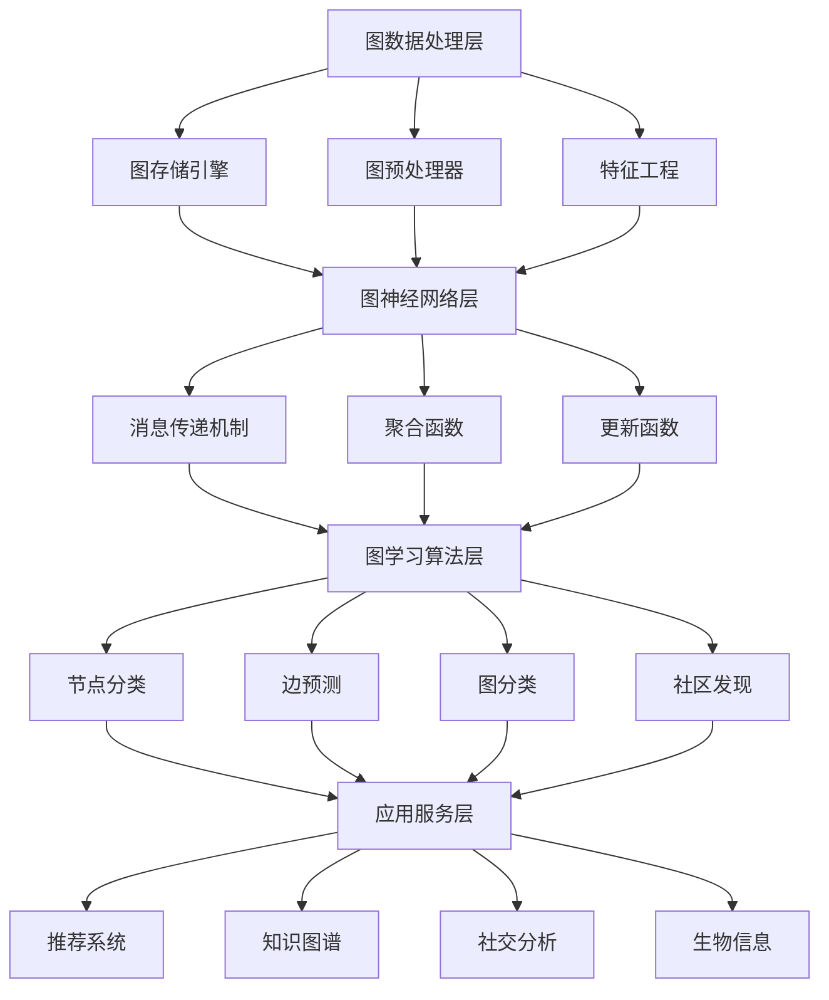

# 图学习系统基础

> **定位**：处理图结构数据的机器学习系统核心技术
> **作者**：Claude
> **创建时间**：2025年8月22日
> **标签**：#图学习 #图神经网络 #GNN #图数据库 #社交网络

---

## 📝 核心概念

**图学习系统** 是专门处理图结构数据的机器学习平台，通过图神经网络（GNN）等技术分析节点、边和图的特征，广泛应用于社交网络、知识图谱、推荐系统、生物信息学等领域。

### 🎯 核心价值

1. **关系建模**：捕获复杂的实体间关系
2. **结构学习**：利用图的拓扑结构信息
3. **传播计算**：通过消息传递学习表示
4. **可解释性**：提供基于图结构的解释

---

## 🏗️ 图学习系统架构

### 1️⃣ 总体架构


### 2️⃣ 图数据模型

#### 📊 图结构表示
```python
class GraphDataModel:
    def __init__(self):
        self.graph_types = {
            'undirected': '无向图',
            'directed': '有向图',
            'weighted': '加权图',
            'multipartite': '多部图',
            'temporal': '时序图',
            'heterogeneous': '异构图'
        }

    def create_graph_representation(self, graph_data):
        """创建图表示"""
        # 1. 节点表示
        nodes = {}
        for node_id, node_attrs in graph_data['nodes'].items():
            nodes[node_id] = {
                'features': node_attrs.get('features', []),
                'labels': node_attrs.get('labels', []),
                'metadata': node_attrs.get('metadata', {})
            }

        # 2. 边表示
        edges = {}
        for edge_id, edge_attrs in graph_data['edges'].items():
            edges[edge_id] = {
                'source': edge_attrs['source'],
                'target': edge_attrs['target'],
                'weight': edge_attrs.get('weight', 1.0),
                'features': edge_attrs.get('features', []),
                'edge_type': edge_attrs.get('type', 'default')
            }

        # 3. 邻接矩阵构建
        adjacency_matrix = self.build_adjacency_matrix(nodes, edges)

        # 4. 特征矩阵构建
        node_feature_matrix = self.build_feature_matrix(nodes)
        edge_feature_matrix = self.build_edge_feature_matrix(edges)

        return {
            'nodes': nodes,
            'edges': edges,
            'adjacency_matrix': adjacency_matrix,
            'node_features': node_feature_matrix,
            'edge_features': edge_feature_matrix,
            'graph_metadata': graph_data.get('metadata', {})
        }

    def build_adjacency_matrix(self, nodes, edges):
        """构建邻接矩阵"""
        num_nodes = len(nodes)
        node_ids = list(nodes.keys())
        node_id_to_index = {node_id: i for i, node_id in enumerate(node_ids)}

        adjacency_matrix = np.zeros((num_nodes, num_nodes))

        for edge in edges.values():
            src_idx = node_id_to_index[edge['source']]
            tgt_idx = node_id_to_index[edge['target']]
            weight = edge.get('weight', 1.0)

            adjacency_matrix[src_idx, tgt_idx] = weight

            # 如果是无向图，对称填充
            if self.graph_type == 'undirected':
                adjacency_matrix[tgt_idx, src_idx] = weight

        return adjacency_matrix

    def graph_sampling_strategies(self, large_graph, target_size):
        """图采样策略"""
        sampling_methods = {
            'random_node_sampling': self.random_node_sampling,
            'random_walk_sampling': self.random_walk_sampling,
            'breadth_first_sampling': self.breadth_first_sampling,
            'importance_sampling': self.importance_sampling
        }

        sampled_graphs = {}
        for method_name, method_func in sampling_methods.items():
            sampled_graph = method_func(large_graph, target_size)
            sampled_graphs[method_name] = sampled_graph

        return sampled_graphs

    def random_walk_sampling(self, graph, walk_length, num_walks):
        """随机游走采样"""
        sampled_nodes = set()
        sampled_edges = set()

        for _ in range(num_walks):
            # 随机选择起始节点
            start_node = random.choice(list(graph.nodes.keys()))
            current_node = start_node

            # 执行随机游走
            for _ in range(walk_length):
                sampled_nodes.add(current_node)

                # 获取邻居节点
                neighbors = self.get_neighbors(graph, current_node)
                if not neighbors:
                    break

                # 随机选择下一个节点
                next_node = random.choice(neighbors)
                sampled_edges.add((current_node, next_node))
                current_node = next_node

        return self.create_subgraph(graph, sampled_nodes, sampled_edges)
```

---

## 🧠 图神经网络架构

### 1️⃣ 消息传递框架
```python
class MessagePassingFramework:
    def __init__(self):
        self.gnn_architectures = {
            'GCN': GraphConvolutionalNetwork,
            'GraphSAGE': GraphSAGE,
            'GAT': GraphAttentionNetwork,
            'GIN': GraphIsomorphismNetwork,
            'GraphTransformer': GraphTransformer
        }

    def message_passing_step(self, graph, node_features, edge_features):
        """消息传递步骤"""
        num_nodes = graph.num_nodes()
        new_node_features = np.zeros_like(node_features)

        for node_id in range(num_nodes):
            # 1. 消息计算
            messages = self.compute_messages(
                graph, node_id, node_features, edge_features
            )

            # 2. 消息聚合
            aggregated_message = self.aggregate_messages(messages)

            # 3. 节点更新
            new_node_features[node_id] = self.update_node_feature(
                node_features[node_id], aggregated_message
            )

        return new_node_features

    def compute_messages(self, graph, target_node, node_features, edge_features):
        """计算消息"""
        messages = []
        neighbors = graph.get_neighbors(target_node)

        for neighbor_id in neighbors:
            # 获取边特征
            edge_id = graph.get_edge_id(neighbor_id, target_node)
            edge_feature = edge_features[edge_id] if edge_id else None

            # 计算消息
            message = self.message_function(
                node_features[neighbor_id],    # 邻居节点特征
                node_features[target_node],    # 目标节点特征
                edge_feature                   # 边特征
            )
            messages.append(message)

        return messages

    def aggregate_messages(self, messages):
        """聚合消息"""
        if not messages:
            return np.zeros(self.feature_dim)

        # 支持多种聚合方式
        aggregation_methods = {
            'mean': lambda x: np.mean(x, axis=0),
            'sum': lambda x: np.sum(x, axis=0),
            'max': lambda x: np.max(x, axis=0),
            'attention': self.attention_aggregation
        }

        aggregation_func = aggregation_methods.get(
            self.aggregation_method, aggregation_methods['mean']
        )

        return aggregation_func(np.array(messages))

    def attention_aggregation(self, messages):
        """注意力机制聚合"""
        # 计算注意力权重
        attention_weights = []
        for message in messages:
            weight = self.attention_mechanism(message, self.query_vector)
            attention_weights.append(weight)

        # 归一化
        attention_weights = softmax(attention_weights)

        # 加权聚合
        aggregated = np.zeros_like(messages[0])
        for i, message in enumerate(messages):
            aggregated += attention_weights[i] * message

        return aggregated
```

### 2️⃣ 主流GNN模型实现

#### 🔥 Graph Convolutional Network (GCN)
```python
class GraphConvolutionalNetwork:
    def __init__(self, input_dim, hidden_dim, output_dim, num_layers):
        self.layers = []
        layer_dims = [input_dim] + [hidden_dim] * (num_layers - 1) + [output_dim]

        for i in range(num_layers):
            layer = GCNLayer(layer_dims[i], layer_dims[i + 1])
            self.layers.append(layer)

    def forward(self, adjacency_matrix, node_features):
        """GCN前向传播"""
        # 1. 归一化邻接矩阵
        normalized_adj = self.normalize_adjacency_matrix(adjacency_matrix)

        # 2. 逐层传播
        hidden = node_features
        for layer in self.layers:
            hidden = layer.forward(normalized_adj, hidden)

        return hidden

    def normalize_adjacency_matrix(self, adj_matrix):
        """归一化邻接矩阵"""
        # 添加自环
        adj_with_self_loops = adj_matrix + np.eye(adj_matrix.shape[0])

        # 计算度矩阵
        degree_matrix = np.diag(np.sum(adj_with_self_loops, axis=1))

        # 对称归一化: D^(-1/2) * A * D^(-1/2)
        degree_inv_sqrt = np.linalg.inv(np.sqrt(degree_matrix))
        normalized_adj = degree_inv_sqrt @ adj_with_self_loops @ degree_inv_sqrt

        return normalized_adj

class GCNLayer:
    def __init__(self, input_dim, output_dim):
        self.weight_matrix = self.initialize_weights(input_dim, output_dim)
        self.bias = np.zeros(output_dim)

    def forward(self, normalized_adj, node_features):
        """GCN层前向传播"""
        # 图卷积: A * X * W + b
        aggregated_features = normalized_adj @ node_features
        output = aggregated_features @ self.weight_matrix + self.bias

        # 激活函数
        return self.activation_function(output)

    def activation_function(self, x):
        """ReLU激活函数"""
        return np.maximum(0, x)
```

#### 🌟 GraphSAGE
```python
class GraphSAGE:
    def __init__(self, input_dim, hidden_dim, output_dim, num_layers):
        self.layers = []
        self.aggregators = ['mean', 'lstm', 'pool']

        layer_dims = [input_dim] + [hidden_dim] * (num_layers - 1) + [output_dim]

        for i in range(num_layers):
            layer = SAGELayer(
                layer_dims[i], layer_dims[i + 1],
                aggregator=self.aggregators[i % len(self.aggregators)]
            )
            self.layers.append(layer)

    def forward(self, graph, node_features):
        """GraphSAGE前向传播"""
        hidden = node_features

        for layer in self.layers:
            hidden = layer.forward(graph, hidden)

        return hidden

class SAGELayer:
    def __init__(self, input_dim, output_dim, aggregator='mean'):
        self.aggregator_type = aggregator
        self.weight_self = self.initialize_weights(input_dim, output_dim)
        self.weight_neighbor = self.initialize_weights(input_dim, output_dim)

        if aggregator == 'lstm':
            self.lstm_aggregator = LSTMAggregator(input_dim)
        elif aggregator == 'pool':
            self.pool_aggregator = PoolingAggregator(input_dim)

    def forward(self, graph, node_features):
        """SAGE层前向传播"""
        num_nodes = node_features.shape[0]
        output_features = np.zeros((num_nodes, self.weight_self.shape[1]))

        for node_id in range(num_nodes):
            # 1. 采样邻居
            neighbors = self.sample_neighbors(graph, node_id, sample_size=10)

            # 2. 聚合邻居特征
            if neighbors:
                neighbor_features = node_features[neighbors]
                aggregated_neighbor = self.aggregate_neighbors(neighbor_features)
            else:
                aggregated_neighbor = np.zeros(node_features.shape[1])

            # 3. 结合自身特征和邻居特征
            self_feature = node_features[node_id] @ self.weight_self
            neighbor_feature = aggregated_neighbor @ self.weight_neighbor

            # 4. 拼接并归一化
            combined_feature = np.concatenate([self_feature, neighbor_feature])
            output_features[node_id] = self.normalize(combined_feature)

        return output_features

    def sample_neighbors(self, graph, node_id, sample_size):
        """邻居采样"""
        all_neighbors = graph.get_neighbors(node_id)
        if len(all_neighbors) <= sample_size:
            return all_neighbors
        else:
            return random.sample(all_neighbors, sample_size)

    def aggregate_neighbors(self, neighbor_features):
        """聚合邻居特征"""
        if self.aggregator_type == 'mean':
            return np.mean(neighbor_features, axis=0)
        elif self.aggregator_type == 'max':
            return np.max(neighbor_features, axis=0)
        elif self.aggregator_type == 'lstm':
            return self.lstm_aggregator.aggregate(neighbor_features)
        elif self.aggregator_type == 'pool':
            return self.pool_aggregator.aggregate(neighbor_features)
```

#### 🎯 Graph Attention Network (GAT)
```python
class GraphAttentionNetwork:
    def __init__(self, input_dim, hidden_dim, output_dim, num_heads, num_layers):
        self.layers = []
        layer_dims = [input_dim] + [hidden_dim] * (num_layers - 1) + [output_dim]

        for i in range(num_layers):
            is_final_layer = (i == num_layers - 1)
            layer = GATLayer(
                layer_dims[i], layer_dims[i + 1],
                num_heads=num_heads if not is_final_layer else 1,
                concat=not is_final_layer
            )
            self.layers.append(layer)

    def forward(self, adjacency_matrix, node_features):
        """GAT前向传播"""
        hidden = node_features

        for layer in self.layers:
            hidden = layer.forward(adjacency_matrix, hidden)

        return hidden

class GATLayer:
    def __init__(self, input_dim, output_dim, num_heads, concat=True):
        self.num_heads = num_heads
        self.concat = concat
        self.head_dim = output_dim // num_heads if concat else output_dim

        # 每个注意力头的权重矩阵
        self.weight_matrices = [
            self.initialize_weights(input_dim, self.head_dim)
            for _ in range(num_heads)
        ]

        # 注意力权重向量
        self.attention_vectors = [
            self.initialize_weights(2 * self.head_dim, 1)
            for _ in range(num_heads)
        ]

    def forward(self, adjacency_matrix, node_features):
        """GAT层前向传播"""
        num_nodes = node_features.shape[0]
        head_outputs = []

        for head in range(self.num_heads):
            # 1. 线性变换
            transformed_features = node_features @ self.weight_matrices[head]

            # 2. 计算注意力权重
            attention_matrix = self.compute_attention_weights(
                transformed_features, adjacency_matrix, head
            )

            # 3. 加权聚合
            head_output = attention_matrix @ transformed_features
            head_outputs.append(head_output)

        # 4. 多头融合
        if self.concat:
            output = np.concatenate(head_outputs, axis=1)
        else:
            output = np.mean(head_outputs, axis=0)

        return self.activation_function(output)

    def compute_attention_weights(self, features, adjacency_matrix, head_idx):
        """计算注意力权重"""
        num_nodes = features.shape[0]
        attention_matrix = np.zeros((num_nodes, num_nodes))

        for i in range(num_nodes):
            for j in range(num_nodes):
                if adjacency_matrix[i, j] != 0:  # 只考虑连接的节点
                    # 拼接特征
                    concat_features = np.concatenate([features[i], features[j]])

                    # 计算注意力分数
                    attention_score = concat_features @ self.attention_vectors[head_idx]
                    attention_matrix[i, j] = attention_score

        # 对每行进行softmax归一化
        for i in range(num_nodes):
            neighbors = np.where(adjacency_matrix[i] != 0)[0]
            if len(neighbors) > 0:
                neighbor_scores = attention_matrix[i, neighbors]
                normalized_scores = self.softmax(neighbor_scores)
                attention_matrix[i, neighbors] = normalized_scores

        return attention_matrix

    def softmax(self, x):
        """Softmax函数"""
        exp_x = np.exp(x - np.max(x))
        return exp_x / np.sum(exp_x)
```

---

## 🔄 图学习算法

### 1️⃣ 节点分类
```python
class NodeClassification:
    def __init__(self, gnn_model):
        self.gnn_model = gnn_model
        self.classifier = None

    def train(self, graph, node_features, node_labels, train_mask):
        """训练节点分类模型"""
        # 1. 通过GNN获取节点嵌入
        node_embeddings = self.gnn_model.forward(graph, node_features)

        # 2. 训练分类器
        train_embeddings = node_embeddings[train_mask]
        train_labels = node_labels[train_mask]

        self.classifier = self.train_classifier(train_embeddings, train_labels)

        # 3. 计算训练损失
        train_predictions = self.classifier.predict(train_embeddings)
        train_accuracy = self.calculate_accuracy(train_predictions, train_labels)

        return {
            'train_accuracy': train_accuracy,
            'node_embeddings': node_embeddings
        }

    def semi_supervised_learning(self, graph, labeled_nodes, unlabeled_nodes):
        """半监督学习"""
        # 1. 使用标记节点训练初始模型
        initial_model = self.train_on_labeled_data(graph, labeled_nodes)

        # 2. 迭代伪标签过程
        current_labeled = labeled_nodes.copy()
        iteration = 0
        max_iterations = 10

        while iteration < max_iterations:
            # 预测未标记节点
            unlabeled_predictions = initial_model.predict(unlabeled_nodes)

            # 选择高置信度预测作为伪标签
            high_confidence_nodes = self.select_high_confidence_predictions(
                unlabeled_predictions, confidence_threshold=0.9
            )

            if not high_confidence_nodes:
                break

            # 添加伪标签到训练集
            current_labeled.extend(high_confidence_nodes)

            # 重新训练模型
            initial_model = self.train_on_labeled_data(graph, current_labeled)

            iteration += 1

        return initial_model

    def active_learning(self, graph, labeled_nodes, unlabeled_nodes, budget):
        """主动学习"""
        current_labeled = labeled_nodes.copy()
        current_unlabeled = unlabeled_nodes.copy()

        for _ in range(budget):
            # 1. 训练当前模型
            current_model = self.train_on_labeled_data(graph, current_labeled)

            # 2. 计算未标记节点的不确定性
            uncertainties = self.compute_uncertainty(
                current_model, current_unlabeled
            )

            # 3. 选择最不确定的节点
            most_uncertain_node = max(uncertainties, key=uncertainties.get)

            # 4. 查询标签（模拟）
            true_label = self.query_oracle(most_uncertain_node)

            # 5. 更新数据集
            current_labeled.append((most_uncertain_node, true_label))
            current_unlabeled.remove(most_uncertain_node)

        return self.train_on_labeled_data(graph, current_labeled)

    def compute_uncertainty(self, model, unlabeled_nodes):
        """计算预测不确定性"""
        uncertainties = {}

        for node in unlabeled_nodes:
            prediction_probs = model.predict_proba(node)

            # 使用熵作为不确定性度量
            entropy = -np.sum(prediction_probs * np.log(prediction_probs + 1e-8))
            uncertainties[node] = entropy

        return uncertainties
```

### 2️⃣ 链接预测
```python
class LinkPrediction:
    def __init__(self, gnn_model):
        self.gnn_model = gnn_model
        self.edge_predictor = None

    def train_link_prediction(self, graph, positive_edges, negative_edges):
        """训练链接预测模型"""
        # 1. 获取节点嵌入
        node_embeddings = self.gnn_model.get_node_embeddings(graph)

        # 2. 构建边特征
        positive_edge_features = self.construct_edge_features(
            node_embeddings, positive_edges
        )
        negative_edge_features = self.construct_edge_features(
            node_embeddings, negative_edges
        )

        # 3. 准备训练数据
        edge_features = np.vstack([positive_edge_features, negative_edge_features])
        edge_labels = np.concatenate([
            np.ones(len(positive_edges)),
            np.zeros(len(negative_edges))
        ])

        # 4. 训练边分类器
        self.edge_predictor = self.train_edge_classifier(edge_features, edge_labels)

        return self.edge_predictor

    def construct_edge_features(self, node_embeddings, edges):
        """构建边特征"""
        edge_features = []

        for src, dst in edges:
            src_embedding = node_embeddings[src]
            dst_embedding = node_embeddings[dst]

            # 多种边特征构建方法
            edge_feature = self.combine_node_embeddings(src_embedding, dst_embedding)
            edge_features.append(edge_feature)

        return np.array(edge_features)

    def combine_node_embeddings(self, src_embedding, dst_embedding):
        """组合节点嵌入为边特征"""
        # 1. 元素wise乘积
        elementwise_product = src_embedding * dst_embedding

        # 2. 绝对差值
        absolute_difference = np.abs(src_embedding - dst_embedding)

        # 3. 拼接
        concatenated = np.concatenate([src_embedding, dst_embedding])

        # 4. 组合多种特征
        combined_feature = np.concatenate([
            elementwise_product,
            absolute_difference,
            concatenated
        ])

        return combined_feature

    def negative_sampling(self, graph, num_negative_samples):
        """负采样"""
        nodes = list(graph.nodes())
        existing_edges = set(graph.edges())
        negative_edges = []

        while len(negative_edges) < num_negative_samples:
            # 随机选择两个节点
            src = random.choice(nodes)
            dst = random.choice(nodes)

            # 确保不是现有边且不是自环
            if (src, dst) not in existing_edges and src != dst:
                negative_edges.append((src, dst))

        return negative_edges

    def temporal_link_prediction(self, temporal_graph, prediction_horizon):
        """时序链接预测"""
        # 1. 构建时间窗口
        time_windows = self.create_time_windows(
            temporal_graph, window_size=prediction_horizon
        )

        predictions = []

        for i, window in enumerate(time_windows[:-1]):
            # 2. 在当前窗口训练模型
            current_graph = self.extract_graph_snapshot(window)
            link_predictor = self.train_link_prediction(current_graph)

            # 3. 预测下一个时间窗口的链接
            next_window = time_windows[i + 1]
            predicted_links = link_predictor.predict_future_links(
                current_graph, next_window
            )

            predictions.append(predicted_links)

        return predictions
```

### 3️⃣ 图分类
```python
class GraphClassification:
    def __init__(self, gnn_model):
        self.gnn_model = gnn_model
        self.graph_classifier = None

    def train_graph_classification(self, graphs, graph_labels):
        """训练图分类模型"""
        graph_embeddings = []

        # 1. 为每个图生成嵌入
        for graph in graphs:
            graph_embedding = self.get_graph_embedding(graph)
            graph_embeddings.append(graph_embedding)

        graph_embeddings = np.array(graph_embeddings)

        # 2. 训练分类器
        self.graph_classifier = self.train_classifier(
            graph_embeddings, graph_labels
        )

        return self.graph_classifier

    def get_graph_embedding(self, graph):
        """获取图级嵌入"""
        # 1. 获取所有节点嵌入
        node_embeddings = self.gnn_model.get_node_embeddings(graph)

        # 2. 图级池化
        graph_embedding = self.graph_pooling(node_embeddings, graph)

        return graph_embedding

    def graph_pooling(self, node_embeddings, graph):
        """图池化策略"""
        pooling_methods = {
            'global_mean_pool': lambda x: np.mean(x, axis=0),
            'global_max_pool': lambda x: np.max(x, axis=0),
            'global_sum_pool': lambda x: np.sum(x, axis=0),
            'attention_pool': self.attention_pooling,
            'hierarchical_pool': self.hierarchical_pooling
        }

        pooling_method = pooling_methods.get(
            self.pooling_strategy, pooling_methods['global_mean_pool']
        )

        return pooling_method(node_embeddings)

    def attention_pooling(self, node_embeddings):
        """注意力池化"""
        # 1. 计算注意力权重
        attention_weights = []
        for node_embedding in node_embeddings:
            weight = self.attention_mechanism(node_embedding)
            attention_weights.append(weight)

        # 2. 归一化权重
        attention_weights = self.softmax(attention_weights)

        # 3. 加权平均
        graph_embedding = np.zeros_like(node_embeddings[0])
        for i, node_embedding in enumerate(node_embeddings):
            graph_embedding += attention_weights[i] * node_embedding

        return graph_embedding

    def hierarchical_pooling(self, node_embeddings, graph):
        """分层池化"""
        # 1. 粗化图结构
        coarsened_graphs = self.graph_coarsening(graph)

        # 2. 逐层池化
        current_embeddings = node_embeddings
        for coarsened_graph in coarsened_graphs:
            pooled_embeddings = self.pool_layer(
                current_embeddings, coarsened_graph
            )
            current_embeddings = pooled_embeddings

        # 3. 最终全局池化
        return np.mean(current_embeddings, axis=0)
```

---

## 📊 大规模图处理

### 1️⃣ 分布式图学习
```python
class DistributedGraphLearning:
    def __init__(self, num_workers):
        self.num_workers = num_workers
        self.worker_pool = WorkerPool(num_workers)

    def distributed_gnn_training(self, large_graph, model_config):
        """分布式GNN训练"""
        # 1. 图分割
        graph_partitions = self.partition_graph(large_graph)

        # 2. 模型并行化
        distributed_model = self.create_distributed_model(model_config)

        # 3. 分布式训练循环
        for epoch in range(self.num_epochs):
            epoch_results = []

            # 并行处理各个分区
            for partition_id, partition in enumerate(graph_partitions):
                worker_result = self.worker_pool.submit_task(
                    self.train_on_partition,
                    partition, distributed_model, epoch
                )
                epoch_results.append(worker_result)

            # 4. 梯度聚合
            aggregated_gradients = self.aggregate_gradients(epoch_results)

            # 5. 模型更新
            distributed_model.update_weights(aggregated_gradients)

            # 6. 跨分区边界信息交换
            self.exchange_boundary_information(graph_partitions)

        return distributed_model

    def partition_graph(self, graph):
        """图分割策略"""
        partitioning_algorithms = {
            'random': self.random_partition,
            'metis': self.metis_partition,
            'community_based': self.community_based_partition,
            'hash_based': self.hash_based_partition
        }

        partitioning_func = partitioning_algorithms.get(
            self.partitioning_strategy, partitioning_algorithms['metis']
        )

        return partitioning_func(graph, self.num_workers)

    def metis_partition(self, graph, num_partitions):
        """METIS图分割算法"""
        # 1. 构建METIS格式的图
        metis_graph = self.convert_to_metis_format(graph)

        # 2. 调用METIS分割
        partition_assignment = self.call_metis(metis_graph, num_partitions)

        # 3. 创建子图
        partitions = []
        for partition_id in range(num_partitions):
            partition_nodes = [
                node for node, assignment in enumerate(partition_assignment)
                if assignment == partition_id
            ]
            subgraph = self.create_subgraph(graph, partition_nodes)
            partitions.append(subgraph)

        return partitions

    def exchange_boundary_information(self, partitions):
        """交换边界信息"""
        boundary_updates = {}

        # 1. 识别跨分区边
        cross_partition_edges = self.find_cross_partition_edges(partitions)

        # 2. 收集边界节点嵌入
        for partition_id, partition in enumerate(partitions):
            boundary_nodes = self.get_boundary_nodes(partition, cross_partition_edges)
            boundary_embeddings = self.get_node_embeddings(boundary_nodes)
            boundary_updates[partition_id] = boundary_embeddings

        # 3. 广播边界信息
        for partition_id in range(len(partitions)):
            self.broadcast_boundary_updates(partition_id, boundary_updates)
```

### 2️⃣ 图数据存储优化
```python
class GraphStorageOptimization:
    def __init__(self):
        self.storage_formats = {
            'adjacency_list': AdjacencyListStorage,
            'csr_matrix': CSRMatrixStorage,
            'edge_list': EdgeListStorage,
            'compressed_sparse': CompressedSparseStorage
        }

    def optimize_graph_storage(self, graph, access_patterns):
        """优化图存储格式"""
        # 1. 分析访问模式
        access_analysis = self.analyze_access_patterns(access_patterns)

        # 2. 选择最优存储格式
        optimal_format = self.select_storage_format(graph, access_analysis)

        # 3. 转换存储格式
        optimized_storage = self.convert_storage_format(graph, optimal_format)

        # 4. 创建索引
        indexes = self.create_indexes(optimized_storage, access_analysis)

        return {
            'storage': optimized_storage,
            'indexes': indexes,
            'format': optimal_format,
            'memory_usage': self.calculate_memory_usage(optimized_storage)
        }

    def compress_graph_structure(self, graph):
        """图结构压缩"""
        compression_techniques = []

        # 1. 节点ID压缩
        if self.has_sparse_node_ids(graph):
            compressed_ids = self.compress_node_ids(graph)
            compression_techniques.append({
                'technique': 'node_id_compression',
                'compression_ratio': self.calculate_compression_ratio(
                    graph.node_ids, compressed_ids
                )
            })

        # 2. 边权重量化
        if self.has_edge_weights(graph):
            quantized_weights = self.quantize_edge_weights(graph.edge_weights)
            compression_techniques.append({
                'technique': 'edge_weight_quantization',
                'compression_ratio': self.calculate_weight_compression_ratio(
                    graph.edge_weights, quantized_weights
                )
            })

        # 3. 图结构编码
        encoded_structure = self.encode_graph_structure(graph)
        compression_techniques.append({
            'technique': 'structure_encoding',
            'compression_ratio': self.calculate_structure_compression_ratio(
                graph, encoded_structure
            )
        })

        return compression_techniques

    def create_graph_indexes(self, graph, query_types):
        """创建图索引"""
        indexes = {}

        for query_type in query_types:
            if query_type == 'neighbor_lookup':
                indexes['neighbor_index'] = self.create_neighbor_index(graph)
            elif query_type == 'shortest_path':
                indexes['distance_index'] = self.create_distance_index(graph)
            elif query_type == 'subgraph_matching':
                indexes['pattern_index'] = self.create_pattern_index(graph)
            elif query_type == 'centrality':
                indexes['centrality_index'] = self.create_centrality_index(graph)

        return indexes
```

---

## 🔗 与其他技术的关系

### 🔗 相关技术栈
- **[[向量数据库技术基础]]**：存储图嵌入和特征向量
- **[[PyTorch深度学习框架]]** / **[[TensorFlow深度学习框架]]**：GNN模型实现
- **[[机器学习集群调度与资源管理]]**：大规模图计算资源调度
- **[[Embedding向量嵌入技术全面教程]]**：节点和图嵌入表示

### 🔗 应用场景
- **社交网络分析**：用户关系建模、社区发现、影响力分析
- **推荐系统**：用户-物品二部图、协同过滤
- **知识图谱**：实体关系推理、知识补全
- **生物信息学**：蛋白质相互作用网络、药物发现
- **金融风控**：交易网络分析、欺诈检测

---

## 🎯 学习建议

### 📚 基础路径
1. **图论基础**：图的基本概念、算法
2. **线性代数**：矩阵运算、特征分解
3. **机器学习**：监督学习、无监督学习
4. **深度学习**：神经网络、反向传播

### 🔬 进阶方向
1. **图神经网络理论**：消息传递、图同构
2. **大规模图计算**：分布式算法、并行计算
3. **图数据库系统**：Neo4j、GraphDB应用
4. **应用领域专业知识**：社交网络、生物信息学等

### 🛠️ 实践项目
1. **实现基础GNN模型**：GCN、GraphSAGE、GAT
2. **构建图学习pipeline**：数据处理到模型部署
3. **大规模图分析**：处理百万级节点图
4. **领域应用开发**：推荐系统、知识图谱应用

---

*图学习系统为处理复杂关系数据提供了强大的工具，是连接数据科学和实际应用的重要桥梁。*