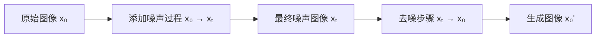

## **📁 一级分类：🧪 技术方法**

🏷 #扩散模型 #图像生成 #语言模型

> **关联**：[[K1-基础理论与概念/核心概念/损失函数与训练调优术语名词库|术语名词库（大白话对照）]]

---

## **🧠 一、AI图像是如何生成的？**

### **✅ 常见生成技术**

AI图像生成主要使用以下几种技术：

|**技术类别**|**代表模型**|**基本原理简介**|
|---|---|---|
|GAN（生成对抗网络）|StyleGAN, BigGAN|用生成器和判别器对抗训练来生成逼真图像|
|[[VAE变分自编码器原理\|VAE（变分自编码器）]]|VQ-VAE, VAE-GAN|编码-解码结构，从潜变量生成图像|
|Diffusion（扩散模型）|Stable Diffusion, DALL·E 2|从噪声中一步步“反扩散”生成图像|
|[[Transformer]]结构|Imagen, Parti|将图像看作token序列，使用[[Transformer]]生成|

目前最主流的是**Diffusion模型**，特别是在高质量图像生成任务中（如 Stable Diffusion、Midjourney）。

---

## **🌪 二、如何理解Diffusion模型？**

### **🧬 Diffusion模型的原理**

Diffusion模型模拟**热力学扩散过程的反过程**，其核心思想如下：

### **📉 正向过程（Forward Process）**

将真实图像逐步添加高斯噪声，直到变成纯噪声。

$$

x_0 \rightarrow x_1 \rightarrow x_2 \rightarrow \cdots \rightarrow x_T

$$

其中：

- $x_0$ 是原始图像；
    
- $x_T$ 是完全高斯噪声。

### **📈 反向过程（Reverse Process）**

训练一个神经网络来学习如何**一步步去噪**，从纯噪声还原图像。

$$

x_T \rightarrow x_{T-1} \rightarrow \cdots \rightarrow x_0

$$

最终生成的 $x_0$ 就是新的图像。

> 🎯 核心任务：学习一个模型 $ \epsilon_\theta(x_t, t) $ 来预测“去噪方向”。

### **🧩 特点与优势**

- 图像生成质量极高，细节丰富；
    
- 训练稳定，不像GAN那样容易崩；
    
- 支持文本引导（如 CLIP、T5 + UNet）形成文图对齐生成。

---

## **📚 可视化理解（mermaid流程图）**



---

## **🧪 三、Diffusion能否用于语言模型训练？**

### **✅ 可以，但机制不同！**

虽然 diffusion 最初是为图像生成设计，但它**确实可以迁移到语言任务中**，已出现如下探索：

### **📌 1. Discrete Diffusion for Text**

将文字token离散化后，也可以做扩散（如 Mask 或替换 token），例如：

- [Diffusion-LM (Li et al., 2022)](https://arxiv.org/abs/2205.14217)
    
- [Analog Bits (Goel et al., 2023)](https://arxiv.org/abs/2305.10441)

### **📌 2. 优势和难点**

|**优势**|**按 Mask 多步采样有机会提升多样性与文本流畅度**|
|---|---|
|难点|文本是离散空间，噪声定义更复杂；训练代价高，采样速度慢|

### **📌 3. 当前地位**

目前 diffusion 在图像领域占主导，在语言领域主要为**实验阶段补充**，尚未替代主流的**自回归语言建模（如GPT）**。

---

## **✅ 总结**

|**模块**|**说明**|
|---|---|
|图像生成|Diffusion 模型通过模拟“去噪”过程从随机噪声中生成图像，已成为主流方法|
|核心机制|学习从噪声还原信号的反扩散路径|
|在语言中应用|有研究探索将diffusion用于离散token序列，但实际应用受限，主要仍是GPT类transformer主导|

## **📁 一级分类：🧪 技术方法**

🏷 #图像生成 #StableDiffusion #多模态模型

---

## **🔧 Stable Diffusion图像生成流程解析**

### **💡 简述**

Stable Diffusion 是一种**文本引导的[[潜空间]]扩散模型（Latent Diffusion Model, LDM）**，目标是从一段自然语言描述中生成高质量图像。

---

### **📊 系统架构模块总览**

```
graph TD
A[用户输入文本 Prompt] --> B[CLIP文本编码器]
B --> C[条件向量]
C --> D[UNet噪声预测器]
E[初始噪声图像z_T] --> D
D --> F[逐步去噪 z_T→z_0]
F --> G[解码器Decoder(VAE-Decoder)]
G --> H[最终生成图像]
```

---

## **🧩 模块详解**

### **1️⃣ 文本编码器：CLIP Text Encoder**

- 使用OpenAI的**CLIP（Contrastive Language-Image Pretraining）**中的Text Encoder。
    
- 输入：用户的文本 prompt，如 "a cat riding a skateboard"
    
- 输出：条件向量 $\mathbf{c}$，作为UNet的去噪引导信息。

> ✅ **作用**：让图像与文本语义对齐。CLIP的对比学习使它特别擅长“捕捉语义”。

---

### **2️⃣ 噪声空间：Latent z-space**

Stable Diffusion并不直接在像素空间中生成图像，而是在一个**压缩的[[潜空间]]**里进行：

- 使用VAE（变分自编码器）中的Encoder将真实图像映射为 latent 图像 $z$；
    
- 在 $z$ 上进行扩散过程；
    
- 生成后再用 Decoder 解码回 RGB 图像。

> 📌 优点：大大减少了计算负担，使高分辨率生成（如 512×512）成为可能。

---

### **3️⃣ UNet：核心的“去噪预测器”**

- 输入：被加了噪声的 latent 图像 $z_t$、时间步 $t$、条件向量 $\mathbf{c}$；
    
- 输出：当前噪声的估计值 $\hat{\epsilon}_\theta$。

其架构大致如下：

```
graph TD
A[z_t] --> B[Encoder (多层残差卷积)]
B --> C[Middle block (Attention + ResBlock)]
C --> D[Decoder (跨层连接 + 上采样)]
```

- 使用 **Cross-Attention** 融合文本信息；
    
- 在不同层使用 **时间步嵌入** 与 **条件嵌入** 作为控制信号。

---

### **4️⃣ 解码器 VAE Decoder**

- 将最终去噪后的 latent 图像 $z_0$ 还原为 3通道图像：
    
    $$
    
    \text{Image} = \text{Decoder}(z_0)
    
    $$

解码器是用高质量图像训练得到的 VAE 的一部分（比如 LAION 数据集）。

---

## **📈 关键流程图 + 数据流描述**

```
flowchart LR
A1[Text Prompt] --> A2[CLIP Text Encoder] --> A3[Text Embedding c]
B1[Random Noise z_T] --> B2[UNet]
A3 --> B2
B2 --> B3[Predicted z_{T-1}]
B3 --> B2
B2 --> B4[Final z_0]
B4 --> C1[VAE Decoder]
C1 --> C2[RGB Image]
```

- **采样算法**：DDIM / DPM / Euler 等多种调度器选择。
    
- 通常迭代步骤为 20~50 步。

---

## **📊 模块参数总览（以Stable Diffusion 1.4为例）**

|**模块**|**参数量**|**描述**|
|---|---|---|
|UNet|~865M|去噪主力，含注意力机制|
|VAE Encoder/Decoder|~100M|图像压缩和重建|
|CLIP Text Encoder|~123M|文本编码，冻结，不参与训练|

---

## **🔍 扩展：ControlNet 和 LoRA 的引入点**

- **ControlNet**：加在UNet中，提供额外结构引导（如草图、姿态）；
    
- **LoRA/LoCon**：用于高效微调UNet参数，使得模型能学习新风格或人物。

---

## **✅ 总结：Stable Diffusion工作流程**

|**步骤**|**描述**|
|---|---|
|1. 文本编码|用CLIP生成条件向量|
|2. 初始化噪声|在[[潜空间]]中生成高斯噪声 z_T|
|3. 多步采样|UNet+条件向量迭代去噪，预测 z_{t-1}|
|4. 图像解码|用VAE将z_0还原为图像|
|5. 输出结果|输出符合prompt的高质量图像|
