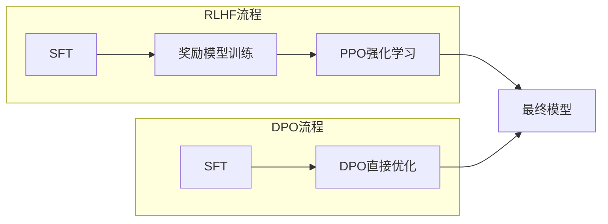

🏷 #训练技术 #对齐 #偏好学习 #进阶

> **关联**：[[K1-基础理论与概念/核心概念/损失函数与训练调优术语名词库|术语名词库（大白话对照）]]

---

## **📌 概念定义**

DPO（Direct Preference Optimization，直接偏好优化）是一种简化的AI模型对齐技术，由Stanford大学在2023年提出。它直接从人类偏好数据中学习，无需像[[RLHF人类反馈强化学习]]那样训练独立的奖励模型，从而大大简化了训练流程并提高了稳定性。

---

## **🔄 在AI对齐中的位置**

```mermaid
flowchart TD
    A[预训练[[Transformer]]模型] --> B[[[SFT]]监督微调]
    B --> C{对齐方法选择}
    C --> D[[[RLHF人类反馈强化学习]]]
    C --> E[DPO直接偏好优化]
    
    D --> D1[复杂三阶段训练]
    D --> D2[需要奖励模型]
    D --> D3[PPO强化学习]
    
    E --> E1[简化单阶段训练]
    E --> E2[直接优化偏好]
    E --> E3[更稳定训练]
    
    D --> F[对齐后模型]
    E --> F
```

---

## **💡 核心创新**

### **问题背景**
[[RLHF人类反馈强化学习]]存在的挑战：
- **训练复杂**：需要三个阶段（SFT → 奖励模型 → PPO）
- **不稳定性**：强化学习固有的训练不稳定
- **奖励Hacking**：模型可能学会欺骗奖励模型
- **计算成本高**：需要维护多个模型

### **DPO的解决方案**
- **直接优化**：跳过奖励模型，直接从偏好数据学习
- **单阶段训练**：将复杂的三阶段简化为一阶段
- **理论保证**：基于严格的数学推导，而非启发式方法

---

## **⚙️ 技术原理**

### **1. 核心数学推导**

DPO基于一个关键洞察：最优策略可以直接从偏好数据中解析求出，无需显式的奖励模型。

**传统RLHF流程：**
```
偏好数据 → 奖励模型 → PPO优化 → 最优策略
```

**DPO流程：**
```
偏好数据 → 直接推导 → 最优策略
```

### **2. 训练目标函数**

| **方法** | **损失函数复杂度** | **训练稳定性** | **理论保证** |
|----------|------------------|----------------|--------------|
| **[[RLHF人类反馈强化学习]]** | 高（多阶段） | 中等 | 启发式 |
| **DPO** | 低（单阶段） | 高 | 严格数学证明 |

### **3. 数据需求**

DPO使用与RLHF相同的偏好数据格式：
```
(prompt, response_chosen, response_rejected)
```

但无需训练独立的奖励模型，直接优化策略模型。

---

## **🔥 技术优势**

### **1. 简化流程**


### **2. 性能对比**

| **指标** | **RLHF** | **DPO** | **优势** |
|----------|----------|---------|----------|
| **训练时间** | 100% | ~60% | DPO显著更快 |
| **GPU显存** | 100% | ~70% | DPO节省资源 |
| **训练稳定性** | 中等 | 高 | DPO更稳定 |
| **最终效果** | 基准 | 相当或更好 | DPO不输效果 |

### **3. 实际优势**
- **降低计算成本**：无需训练和维护奖励模型
- **提高训练稳定性**：避免强化学习的不稳定性
- **简化工程实现**：减少代码复杂度和调试难度
- **更好的可控性**：直接控制模型偏好，不经过中间层

---

## **🚀 成功应用案例**

### **开源模型**
- **Zephyr-7B**：基于Mistral-7B用DPO训练，性能媲美ChatGPT
- **StarChat-7B**：代码对话模型，DPO训练后显著提升
- **Neural-Chat-7B**：Intel开源的DPO训练聊天模型

### **企业应用**
- **Anthropic**：Claude系列部分使用DPO技术
- **HuggingFace**：TRL库原生支持DPO训练
- **各大AI公司**：作为RLHF的补充或替代方案

---

## **⚖️ 与RLHF对比分析**

| **维度** | **RLHF** | **DPO** | **最佳选择** |
|----------|----------|---------|--------------|
| **训练复杂度** | 高（三阶段） | 低（单阶段） | DPO |
| **理论基础** | 启发式 | 严格数学推导 | DPO |
| **资源需求** | 高 | 中等 | DPO |
| **训练稳定性** | 中等 | 高 | DPO |
| **最终性能** | 优秀 | 相当 | 平手 |
| **成熟度** | 高 | 中等 | RLHF |
| **社区支持** | 广泛 | 快速增长 | RLHF |

---

## **🔧 实现技术细节**

### **1. 数据准备**
```python
# 偏好数据格式
{
  "prompt": "如何学习机器学习？",
  "chosen": "建议从数学基础开始，然后学习算法...",
  "rejected": "直接背模型就行了..."
}
```

### **2. 训练配置**
- **学习率**：通常比SFT更小（1e-6 to 1e-5）
- **批次大小**：与[[SFT（Supervised Fine-Tuning，监督微调）]]相似
- **训练轮数**：通常1-3个epoch足够
- **温度参数β**：控制优化强度的关键超参数

### **3. 开源工具支持**
- **TRL (Transformers Reinforcement Learning)**：HuggingFace官方库
- **Alignment Handbook**：完整的DPO训练流程
- **Axolotl**：支持DPO的模型训练框架

---

## **⚠️ 局限性与挑战**

### **技术局限**
- **偏好数据质量依赖**：对数据质量要求很高
- **超参数敏感**：β温度参数需要仔细调优
- **长序列挑战**：在很长的对话中效果可能下降

### **应用挑战**
- **数据收集成本**：仍需要大量人类偏好标注
- **评估困难**：缺乏标准化的评估基准
- **泛化能力**：在分布外数据上的表现有待验证

---

## **🔮 发展趋势**

### **技术演进方向**
1. **多目标DPO**：同时优化多个偏好维度
2. **在线DPO**：结合在线学习的动态优化
3. **多模态DPO**：扩展到图像、视频等模态
4. **Constitutional DPO**：结合原则性约束的优化

### **工程优化**
- **更高效的采样策略**
- **更好的超参数自动调优**
- **与[[AI_Agent与多Agent系统架构全览|AI Agent]]系统的集成**
- **分布式训练优化**

---

## **💡 实践建议**

### **何时选择DPO**
✅ **推荐使用DPO的场景：**
- 资源有限，无法承担RLHF的复杂性
- 需要快速迭代和实验
- 追求训练稳定性
- 有高质量的偏好数据

❌ **慎用DPO的场景：**
- 需要极致性能优化
- 偏好数据质量不高
- 需要复杂的奖励设计

### **实施步骤**
1. **数据准备**：收集高质量偏好数据
2. **基础训练**：先完成[[SFT（Supervised Fine-Tuning，监督微调）]]
3. **DPO训练**：使用合适的超参数进行DPO
4. **评估验证**：多维度评估模型效果
5. **迭代优化**：根据评估结果调整策略

---

## **📚 相关资源**

### **核心论文**
- [Direct Preference Optimization: Your Language Model is Secretly a Reward Model](https://arxiv.org/abs/2305.18290)
- [Training language models to follow instructions with human feedback](https://arxiv.org/abs/2203.02155) (RLHF对比)

### **开源实现**
- [TRL库DPO实现](https://github.com/huggingface/trl)
- [Alignment Handbook](https://github.com/huggingface/alignment-handbook)
- [DPO训练教程](https://huggingface.co/docs/trl/dpo_trainer)

### **成功案例**
- [Zephyr-7B模型](https://huggingface.co/HuggingFaceH4/zephyr-7b-beta)
- [StarChat代码模型](https://huggingface.co/HuggingFaceH4/starchat-beta)

---

## **🎯 总结**

DPO代表了AI对齐技术的重要进步，通过简化[[RLHF人类反馈强化学习]]的复杂流程，使得高质量的AI对齐变得更加可行和高效。虽然在某些极端场景下可能不如RLHF，但其简单性、稳定性和可解释性使其成为现代AI系统对齐的重要选择。

随着技术的不断发展和更多实践案例的积累，DPO有望成为AI对齐的主流方法之一，特别是在资源有限或需要快速迭代的场景中。

---

*这个文档将随着DPO技术的发展和更多实践经验的积累持续更新，欢迎贡献最新的研究进展和实践心得。*
