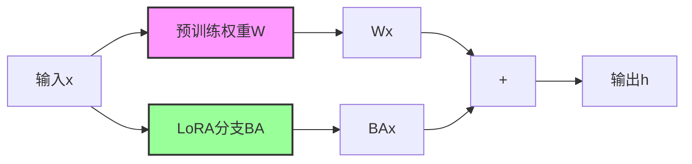
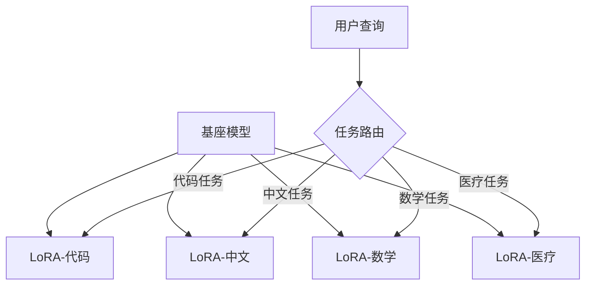

# LoRA（Low-Rank Adaptation）低秩适应微调

🏷 #训练技术 #参数高效微调 #模型优化 #进阶

---

## **📌 概念定义**

LoRA（Low-Rank Adaptation of Large Language Models）是一种高效的模型微调技术，由微软研究院在2021年提出。它通过在[[Transformer]]的注意力层中注入可训练的低秩分解矩阵，在保持预训练模型参数冻结的情况下，仅训练少量新增参数就能实现高效微调。

---

## **🔬 核心原理**

### **数学基础**

LoRA的核心思想是将权重更新矩阵分解为两个低秩矩阵的乘积：

```
ΔW = BA
```

其中：
- `W` ∈ R^(d×k) 是预训练权重矩阵
- `B` ∈ R^(d×r) 和 `A` ∈ R^(r×k) 是低秩分解矩阵
- `r << min(d,k)` 是秩（rank），通常取值为4、8、16等

### **训练过程**



- **前向传播**：`h = Wx + BAx`
- **反向传播**：只更新B和A，W保持冻结

---

## **💡 技术优势**

### **1. 参数效率**

| **模型规模** | **全量微调参数** | **LoRA参数 (r=8)** | **参数减少比例** |
|-------------|-----------------|-------------------|-----------------|
| **7B** | 7,000M | ~10M | 99.86% |
| **13B** | 13,000M | ~20M | 99.85% |
| **70B** | 70,000M | ~100M | 99.86% |

### **2. 训练效率**

- **显存占用**：大幅降低，7B模型可在单张消费级GPU上微调
- **训练速度**：比全量微调快2-3倍
- **切换灵活**：可同时维护多个LoRA适配器

### **3. 性能保持**

研究表明，LoRA在多数任务上的性能接近甚至超过全量微调，特别是在：
- 文本分类
- 问答任务
- 代码生成
- 指令跟随

---

## **🛠 实现细节**

### **1. 应用位置**

LoRA通常应用于[[Transformer]]架构的以下模块：
- **查询投影（Wq）**
- **值投影（Wv）**
- 有时也应用于：键投影（Wk）、输出投影（Wo）

### **2. 初始化策略**

```python
# A矩阵：使用高斯分布初始化
A ~ N(0, σ²)

# B矩阵：初始化为零
B = 0

# 这确保训练开始时 BA = 0，不影响预训练模型
```

### **3. 缩放因子**

LoRA引入缩放因子α来控制适配强度：
```
h = Wx + (α/r) * BAx
```

常见配置：α = 2r 或 α = r

---

## **🔄 与其他微调方法对比**

| **方法** | **可训练参数** | **显存需求** | **推理开销** | **多任务支持** |
|----------|---------------|-------------|-------------|---------------|
| **全量微调** | 100% | 高 | 无额外 | 需要多份模型 |
| **[[SFT]]** | 100% | 高 | 无额外 | 需要多份模型 |
| **LoRA** | <1% | 低 | 极小 | 易切换适配器 |
| **Adapter** | 1-3% | 中 | 有额外 | 可切换 |
| **Prefix Tuning** | <0.1% | 低 | 有额外 | 可切换 |
| **QLoRA** | <1% | 极低 | 小 | 易切换 |

---

## **🚀 实际应用**

### **1. 开源模型微调**

**Alpaca-LoRA**：
- 基于LLaMA模型的指令微调
- 使用52K指令数据
- 在单张RTX 4090上几小时完成训练

**ChatGLM-LoRA**：
- 针对中文场景优化
- 支持多轮对话微调
- 参数量仅为原模型的0.1%

### **2. 企业应用场景**

| **场景** | **基座模型** | **LoRA配置** | **效果** |
|----------|-------------|-------------|----------|
| **客服对话** | ChatGLM/Qwen | r=8, α=16 | 响应准确率提升30% |
| **代码补全** | CodeLlama | r=16, α=32 | 特定语言准确率提升40% |
| **文档摘要** | LLaMA-2 | r=8, α=8 | ROUGE分数提升15% |
| **垂直问答** | Baichuan | r=4, α=8 | 领域准确率达90%+ |

### **3. 多LoRA组合**



---

## **⚙️ 高级技术**

### **1. QLoRA（量化LoRA）**

结合4-bit量化技术，进一步降低显存占用：
- **原理**：基座模型4-bit量化 + LoRA适配器FP16训练
- **优势**：65B模型可在单张A100上微调
- **性能**：接近全精度LoRA

### **2. AdaLoRA（自适应LoRA）**

动态分配不同层的秩：
- 重要层分配更高的秩
- 次要层使用更低的秩
- 总参数量保持不变

### **3. LoRA合并与组合**

**任务算术**：
```
LoRA_combined = w1 * LoRA_task1 + w2 * LoRA_task2
```

**知识蒸馏**：
将多个LoRA的知识蒸馏到单个LoRA中

---

## **🔧 实践指南**

### **超参数选择建议**

| **任务类型** | **推荐r值** | **推荐α** | **目标模块** |
|-------------|-----------|----------|-------------|
| **指令微调** | 8-16 | 16-32 | Wq, Wv |
| **领域适应** | 4-8 | 8-16 | Wq, Wv |
| **多语言** | 16-32 | 32-64 | Wq, Wv, Wo |
| **代码生成** | 16-32 | 16-32 | 全部注意力层 |

### **训练技巧**

1. **学习率**：通常比全量微调高10倍（如1e-4 vs 1e-5）
2. **预热步数**：较短的预热期（总步数的3-6%）
3. **批次大小**：可以设置更大，因为显存占用低
4. **正则化**：适度的dropout（0.05-0.1）防止过拟合

### **常见问题解决**

**问题1：性能不如预期**
- 增加r值（如从8增加到16）
- 应用到更多模块（如加入FFN层）
- 调整α/r比例

**问题2：训练不稳定**
- 降低学习率
- 增加预热步数
- 使用梯度裁剪

**问题3：推理速度慢**
- 合并LoRA权重到基座模型
- 使用专门的推理优化库

---

## **🔮 发展趋势**

### **技术演进**

1. **更高效的分解方法**
   - 张量分解LoRA
   - 稀疏LoRA
   - 动态秩调整

2. **与其他技术结合**
   - LoRA + [[DPO直接偏好优化]]
   - LoRA + [[RLHF人类反馈强化学习]]
   - LoRA + 知识蒸馏

3. **硬件协同优化**
   - NPU/TPU专门优化
   - 边缘设备部署
   - 分布式LoRA训练

### **应用拓展**

- **多模态LoRA**：视觉-语言模型的高效适应
- **联邦LoRA**：隐私保护的分布式微调
- **在线LoRA**：持续学习和适应

---

## **💡 最佳实践总结**

### **何时使用LoRA**

✅ **推荐场景**：
- 计算资源有限
- 需要快速迭代实验
- 多任务切换需求
- 边缘设备部署

❌ **不适用场景**：
- 需要根本性改变模型行为
- 任务与预训练差异极大
- 对推理延迟极度敏感

### **成功案例启示**

1. **Stable Diffusion LoRA**：让个人电脑也能训练风格模型
2. **LLaMA系列LoRA**：推动开源社区蓬勃发展
3. **企业私有化部署**：低成本实现领域定制

---

## **📚 学习资源**

### **论文与代码**
- [LoRA原始论文](https://arxiv.org/abs/2106.09685)
- [PEFT库（HuggingFace）](https://github.com/huggingface/peft)
- [QLoRA实现](https://github.com/artidoro/qlora)

### **教程与实践**
- [LoRA微调实战教程](https://huggingface.co/docs/peft/conceptual_guides/lora)
- [Alpaca-LoRA项目](https://github.com/tloen/alpaca-lora)

---

## **🎯 总结**

LoRA代表了大模型时代参数高效微调的重要突破，通过巧妙的低秩分解思想，在保持性能的同时大幅降低了微调成本。它不仅推动了开源社区的繁荣，也为企业私有化部署提供了可行方案。

随着技术的不断发展，LoRA正在与[[DPO直接偏好优化]]、[[RLHF人类反馈强化学习]]等技术深度融合，成为构建垂直领域AI应用的关键技术之一。对于任何希望在有限资源下释放大模型潜力的开发者和企业，LoRA都是一项必须掌握的核心技术。

---

*这个文档将随着LoRA技术的发展和社区实践持续更新，欢迎贡献最新的研究进展和应用案例。*