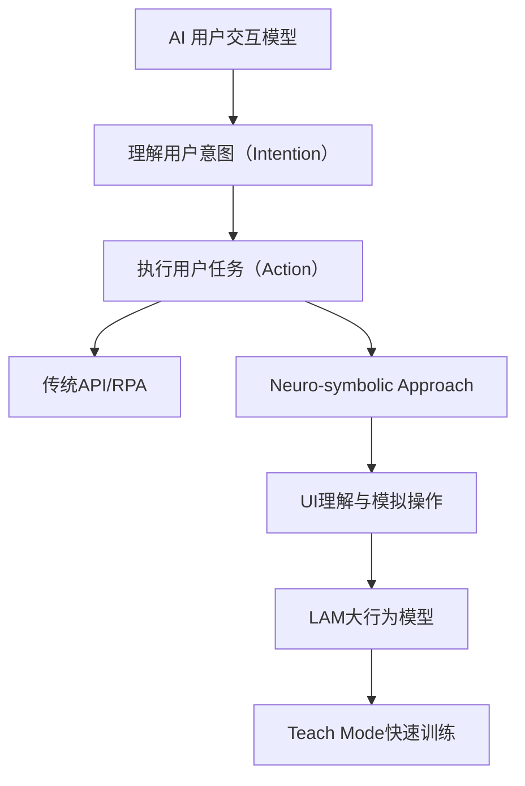

🏷 标签：#AI原生操作系统 #智能硬件 #创业思维

---

# **📝 工具与平台 - Rabbit R1与LAM系统详解**

## **📌 关键词提炼**

- Rabbit R1
    
- Large Action Model (LAM)
    
- Teach Mode
    
- Neuro-symbolic Network
    
- Intention vs. Action
    
- Native AI Device
    
- Personalized Computing
    
- Prompt Engineering
    
- 创业思维 & 第一性原则

---

## **🧠 核心理念梳理**



---

## **🔧 产品设计与技术结构**

### **Rabbit R1 是什么？**

- 一个按住即可对话、执行任务的 AI 终端设备
    
- 集成语音、图像、文字等多模态输入输出
    
- 核心目标：跳过APP，用AI操作现有界面
    
- 售价：$199，无订阅，非亏本销售
    
- 全球销量超过13万台，退货率<1%，远低于行业5%-7%的平均水平

### **为什么是硬件而不是APP？**

- iOS/Android系统不允许跨APP控制（权限限制）
    
- 必须打造自己的系统栈与交互链路（Vehicle）

---

## **🧬 LAM vs. LLM：核心区别**

| **属性** | **LLM (大语言模型)** | **LAM (大行为模型)** |
| ------ | --------------- | --------------- |
| 功能     | 理解意图            | 执行操作            |
| 输入     | 语言、上下文          | 录屏、界面行为         |
| 输出     | 回答/文本           | 动作（点击、填写等）      |
| 方法     | [[Transformer]]     | Neuro-symbolic  |
| 本质     | 推理生成            | 模拟操控            |
| 应用     | 对话、生成式AI        | AI [[01-核心知识库/K2-技术方法与实现/模型架构/Agent]]、自动操作任务 |

---

## **🧪 技术方法解析**

### **Neursymbolic Network（神经符号网络）**

- 类比特斯拉的自动驾驶：通过摄像头录屏学习界面要素
    
- 替代传统RPA中的“固定坐标点击”
    
- 跨应用泛化能力强，不易被UI变化影响

### **Teach Mode（教学模式）**

- 用户录一段操作视频并配说明，即可生成[[01-核心知识库/K2-技术方法与实现/模型架构/Agent]]
    
- 无需写代码，仅需一次操作示范
    
- 比OpenAI的Plugin或GPTS更通用、门槛更低
---
## **📊 商业模式策略**

|**阶段**|**收益方式**|**核心逻辑**|
|---|---|---|
|当前|硬件利润（~50%）|降低Early Adopter门槛|
|中期|Teach Mode App Store 抽成|类似iOS分发机制，向[[01-核心知识库/K2-技术方法与实现/模型架构/Agent]]开发者抽佣|
|长期|AI-Native OS 平台化|构建AI原生桌面与生态体系|

---

## **🧠 创业与产品哲学**

### **吕骋的三个原则**

```
- Intuitive（直觉）：产品必须足够直观，让用户“无脑爱上”
- Sensitive（敏感）：保持好奇，对世界细节保持感知
- Obsessive（执着）：抠细节、保证品质，对设计极度严苛
```

### **创业核心建议**

|**维度**|**建议**|
|---|---|
|商业模式|不要创新商业模式，参考已被验证的（订阅制、抽佣制等）|
|技术路线|专注模型应用落地，不必自研底层大模型|
|硬件形态|降低用户学习成本，选择熟悉交互（按钮、屏幕）|
|市场策略|不与巨头正面竞争，专注短期活下去|
|用户反馈|提前放量获取高频真实数据，进行快速微调|

---

## **🧭 未来路径与扩展设想**

### **Rabbit生态图（Mermaid）**

```mermaid
graph LR
User[用户] -->|语音指令| R1[Rabbit R1 设备]
R1 -->|Intention识别| LLM[OpenAI/Anthropic等]
R1 -->|界面分析&操作| LAM[LAM大行为模型]
LAM -->|Teach Mode 教学| [[Agent]]Store[[[Agent]] 应用商店]
R1 -->|数据同步| RabbitHole[Web端Rabbit OS]
RabbitHole -->|桌面交互| AI桌面
```

---

## **📚 延伸阅读推荐**

- [Rabbit Research Page](https://rabbit.tech/research)
    
- OpenAI GPTS/Plugin 系统
    
- 特斯拉自动驾驶视觉学习架构
    
- Allen Kay 对软件-硬件关系的思考：“真正重视软件的人，终有一天会做硬件。”

---

如需生成PPT、演讲提纲或进一步图解，也可以告诉我继续。你希望我帮你基于这个内容继续做哪些延伸？