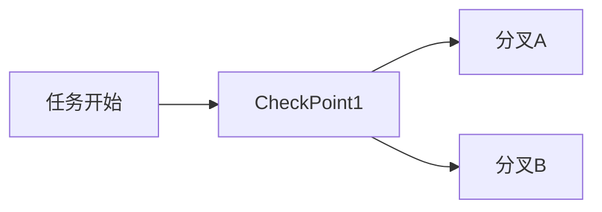

🏷 标签： #训练 #AI操作系统

---
## **📌 分类说明**

| **分类名称** | **说明**                       | **示例文档**                    |
| -------- | ---------------------------- | --------------------------- |
| 🛠 工具与平台 | AI运行时与[[AI_Agent与多Agent系统架构全览|AI Agent]]操作系统相关工具及平台原理 | E2B与[[AI_Agent与多Agent系统架构全览|AI Agent]]s的MicroVM架构 |

---

## **📝 笔记标题：E2B如何为[[AI_Agent与多Agent系统架构全览|AI Agent]]s提供"专属电脑"？ —— Manus背后的Infra基础设施全解**

---

## **🌐 一、E2B是什么？**

- **定义**：E2B是一个开源微虚拟机平台，提供AI代码运行时沙盒，支持Python/JS等语言。
    
- **关键特征**：
    
    - 基于 AWS Firecracker 微虚拟机架构
        
    - 快速启动：150ms 级别
        
    - 沙盒隔离：安全性高，适合多用户并发
- **创始背景**：
    
    - 创始人：Vasek Mlejnsky & Tomas Valenta
        
    - 前身项目：DevBook（互动式开发文档）
        
    - 转型点：GPT-3.5 出现后尝试自动构建 AI agents，吸引关注后创建E2B（2023年）

---

## **⚙️ 二、E2B如何支撑AI [[01-核心知识库/K2-技术方法与实现/模型架构/Agent]]s的“专属电脑”？**

### **🔧 基本原理**

```mermaid
graph LR
A[LLM [[Agent]]] --> B[生成代码]
B --> C[发送至E2B沙盒]
C --> D[MicroVM执行环境]
D --> E[结果回传给[[Agent]]]
```

- **核心能力**：
    
    - 支持代码创建、执行、浏览器操作
        
    - 沙盒持久化（支持fork、checkpoint）
        
    - [[01-核心知识库/K2-技术方法与实现/模型架构/Agent]]运行中可挂起、恢复

### **📈 增长数据**

- 2024年：每月4万次创建
    
- 2025年：增长至1500万次/月（增长375倍）

---

## **🧠 三、[[01-核心知识库/K2-技术方法与实现/模型架构/Agent]] Runtime的产品定位进化**

### **⏳ 从Code Interpreter 到 [[01-核心知识库/K2-技术方法与实现/模型架构/Agent]] Runtime**

|**阶段**|**产品定位**|**典型场景**|
|---|---|---|
|2023年初|代码执行器（Code Interpreter）|Python执行、数据分析|
|2024年中|Computer Use支持（桌面沙盒）|模拟浏览器、系统任务|
|2025年初|[[01-核心知识库/K2-技术方法与实现/模型架构/Agent]]通用运行时（[[01-核心知识库/K2-技术方法与实现/模型架构/Agent]] Runtime）|多[[01-核心知识库/K2-技术方法与实现/模型架构/Agent]]并行、复杂逻辑分支|

### **📦 场景模板支持**

- **Fragments模板**：开源AI App构建模板
    
- 示例：用 Next.js 构建待办事项App → LLM生成 → 沙盒中运行 → 实时反馈界面

---

## **🧪 四、关键技术模块解析**

### **1. MicroVM架构：快速、安全、隔离**

```mermaid
graph LR
A[[[Agent]] Request] --> B[启动MicroVM]
B --> C[代码执行/浏览器操作]
C --> D[结果返回]
```

- 安全隔离、动态资源调度
    
- 代码运行权限大、自由度高（读写文件、装包、联网等）

### **2. 持久化、分叉、检查点机制**



- 类似蒙特卡洛树搜索（MCTS）
    
- 每个节点是一个沙盒快照，可回滚、探索不同路径

---

## **💼 五、主要应用场景**

### **🎯 数据分析（Code Interpreter）**

- 上传CSV → 自动生成Python分析代码 → 可视化输出
    
- 预装分析包，支持错误修复循环
    
- 每个[[01-核心知识库/K2-技术方法与实现/模型架构/Agent]]有独立沙盒 → 稳定性高

### **💻 AI生成应用运行时**

- AI生成应用需“即写即跑” → 沙盒即为Runtime
    
- 开源模板Fragments直接复用
    
- 非开发者工具如AI Excel背后也是代码执行

### **🤖 模型训练（以Hugging Face为例）**

- RLHF任务：自动生成代码 → 沙盒运行 → 奖励反馈
    
- 并行运行上千个沙盒 → 快速、低成本、隔离好

---

## **🧠 六、Computer Use的探索与挑战**

### **🌍 E2B Desktop Sandbox：模拟使用图形界面电脑**

- 基于开源模型构建 computer use agent：
    
    - Llama3 Vision 模型用于屏幕识别
        
    - OS-Atlas 提供点击位置预测
        
    - FFmpeg 实现实时画面流

### **🧩 技术挑战**

|**挑战**|**解决方案**|
|---|---|
|安全性|全部运行于沙盒，避免触碰本地数据|
|UI点击|结合VLM输出坐标实现点击操作|
|推理能力|使用工具调用，将视觉理解与操作结合|
|LLM部署|主流模型服务商 + Hugging Face免费空间|
|画面传输|低延迟FFmpeg流播放|

---

## **📈 七、开发者体验与定价策略**

### **✅ DX：开发者体验为核心优势**

- 无需理解infra细节，开箱即用
    
- 不锁定OpenAI等模型，具备中立性
    
- 提供统一的 code interpreter SDK

### **💰 定价模型探索**

|**方案**|**优点**|**缺点**|
|---|---|---|
|按月计费|简单易懂|难以覆盖高频用户|
|按使用量|精准计费|可能造成费用不透明感|
|混合型+限额机制|透明又灵活|需要精细化管理|

---

## **🌍 八、硅谷战略与未来展望**

- **地理战略**：开发者多在硅谷 → 产品迭代效率高
    
- **人才密度高**：高质量对话密集，助力早期决策
    
- **愿景**：成为AI [[01-核心知识库/K2-技术方法与实现/模型架构/Agent]]时代的“新AWS”

---

## **🔚 总结**

|**维度**|**关键词**|
|---|---|
|产品定义|开源微虚拟机、沙盒运行时|
|[[01-核心知识库/K2-技术方法与实现/模型架构/Agent]]价值|赋予AI“操作系统”级能力|
|未来趋势|Multi-[[01-核心知识库/K2-技术方法与实现/模型架构/Agent]] + 代码分叉 + Desktop [[01-核心知识库/K2-技术方法与实现/模型架构/Agent]]|
|核心亮点|安全隔离、快速启动、GPU支持预期、LLM中立|
|典型应用|数据分析、AI Excel、模型训练、Computer Use|
