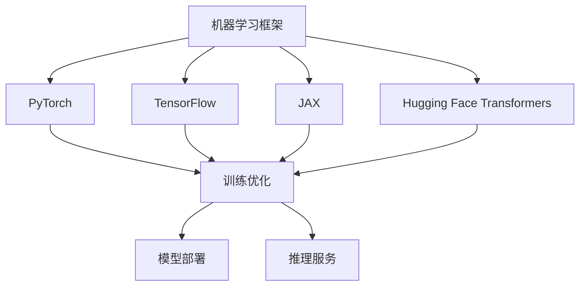
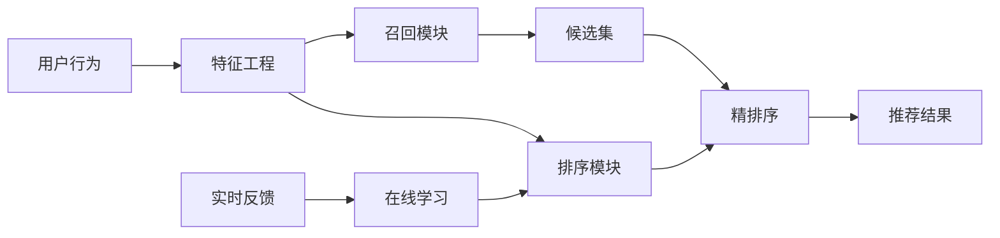
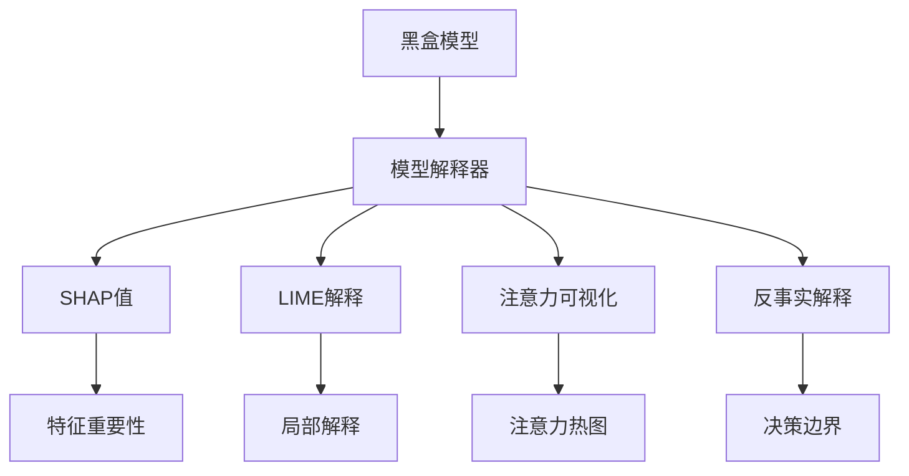
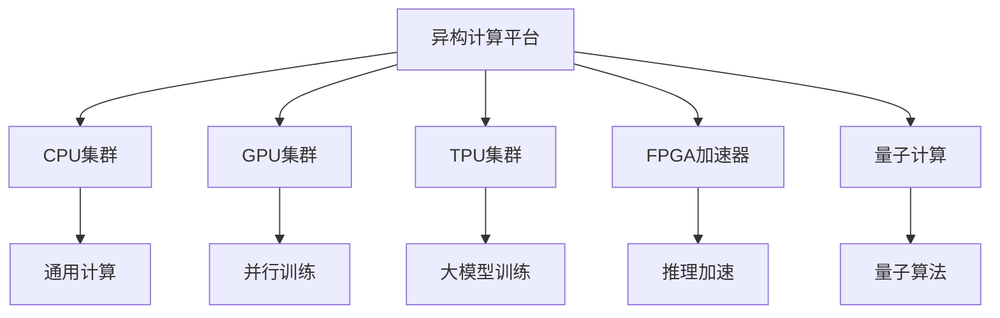
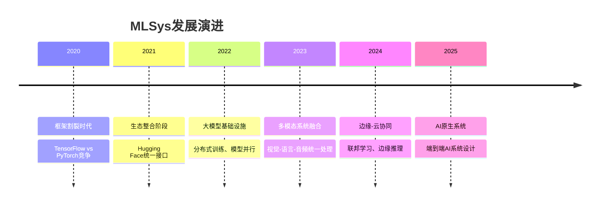
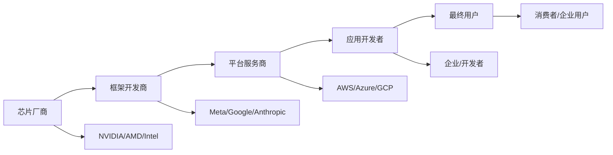
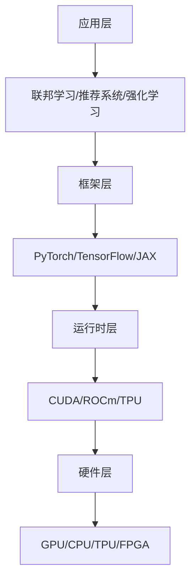

# MLSys机器学习系统生态

> **定位**：机器学习系统的完整生态架构与技术栈全览
> **作者**：Claude
> **创建时间**：2025年8月22日
> **标签**：#MLSys #机器学习系统 #分布式计算 #系统架构

---

## 📝 核心概念

**MLSys（Machine Learning Systems）** 是指支持机器学习应用全生命周期的系统集合，涵盖从数据处理、模型训练、推理部署到运维监控的完整技术栈。

### 🎯 核心价值

1. **端到端支持**：覆盖ML工作流的所有环节
2. **高效扩展**：支持大规模分布式计算
3. **异构兼容**：适配多种硬件和计算环境
4. **生产就绪**：提供企业级稳定性和可靠性

---

## 🏗️ MLSys生态架构

### 1️⃣ 核心框架层


**关键特征**：
- **[[PyTorch深度学习框架]]**：动态图，研究友好
- **[[TensorFlow深度学习框架]]**：静态图，生产优化
- **JAX**：函数式编程，高性能计算
- **[[Hugging Face生态全面指南|Hugging Face]]**：预训练模型生态

### 2️⃣ 应用领域层

#### 🔐 联邦学习系统
```python
# 联邦学习架构示例
class FederatedLearningSystem:
    def __init__(self):
        self.central_server = CentralServer()
        self.client_nodes = [ClientNode(i) for i in range(n_clients)]
        self.privacy_engine = PrivacyEngine()

    def federated_training(self):
        # 1. 全局模型分发
        global_model = self.central_server.get_global_model()

        # 2. 本地训练（保护隐私）
        local_updates = []
        for client in self.client_nodes:
            local_update = client.train_locally(global_model)
            local_updates.append(local_update)

        # 3. 聚合更新
        aggregated_update = self.central_server.aggregate(local_updates)

        # 4. 全局模型更新
        self.central_server.update_global_model(aggregated_update)
```

**技术特点**：
- 隐私保护：本地数据不离设备
- 通信优化：模型参数压缩传输
- 异构适配：支持不同设备能力

#### 📊 推荐系统架构


**核心组件**：
- **召回系统**：协同过滤、内容匹配、深度匹配
- **排序系统**：Wide&Deep、DCN、DeepFM等
- **实时系统**：流式计算、在线学习

#### 🎮 强化学习系统
```python
# 强化学习训练循环
class RLTrainingSystem:
    def __init__(self):
        self.env = Environment()
        self.agent = Agent()
        self.replay_buffer = ReplayBuffer()
        self.trainer = Trainer()

    def training_loop(self):
        for episode in range(max_episodes):
            state = self.env.reset()
            episode_reward = 0

            while not done:
                # 1. 智能体决策
                action = self.agent.select_action(state)

                # 2. 环境交互
                next_state, reward, done = self.env.step(action)

                # 3. 存储经验
                self.replay_buffer.store(state, action, reward, next_state, done)

                # 4. 模型训练
                if len(self.replay_buffer) > batch_size:
                    batch = self.replay_buffer.sample(batch_size)
                    self.trainer.train_step(batch)

                state = next_state
                episode_reward += reward
```

**技术要点**：
- **环境建模**：仿真器、游戏引擎、物理引擎
- **智能体设计**：[[PPO（Proximal Policy Optimization，近端策略优化）|PPO]]、SAC、TD3等算法
- **分布式训练**：并行环境、异步更新

#### 🔍 可解释AI系统


**核心技术**：
- **事后解释**：SHAP、LIME、Integrated Gradients
- **注意力机制**：Transformer注意力可视化
- **对抗样本**：反事实解释、对抗扰动分析

#### 🤖 机器人系统ML应用
```python
# 机器人感知-决策-控制循环
class RobotMLSystem:
    def __init__(self):
        self.perception = PerceptionModule()  # 视觉、激光雷达
        self.planning = PlanningModule()      # 路径规划
        self.control = ControlModule()        # 运动控制
        self.learning = LearningModule()      # 在线学习

    def robot_loop(self):
        while True:
            # 1. 感知环境
            sensor_data = self.perception.process_sensors()

            # 2. 理解场景
            scene_understanding = self.perception.understand_scene(sensor_data)

            # 3. 规划动作
            action_plan = self.planning.plan_action(scene_understanding)

            # 4. 执行控制
            self.control.execute_action(action_plan)

            # 5. 学习优化
            feedback = self.get_feedback()
            self.learning.update_models(feedback)
```

**技术栈**：
- **计算机视觉**：目标检测、语义分割、SLAM
- **路径规划**：RRT、A*、神经网络规划器
- **控制算法**：PID、MPC、学习控制

#### 📊 图学习系统
```python
# 图神经网络系统
class GraphLearningSystem:
    def __init__(self):
        self.graph_loader = GraphDataLoader()
        self.gnn_models = {
            'GCN': GraphConvolutionalNetwork(),
            'GraphSAGE': GraphSAGE(),
            'GAT': GraphAttentionNetwork()
        }
        self.distributed_engine = DistributedGraphEngine()

    def train_on_large_graph(self, graph_data):
        # 1. 图采样
        subgraphs = self.graph_loader.sample_subgraphs(graph_data)

        # 2. 分布式训练
        for batch in subgraphs:
            # 邻居聚合
            node_embeddings = self.gnn_models['GraphSAGE'].forward(batch)

            # 损失计算
            loss = self.compute_loss(node_embeddings, batch.labels)

            # 梯度更新
            loss.backward()
            self.optimizer.step()
```

**应用场景**：
- **社交网络**：用户关系建模、社区发现
- **知识图谱**：实体关系推理、知识补全
- **推荐系统**：用户-物品图、协同过滤

### 3️⃣ 基础设施层

#### ⚡ 机器学习集群调度
```yaml
# Kubernetes ML作业调度配置
apiVersion: batch/v1
kind: Job
metadata:
  name: distributed-training
spec:
  template:
    spec:
      containers:
      - name: trainer
        image: pytorch:latest
        resources:
          requests:
            nvidia.com/gpu: 4
            memory: "32Gi"
            cpu: "16"
          limits:
            nvidia.com/gpu: 4
            memory: "64Gi"
            cpu: "32"
        env:
        - name: MASTER_ADDR
          value: "trainer-0"
        - name: MASTER_PORT
          value: "29500"
        - name: WORLD_SIZE
          value: "4"
```

**关键组件**：
- **资源调度**：Kubernetes、Slurm、Ray
- **任务管理**：MLflow、Kubeflow、Airflow
- **监控运维**：Prometheus、Grafana、TensorBoard

#### 🔧 异构计算平台


**硬件特化**：
- **CPU**：通用计算、数据预处理
- **GPU**：并行训练、深度学习推理
- **[[TPU vs 存算一体芯片（PnM PIM CIM）优劣势详细对比|TPU]]**：大规模矩阵运算
- **FPGA**：低延迟推理、边缘计算
- **[[量子计算避免局部最优：原理、挑战与AI应用前沿|量子计算]]**：优化问题、量子机器学习

#### 🌐 量子计算系统
```python
# 量子机器学习示例
import cirq
import numpy as np

class QuantumMLSystem:
    def __init__(self, n_qubits):
        self.n_qubits = n_qubits
        self.qubits = cirq.GridQubit.rect(1, n_qubits)
        self.circuit = cirq.Circuit()

    def quantum_feature_map(self, classical_data):
        """将经典数据编码到量子态"""
        for i, data_point in enumerate(classical_data):
            # 角度编码
            angle = np.pi * data_point
            self.circuit.append(cirq.ry(angle)(self.qubits[i]))

    def variational_ansatz(self, parameters):
        """变分量子电路"""
        for i in range(self.n_qubits - 1):
            self.circuit.append(cirq.CNOT(self.qubits[i], self.qubits[i + 1]))
            self.circuit.append(cirq.ry(parameters[i])(self.qubits[i]))
```

---

## 🚀 技术发展趋势

### 1️⃣ 系统融合趋势


### 2️⃣ 关键技术方向

#### 🔄 系统优化技术
- **模型压缩**：量化、剪枝、蒸馏
- **推理优化**：图优化、算子融合、内存优化
- **分布式优化**：梯度压缩、异步更新、弹性训练

#### 🛡️ 系统可靠性
- **故障恢复**：检查点机制、故障转移
- **负载均衡**：动态调度、资源弹性伸缩
- **安全隐私**：差分隐私、安全多方计算

#### 🌍 绿色计算
- **能效优化**：动态频率调节、智能休眠
- **碳足迹跟踪**：训练能耗监控、绿色数据中心
- **可持续AI**：轻量化模型、高效算法

---

## 🔗 生态协同关系

### 🏢 产业生态链


### 🔧 技术栈依赖


---

## 🎯 学习建议

### 📚 基础路径
1. **系统基础**：[[计算机科学核心知识体系]]
2. **ML框架**：[[PyTorch深度学习框架]]、[[TensorFlow深度学习框架]]
3. **分布式系统**：并行计算、分布式训练
4. **系统优化**：性能调优、资源管理

### 🔬 进阶方向
1. **专业领域**：选择联邦学习、推荐系统、强化学习等方向深入
2. **系统设计**：大规模ML系统架构设计
3. **硬件优化**：GPU编程、异构计算
4. **前沿技术**：量子机器学习、神经形态计算

### 🛠️ 实践项目
1. **搭建分布式训练环境**
2. **实现简单推荐系统**
3. **部署联邦学习框架**
4. **设计可解释AI工具**

---

## 📊 相关文档链接

### 🔗 基础设施相关
- [[向量数据库技术基础]]
- [[E2B_AI_Agents运行时基础设施]]
- [[Hugging Face生态全面指南]]

### 🔗 应用技术相关
- [[RLHF人类反馈强化学习]]
- [[具身智能技术架构]]
- [[AI模型可解释性研究]]

### 🔗 计算平台相关
- [[量子计算避免局部最优：原理、挑战与AI应用前沿]]
- [[端侧AI芯片技术]]
- [[TPU vs 存算一体芯片（PnM PIM CIM）优劣势详细对比]]

---

*MLSys代表了机器学习技术从研究走向工程实践的关键桥梁，是构建可靠、高效、可扩展AI系统的核心技术栈。*