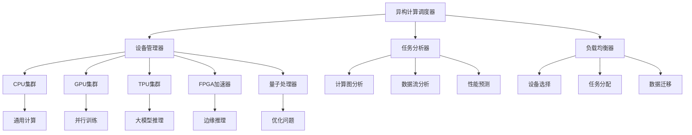

# 异构计算平台架构

> **定位**：多种计算设备协同的高性能ML计算平台
> **作者**：Claude
> **创建时间**：2025年8月22日
> **标签**：#异构计算 #GPU #TPU #FPGA #量子计算

---

## 📝 核心概念

**异构计算平台** 是指集成了多种不同架构计算设备（CPU、GPU、TPU、FPGA、量子处理器等）的计算系统，通过协调这些设备的专长来优化机器学习工作负载的性能和能效。

### 🎯 核心价值

1. **性能优化**：根据任务特性选择最优计算设备
2. **能效提升**：专用设备处理特定任务，降低功耗
3. **成本控制**：灵活配置，按需使用昂贵的专用硬件
4. **负载均衡**：多设备并行，提高整体吞吐量

---

## 🏗️ 异构计算架构

### 1️⃣ 总体架构


### 2️⃣ 设备特性对比

#### 🔧 计算设备特性矩阵
```python
class ComputeDeviceManager:
    def __init__(self):
        self.device_characteristics = {
            'CPU': {
                'compute_type': 'sequential',
                'parallelism': 'low',
                'memory_bandwidth': 'high',
                'programming_flexibility': 'very_high',
                'power_efficiency': 'medium',
                'cost_per_ops': 'high',
                'best_for': ['control_logic', 'data_preprocessing', 'small_models']
            },
            'GPU': {
                'compute_type': 'parallel',
                'parallelism': 'very_high',
                'memory_bandwidth': 'very_high',
                'programming_flexibility': 'high',
                'power_efficiency': 'medium',
                'cost_per_ops': 'medium',
                'best_for': ['deep_learning', 'matrix_operations', 'training']
            },
            'TPU': {
                'compute_type': 'systolic',
                'parallelism': 'ultra_high',
                'memory_bandwidth': 'ultra_high',
                'programming_flexibility': 'medium',
                'power_efficiency': 'very_high',
                'cost_per_ops': 'low',
                'best_for': ['transformer_models', 'large_scale_inference', 'batch_processing']
            },
            'FPGA': {
                'compute_type': 'configurable',
                'parallelism': 'high',
                'memory_bandwidth': 'high',
                'programming_flexibility': 'medium',
                'power_efficiency': 'very_high',
                'cost_per_ops': 'low',
                'best_for': ['edge_inference', 'custom_operations', 'real_time_processing']
            },
            'Quantum': {
                'compute_type': 'quantum',
                'parallelism': 'exponential',
                'memory_bandwidth': 'n/a',
                'programming_flexibility': 'low',
                'power_efficiency': 'very_low',
                'cost_per_ops': 'very_high',
                'best_for': ['optimization_problems', 'quantum_ml', 'cryptography']
            }
        }

    def select_optimal_device(self, task_profile):
        """选择最优计算设备"""
        task_requirements = {
            'parallelism_need': task_profile.get('parallelism_requirement'),
            'memory_intensity': task_profile.get('memory_bandwidth_need'),
            'real_time_requirement': task_profile.get('latency_constraint'),
            'power_constraint': task_profile.get('power_budget'),
            'cost_sensitivity': task_profile.get('cost_constraint')
        }

        device_scores = {}
        for device_type, characteristics in self.device_characteristics.items():
            score = self.calculate_device_score(characteristics, task_requirements)
            device_scores[device_type] = score

        return max(device_scores, key=device_scores.get)

    def calculate_device_score(self, device_chars, task_reqs):
        """计算设备适配分数"""
        score_mapping = {
            'very_low': 1, 'low': 2, 'medium': 3, 'high': 4, 'very_high': 5, 'ultra_high': 6
        }

        parallelism_score = score_mapping.get(device_chars['parallelism'], 3)
        efficiency_score = score_mapping.get(device_chars['power_efficiency'], 3)
        cost_score = 6 - score_mapping.get(device_chars['cost_per_ops'], 3)  # 成本越低越好

        # 根据任务需求加权
        weighted_score = (
            parallelism_score * task_reqs.get('parallelism_need', 1) +
            efficiency_score * task_reqs.get('power_constraint', 1) +
            cost_score * task_reqs.get('cost_sensitivity', 1)
        ) / 3

        return weighted_score
```

---

## 🚀 专用计算设备深度解析

### 1️⃣ GPU计算架构
```python
class GPUComputeManager:
    def __init__(self):
        self.gpu_types = {
            'A100': {
                'tensor_cores': True,
                'fp16_performance': 312,  # TFLOPS
                'memory_gb': 80,
                'memory_bandwidth': 2039,  # GB/s
                'nvlink_bandwidth': 600,  # GB/s
                'best_for': ['large_model_training', 'multi_gpu_scaling']
            },
            'H100': {
                'tensor_cores': True,
                'fp16_performance': 989,  # TFLOPS
                'memory_gb': 80,
                'memory_bandwidth': 3350,  # GB/s
                'nvlink_bandwidth': 900,  # GB/s
                'best_for': ['transformer_training', 'large_language_models']
            },
            'RTX4090': {
                'tensor_cores': True,
                'fp16_performance': 165,  # TFLOPS
                'memory_gb': 24,
                'memory_bandwidth': 1008,  # GB/s
                'best_for': ['research', 'small_scale_training', 'inference']
            }
        }

    def optimize_gpu_workload(self, model, batch_size, precision):
        """优化GPU工作负载"""
        # 1. 分析模型计算特性
        compute_intensity = self.analyze_compute_intensity(model)
        memory_requirement = self.estimate_memory_requirement(model, batch_size)

        # 2. 选择最优GPU配置
        optimal_config = self.select_gpu_configuration(
            compute_intensity, memory_requirement, precision
        )

        # 3. 优化执行策略
        execution_strategy = {
            'tensor_core_usage': self.should_use_tensor_cores(model, precision),
            'memory_optimization': self.get_memory_optimization_strategy(memory_requirement),
            'multi_gpu_strategy': self.get_multi_gpu_strategy(model, batch_size)
        }

        return optimal_config, execution_strategy

    def tensor_core_optimization(self, model):
        """Tensor Core优化"""
        optimizations = []

        # 1. 检查层兼容性
        for layer in model.layers:
            if self.is_tensor_core_compatible(layer):
                optimizations.append({
                    'layer': layer.name,
                    'optimization': 'enable_tensor_cores',
                    'expected_speedup': 2.5
                })

        # 2. 数据类型优化
        if model.supports_mixed_precision:
            optimizations.append({
                'optimization': 'mixed_precision',
                'strategy': 'fp16_with_fp32_master_weights',
                'expected_speedup': 1.8
            })

        return optimizations

    def multi_gpu_parallelism(self, model, num_gpus):
        """多GPU并行策略"""
        if model.parameter_count < 1e9:  # 小于1B参数
            return {
                'strategy': 'data_parallel',
                'implementation': 'DistributedDataParallel',
                'communication': 'all_reduce'
            }
        else:  # 大模型
            return {
                'strategy': 'model_parallel',
                'implementation': 'pipeline_parallel + tensor_parallel',
                'communication': 'point_to_point'
            }
```

### 2️⃣ TPU计算架构
```python
class TPUComputeManager:
    def __init__(self):
        self.tpu_generations = {
            'v4': {
                'systolic_array_size': '256x256',
                'peak_performance_bf16': 275,  # TFLOPS
                'hbm_memory_gb': 32,
                'hbm_bandwidth': 1200,  # GB/s
                'inter_chip_bandwidth': 4800,  # GB/s
                'best_for': ['transformer_training', 'large_batch_inference']
            },
            'v5e': {
                'systolic_array_size': '256x256',
                'peak_performance_bf16': 197,  # TFLOPS
                'hbm_memory_gb': 16,
                'hbm_bandwidth': 819,  # GB/s
                'cost_effective': True,
                'best_for': ['cost_sensitive_training', 'research']
            }
        }

    def optimize_for_tpu(self, model, batch_size):
        """TPU优化策略"""
        # 1. 计算图优化
        graph_optimizations = {
            'batch_size_multiple': self.find_optimal_batch_size(batch_size),
            'sequence_length_padding': self.optimize_sequence_padding(model),
            'operation_fusion': self.fuse_operations(model)
        }

        # 2. 内存优化
        memory_optimizations = {
            'gradient_checkpointing': self.should_use_gradient_checkpointing(model),
            'activation_sharding': self.get_activation_sharding_strategy(model),
            'weight_sharding': self.get_weight_sharding_strategy(model)
        }

        # 3. 通信优化
        communication_optimizations = {
            'all_reduce_strategy': 'hierarchical',
            'gradient_compression': False,  # TPU间通信带宽充足
            'overlap_computation_communication': True
        }

        return {
            'graph': graph_optimizations,
            'memory': memory_optimizations,
            'communication': communication_optimizations
        }

    def systolic_array_utilization(self, operation):
        """脉动阵列利用率优化"""
        if operation.type == 'matrix_multiplication':
            # 确保矩阵维度是256的倍数（TPU v4）
            optimal_dims = {
                'M': self.round_up_to_multiple(operation.M, 256),
                'N': self.round_up_to_multiple(operation.N, 256),
                'K': self.round_up_to_multiple(operation.K, 256)
            }

            padding_overhead = self.calculate_padding_overhead(
                operation, optimal_dims
            )

            return {
                'original_dims': (operation.M, operation.N, operation.K),
                'optimized_dims': (optimal_dims['M'], optimal_dims['N'], optimal_dims['K']),
                'utilization_improvement': self.calculate_utilization_improvement(
                    operation, optimal_dims
                ),
                'padding_overhead': padding_overhead
            }
```

### 3️⃣ FPGA加速器
```python
class FPGAAccelerator:
    def __init__(self):
        self.fpga_resources = {
            'logic_elements': 500000,
            'dsp_blocks': 5000,
            'memory_blocks': 2000,
            'io_pins': 1000
        }

    def design_custom_accelerator(self, model_operations):
        """设计定制加速器"""
        # 1. 分析操作类型和频率
        operation_analysis = self.analyze_operations(model_operations)

        # 2. 设计数据路径
        datapath_design = self.design_datapath(operation_analysis)

        # 3. 资源分配
        resource_allocation = self.allocate_fpga_resources(datapath_design)

        # 4. 生成HDL代码
        hdl_code = self.generate_verilog(datapath_design, resource_allocation)

        return {
            'datapath': datapath_design,
            'resources': resource_allocation,
            'hdl': hdl_code,
            'expected_performance': self.estimate_performance(datapath_design)
        }

    def optimize_for_edge_inference(self, model):
        """边缘推理优化"""
        optimizations = []

        # 1. 量化优化
        if model.supports_quantization:
            optimizations.append({
                'type': 'quantization',
                'strategy': 'int8_symmetric',
                'resource_savings': 0.75,  # 75%内存节省
                'performance_gain': 2.0    # 2x速度提升
            })

        # 2. 稀疏化优化
        sparsity_level = self.analyze_model_sparsity(model)
        if sparsity_level > 0.5:
            optimizations.append({
                'type': 'sparsity_acceleration',
                'sparsity_level': sparsity_level,
                'implementation': 'sparse_matrix_multiply_unit'
            })

        # 3. 流水线优化
        pipeline_config = self.design_inference_pipeline(model)
        optimizations.append({
            'type': 'pipeline_optimization',
            'stages': pipeline_config['stages'],
            'throughput_improvement': pipeline_config['throughput_gain']
        })

        return optimizations
```

### 4️⃣ 量子计算加速
```python
class QuantumMLAccelerator:
    def __init__(self):
        self.quantum_backends = {
            'ibm_quantum': {
                'qubit_count': 127,
                'gate_fidelity': 0.999,
                'coherence_time': 100,  # microseconds
                'connectivity': 'heavy_hex'
            },
            'google_sycamore': {
                'qubit_count': 70,
                'gate_fidelity': 0.9985,
                'coherence_time': 80,  # microseconds
                'connectivity': '2d_grid'
            }
        }

    def quantum_optimization_problems(self, classical_problem):
        """量子优化问题求解"""
        # 1. 问题映射到量子形式
        quantum_formulation = self.map_to_quantum(classical_problem)

        # 2. 选择量子算法
        if classical_problem.type == 'combinatorial_optimization':
            algorithm = 'QAOA'  # Quantum Approximate Optimization Algorithm
        elif classical_problem.type == 'linear_system':
            algorithm = 'HHL'   # Harrow-Hassidim-Lloyd algorithm
        else:
            algorithm = 'VQE'   # Variational Quantum Eigensolver

        # 3. 设计量子电路
        quantum_circuit = self.design_quantum_circuit(
            quantum_formulation, algorithm
        )

        # 4. 噪声缓解
        error_mitigation = self.design_error_mitigation_strategy(
            quantum_circuit
        )

        return {
            'quantum_circuit': quantum_circuit,
            'algorithm': algorithm,
            'error_mitigation': error_mitigation,
            'expected_quantum_advantage': self.estimate_quantum_advantage(
                classical_problem, quantum_circuit
            )
        }

    def variational_quantum_neural_networks(self, classical_nn):
        """变分量子神经网络"""
        # 1. 设计量子神经网络架构
        qnn_architecture = {
            'input_encoding': 'amplitude_encoding',
            'variational_layers': self.design_variational_layers(classical_nn),
            'measurement_strategy': 'expectation_values'
        }

        # 2. 参数化量子电路
        parameterized_circuit = self.create_parameterized_circuit(
            qnn_architecture
        )

        # 3. 经典-量子混合训练
        hybrid_training_strategy = {
            'optimizer': 'gradient_descent',
            'gradient_computation': 'parameter_shift_rule',
            'classical_preprocessing': True,
            'quantum_feature_map': 'ry_rz_encoding'
        }

        return {
            'architecture': qnn_architecture,
            'circuit': parameterized_circuit,
            'training': hybrid_training_strategy
        }
```

---

## 🔄 异构任务调度

### 1️⃣ 计算图分割
```python
class HeterogeneousTaskScheduler:
    def __init__(self):
        self.device_manager = ComputeDeviceManager()
        self.performance_predictor = PerformancePredictor()

    def partition_computation_graph(self, computation_graph):
        """计算图分割"""
        # 1. 分析计算图结构
        graph_analysis = self.analyze_computation_graph(computation_graph)

        # 2. 识别关键路径
        critical_paths = self.find_critical_paths(computation_graph)

        # 3. 计算节点设备亲和性
        node_device_affinity = {}
        for node in computation_graph.nodes:
            affinity_scores = {}
            for device_type in self.device_manager.device_characteristics:
                score = self.calculate_node_device_affinity(node, device_type)
                affinity_scores[device_type] = score
            node_device_affinity[node.id] = affinity_scores

        # 4. 图分割优化
        partition_strategy = self.optimize_graph_partition(
            computation_graph, node_device_affinity, critical_paths
        )

        return partition_strategy

    def calculate_node_device_affinity(self, node, device_type):
        """计算节点与设备的亲和性"""
        device_chars = self.device_manager.device_characteristics[device_type]

        # 操作类型匹配
        operation_match = self.operation_device_match(node.operation, device_type)

        # 性能预测
        predicted_performance = self.performance_predictor.predict(
            node.operation, device_type
        )

        # 内存需求匹配
        memory_match = self.memory_requirement_match(
            node.memory_requirement, device_type
        )

        # 综合评分
        affinity_score = (
            0.4 * operation_match +
            0.4 * predicted_performance +
            0.2 * memory_match
        )

        return affinity_score

    def data_movement_optimization(self, partition_strategy):
        """数据移动优化"""
        # 1. 分析跨设备数据依赖
        cross_device_edges = self.find_cross_device_edges(partition_strategy)

        # 2. 数据移动成本计算
        data_movement_costs = {}
        for edge in cross_device_edges:
            src_device = partition_strategy[edge.src]['device']
            dst_device = partition_strategy[edge.dst]['device']
            cost = self.calculate_data_transfer_cost(
                edge.data_size, src_device, dst_device
            )
            data_movement_costs[edge] = cost

        # 3. 优化数据移动
        optimizations = []

        # 数据预取
        prefetch_opportunities = self.find_prefetch_opportunities(
            cross_device_edges
        )
        optimizations.extend(prefetch_opportunities)

        # 数据复用
        reuse_opportunities = self.find_data_reuse_opportunities(
            cross_device_edges
        )
        optimizations.extend(reuse_opportunities)

        # 管道化
        pipeline_opportunities = self.find_pipeline_opportunities(
            partition_strategy
        )
        optimizations.extend(pipeline_opportunities)

        return optimizations
```

### 2️⃣ 动态负载均衡
```python
class DynamicLoadBalancer:
    def __init__(self):
        self.device_monitors = {}
        self.task_queue = TaskQueue()

    def monitor_device_utilization(self):
        """监控设备利用率"""
        utilization_metrics = {}

        for device_id, monitor in self.device_monitors.items():
            metrics = monitor.get_current_metrics()
            utilization_metrics[device_id] = {
                'compute_utilization': metrics['compute_usage'],
                'memory_utilization': metrics['memory_usage'],
                'temperature': metrics['temperature'],
                'power_consumption': metrics['power_usage'],
                'queue_length': metrics['pending_tasks']
            }

        return utilization_metrics

    def dynamic_task_migration(self, utilization_metrics):
        """动态任务迁移"""
        migration_decisions = []

        # 1. 识别过载设备
        overloaded_devices = [
            device_id for device_id, metrics in utilization_metrics.items()
            if metrics['compute_utilization'] > 0.9
        ]

        # 2. 识别空闲设备
        underutilized_devices = [
            device_id for device_id, metrics in utilization_metrics.items()
            if metrics['compute_utilization'] < 0.3
        ]

        # 3. 制定迁移策略
        for overloaded_device in overloaded_devices:
            # 选择可迁移的任务
            migratable_tasks = self.find_migratable_tasks(overloaded_device)

            for task in migratable_tasks:
                # 为任务寻找目标设备
                target_device = self.find_migration_target(
                    task, underutilized_devices, utilization_metrics
                )

                if target_device:
                    migration_decisions.append({
                        'task_id': task.id,
                        'source_device': overloaded_device,
                        'target_device': target_device,
                        'migration_cost': self.estimate_migration_cost(
                            task, overloaded_device, target_device
                        )
                    })

        return migration_decisions

    def adaptive_resource_allocation(self, workload_predictions):
        """自适应资源分配"""
        # 1. 预测未来负载
        future_workload = self.predict_future_workload(workload_predictions)

        # 2. 计算资源需求
        resource_requirements = {}
        for device_type, predicted_load in future_workload.items():
            resource_requirements[device_type] = {
                'compute_resources': predicted_load['compute_demand'],
                'memory_resources': predicted_load['memory_demand'],
                'expected_duration': predicted_load['duration']
            }

        # 3. 制定资源分配策略
        allocation_strategy = self.optimize_resource_allocation(
            resource_requirements, self.get_available_resources()
        )

        return allocation_strategy
```

---

## 📊 性能监控与优化

### 1️⃣ 性能分析工具
```python
class HeterogeneousPerformanceProfiler:
    def __init__(self):
        self.profilers = {
            'GPU': GPUProfiler(),
            'TPU': TPUProfiler(),
            'FPGA': FPGAProfiler(),
            'CPU': CPUProfiler()
        }

    def comprehensive_profiling(self, workload):
        """全面性能分析"""
        profiling_results = {}

        for device_type, profiler in self.profilers.items():
            if device_type in workload.target_devices:
                device_profile = profiler.profile_workload(workload)
                profiling_results[device_type] = device_profile

        # 跨设备性能分析
        cross_device_analysis = self.analyze_cross_device_performance(
            profiling_results
        )

        return {
            'device_profiles': profiling_results,
            'cross_device_analysis': cross_device_analysis,
            'optimization_recommendations': self.generate_optimization_recommendations(
                profiling_results, cross_device_analysis
            )
        }

    def bottleneck_identification(self, execution_trace):
        """瓶颈识别"""
        bottlenecks = []

        # 1. 计算瓶颈
        compute_bottlenecks = self.find_compute_bottlenecks(execution_trace)
        bottlenecks.extend(compute_bottlenecks)

        # 2. 内存瓶颈
        memory_bottlenecks = self.find_memory_bottlenecks(execution_trace)
        bottlenecks.extend(memory_bottlenecks)

        # 3. 通信瓶颈
        communication_bottlenecks = self.find_communication_bottlenecks(execution_trace)
        bottlenecks.extend(communication_bottlenecks)

        # 4. 同步瓶颈
        synchronization_bottlenecks = self.find_synchronization_bottlenecks(execution_trace)
        bottlenecks.extend(synchronization_bottlenecks)

        return sorted(bottlenecks, key=lambda x: x['impact'], reverse=True)

    def auto_optimization_engine(self, performance_data):
        """自动优化引擎"""
        optimizations = []

        # 1. 基于规则的优化
        rule_based_opts = self.apply_optimization_rules(performance_data)
        optimizations.extend(rule_based_opts)

        # 2. 机器学习驱动的优化
        ml_based_opts = self.ml_driven_optimization(performance_data)
        optimizations.extend(ml_based_opts)

        # 3. 搜索空间探索
        search_based_opts = self.search_space_exploration(performance_data)
        optimizations.extend(search_based_opts)

        return optimizations
```

---

## 🔗 与其他技术的关系

### 🔗 相关技术栈
- **[[机器学习集群调度与资源管理]]**：上层调度系统
- **[[端侧AI芯片技术]]**：边缘异构计算
- **[[TPU vs 存算一体芯片（PnM PIM CIM）优劣势详细对比]]**：专用芯片对比
- **[[量子计算避免局部最优：原理、挑战与AI应用前沿]]**：量子计算加速

### 🔗 应用场景
- **大模型训练**：多TPU协同，GPU+CPU混合
- **实时推理**：FPGA边缘加速，GPU云端处理
- **科学计算**：量子-经典混合计算
- **自动驾驶**：车载异构芯片协同

---

## 🎯 学习建议

### 📚 基础路径
1. **计算机体系结构**：并行计算、存储层次
2. **硬件加速器原理**：GPU、FPGA、ASIC设计
3. **编程模型**：CUDA、OpenCL、Verilog/VHDL
4. **系统优化**：性能分析、资源管理

### 🔬 进阶方向
1. **异构编程**：跨平台编程框架
2. **硬件软件协同设计**：算法硬件联合优化
3. **量子机器学习**：量子算法设计
4. **边缘计算**：低功耗高效能设计

---

*异构计算平台是AI计算的未来方向，通过合理利用不同计算设备的优势，实现性能、能效和成本的最优平衡。*