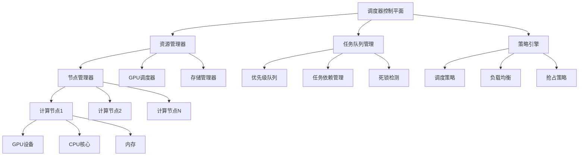

# 机器学习集群调度与资源管理

> **定位**：大规模ML训练的资源调度与管理核心技术
> **作者**：Claude
> **创建时间**：2025年8月22日
> **标签**：#集群调度 #资源管理 #分布式训练 #MLOps

---

## 📝 核心概念

**机器学习集群调度** 是指在分布式计算环境中，智能分配和管理计算资源（CPU、GPU、内存、存储、网络）以支持大规模机器学习训练和推理任务的系统技术。

### 🎯 核心挑战

1. **资源异构性**：CPU、GPU、TPU等不同计算设备
2. **任务多样性**：训练、推理、数据处理等不同负载
3. **动态扩缩容**：根据负载自动调整资源
4. **故障容错**：处理硬件故障和任务重启

---

## 🏗️ 调度系统架构

### 1️⃣ 总体架构


### 2️⃣ 调度器核心组件

#### 🎛️ 主调度器
```python
class MLClusterScheduler:
    def __init__(self):
        self.resource_manager = ResourceManager()
        self.job_queue = JobQueue()
        self.scheduler_policies = SchedulingPolicies()
        self.node_manager = NodeManager()

    def schedule_job(self, job):
        """主调度逻辑"""
        # 1. 作业验证和预处理
        validated_job = self.validate_job(job)

        # 2. 资源需求分析
        resource_requirements = self.analyze_resource_requirements(validated_job)

        # 3. 资源匹配和分配
        allocated_resources = self.allocate_resources(resource_requirements)

        if allocated_resources:
            # 4. 启动作业
            self.launch_job(validated_job, allocated_resources)
            return True
        else:
            # 5. 加入等待队列
            self.job_queue.enqueue(validated_job)
            return False

    def continuous_scheduling_loop(self):
        """持续调度循环"""
        while True:
            # 1. 检查资源状态
            self.resource_manager.update_resource_status()

            # 2. 处理排队作业
            pending_jobs = self.job_queue.get_pending_jobs()

            for job in pending_jobs:
                if self.try_schedule_job(job):
                    self.job_queue.remove(job)

            # 3. 执行抢占策略
            self.execute_preemption_if_needed()

            # 4. 清理完成的作业
            self.cleanup_completed_jobs()

            time.sleep(self.scheduling_interval)
```

#### 🔧 资源管理器
```python
class ResourceManager:
    def __init__(self):
        self.nodes = {}
        self.gpu_pools = {}
        self.resource_monitors = {}

    def register_node(self, node_info):
        """注册计算节点"""
        node_id = node_info['node_id']
        self.nodes[node_id] = {
            'cpu_cores': node_info['cpu_cores'],
            'memory_gb': node_info['memory_gb'],
            'gpu_devices': node_info['gpu_devices'],
            'storage_gb': node_info['storage_gb'],
            'network_bandwidth': node_info['network_bandwidth'],
            'status': 'available',
            'allocated_resources': {},
            'running_jobs': []
        }

        # 注册GPU设备
        for gpu_info in node_info['gpu_devices']:
            gpu_id = f"{node_id}:{gpu_info['device_id']}"
            self.gpu_pools[gpu_id] = {
                'node_id': node_id,
                'device_id': gpu_info['device_id'],
                'memory_mb': gpu_info['memory_mb'],
                'compute_capability': gpu_info['compute_capability'],
                'status': 'free',
                'allocated_to': None
            }

    def allocate_resources(self, resource_request):
        """分配资源"""
        # 1. 分析资源需求
        cpu_cores = resource_request.get('cpu_cores', 1)
        memory_gb = resource_request.get('memory_gb', 4)
        gpu_count = resource_request.get('gpu_count', 0)
        gpu_memory_mb = resource_request.get('gpu_memory_mb', 0)

        # 2. 寻找合适的节点
        candidate_nodes = self.find_candidate_nodes(resource_request)

        if not candidate_nodes:
            return None

        # 3. 选择最优节点
        best_node = self.select_best_node(candidate_nodes, resource_request)

        # 4. 执行资源分配
        allocation = self.perform_allocation(best_node, resource_request)

        return allocation

    def find_candidate_nodes(self, resource_request):
        """寻找候选节点"""
        candidates = []

        for node_id, node_info in self.nodes.items():
            if self.node_can_satisfy_request(node_info, resource_request):
                candidates.append(node_id)

        return candidates

    def node_can_satisfy_request(self, node_info, resource_request):
        """检查节点是否能满足资源需求"""
        # CPU检查
        available_cpu = (node_info['cpu_cores'] -
                        node_info['allocated_resources'].get('cpu_cores', 0))
        if available_cpu < resource_request.get('cpu_cores', 1):
            return False

        # 内存检查
        available_memory = (node_info['memory_gb'] -
                           node_info['allocated_resources'].get('memory_gb', 0))
        if available_memory < resource_request.get('memory_gb', 4):
            return False

        # GPU检查
        if resource_request.get('gpu_count', 0) > 0:
            available_gpus = self.count_available_gpus(node_info['node_id'])
            if available_gpus < resource_request.get('gpu_count', 0):
                return False

        return True
```

#### 📊 任务队列管理
```python
class JobQueue:
    def __init__(self):
        self.priority_queues = {
            'high': PriorityQueue(),
            'medium': PriorityQueue(),
            'low': PriorityQueue()
        }
        self.job_dependencies = {}
        self.running_jobs = {}

    def enqueue_job(self, job):
        """作业入队"""
        priority = job.get('priority', 'medium')
        job_id = job['job_id']

        # 1. 检查依赖关系
        dependencies = job.get('dependencies', [])
        if dependencies:
            self.job_dependencies[job_id] = dependencies

        # 2. 计算优先级分数
        priority_score = self.calculate_priority_score(job)

        # 3. 加入对应优先级队列
        self.priority_queues[priority].put((priority_score, job))

    def calculate_priority_score(self, job):
        """计算优先级分数"""
        base_priority = {
            'high': 1000,
            'medium': 500,
            'low': 100
        }.get(job.get('priority', 'medium'), 500)

        # 考虑等待时间
        wait_time_bonus = min(time.time() - job['submit_time'], 3600) / 3600 * 100

        # 考虑资源需求（小任务优先）
        resource_penalty = job.get('gpu_count', 1) * 10

        # 考虑用户配额
        user_bonus = self.get_user_priority_bonus(job['user_id'])

        total_score = base_priority + wait_time_bonus - resource_penalty + user_bonus

        return total_score

    def get_schedulable_jobs(self):
        """获取可调度的作业"""
        schedulable_jobs = []

        # 按优先级从高到低处理
        for priority in ['high', 'medium', 'low']:
            queue = self.priority_queues[priority]

            while not queue.empty():
                _, job = queue.get()
                job_id = job['job_id']

                # 检查依赖是否满足
                if self.dependencies_satisfied(job_id):
                    schedulable_jobs.append(job)
                else:
                    # 依赖未满足，重新入队
                    queue.put((self.calculate_priority_score(job), job))
                    break

        return schedulable_jobs

    def dependencies_satisfied(self, job_id):
        """检查作业依赖是否满足"""
        if job_id not in self.job_dependencies:
            return True

        dependencies = self.job_dependencies[job_id]
        for dep_job_id in dependencies:
            if dep_job_id not in self.completed_jobs:
                return False

        return True
```

---

## 🚀 调度策略

### 1️⃣ 基础调度算法
```python
class SchedulingPolicies:
    def first_fit_decreasing(self, jobs, nodes):
        """首次适应递减算法"""
        # 1. 按资源需求排序（降序）
        sorted_jobs = sorted(jobs,
                           key=lambda x: x.get('gpu_count', 0),
                           reverse=True)

        # 2. 为每个作业寻找第一个合适的节点
        allocations = []
        for job in sorted_jobs:
            for node_id in nodes:
                if self.can_allocate(job, node_id):
                    allocation = self.allocate_job_to_node(job, node_id)
                    allocations.append(allocation)
                    break

        return allocations

    def best_fit(self, jobs, nodes):
        """最佳适应算法"""
        allocations = []

        for job in jobs:
            best_node = None
            min_waste = float('inf')

            for node_id in nodes:
                if self.can_allocate(job, node_id):
                    waste = self.calculate_resource_waste(job, node_id)
                    if waste < min_waste:
                        min_waste = waste
                        best_node = node_id

            if best_node:
                allocation = self.allocate_job_to_node(job, best_node)
                allocations.append(allocation)

        return allocations

    def gang_scheduling(self, parallel_jobs):
        """团体调度算法"""
        for job_group in parallel_jobs:
            all_nodes_available = True
            required_nodes = []

            # 1. 检查所有需要的节点是否可用
            for sub_job in job_group:
                suitable_node = self.find_suitable_node(sub_job)
                if suitable_node:
                    required_nodes.append((sub_job, suitable_node))
                else:
                    all_nodes_available = False
                    break

            # 2. 如果所有节点都可用，则同时分配
            if all_nodes_available:
                for sub_job, node in required_nodes:
                    self.allocate_job_to_node(sub_job, node)
                return True

        return False
```

### 2️⃣ GPU特化调度
```python
class GPUScheduler:
    def __init__(self):
        self.gpu_topology = {}
        self.gpu_utilization = {}

    def gpu_aware_scheduling(self, job, available_gpus):
        """GPU感知调度"""
        gpu_requirements = job.get('gpu_requirements', {})
        gpu_count = gpu_requirements.get('count', 1)
        min_memory = gpu_requirements.get('min_memory_mb', 0)
        compute_capability = gpu_requirements.get('min_compute_capability', 0)

        # 1. 过滤满足要求的GPU
        suitable_gpus = []
        for gpu_id, gpu_info in available_gpus.items():
            if (gpu_info['memory_mb'] >= min_memory and
                gpu_info['compute_capability'] >= compute_capability):
                suitable_gpus.append(gpu_id)

        if len(suitable_gpus) < gpu_count:
            return None

        # 2. 选择最优GPU组合
        if job.get('require_gpu_locality', False):
            # 优先选择同一节点的GPU
            selected_gpus = self.select_local_gpus(suitable_gpus, gpu_count)
        else:
            # 选择负载最轻的GPU
            selected_gpus = self.select_least_loaded_gpus(suitable_gpus, gpu_count)

        return selected_gpus

    def select_local_gpus(self, suitable_gpus, gpu_count):
        """选择本地GPU组合"""
        node_gpu_map = {}

        # 按节点分组GPU
        for gpu_id in suitable_gpus:
            node_id = gpu_id.split(':')[0]
            if node_id not in node_gpu_map:
                node_gpu_map[node_id] = []
            node_gpu_map[node_id].append(gpu_id)

        # 优先从单个节点选择GPU
        for node_id, gpus in node_gpu_map.items():
            if len(gpus) >= gpu_count:
                return gpus[:gpu_count]

        # 如果单节点不够，跨节点选择
        return suitable_gpus[:gpu_count]

    def dynamic_gpu_sharing(self, jobs):
        """动态GPU共享"""
        # 1. 分析作业GPU利用率
        low_utilization_jobs = []
        high_priority_pending_jobs = []

        for job in jobs:
            gpu_util = self.get_job_gpu_utilization(job['job_id'])
            if gpu_util < 0.5:  # GPU利用率低于50%
                low_utilization_jobs.append(job)

        # 2. 找到可以共享GPU的作业组合
        sharing_opportunities = []
        for low_util_job in low_utilization_jobs:
            compatible_jobs = self.find_compatible_jobs(low_util_job, high_priority_pending_jobs)
            if compatible_jobs:
                sharing_opportunities.append((low_util_job, compatible_jobs))

        # 3. 执行GPU共享
        for base_job, compatible_jobs in sharing_opportunities:
            self.enable_gpu_sharing(base_job, compatible_jobs)
```

---

## 🔄 弹性调度

### 1️⃣ 动态扩缩容
```python
class ElasticScheduling:
    def __init__(self):
        self.auto_scaler = AutoScaler()
        self.checkpoint_manager = CheckpointManager()

    def elastic_training_management(self, job):
        """弹性训练管理"""
        # 1. 监控训练进度和资源利用率
        training_metrics = self.monitor_training_progress(job)

        # 2. 决定是否需要扩缩容
        scaling_decision = self.make_scaling_decision(training_metrics)

        if scaling_decision['action'] == 'scale_out':
            self.scale_out_training(job, scaling_decision['target_workers'])
        elif scaling_decision['action'] == 'scale_in':
            self.scale_in_training(job, scaling_decision['target_workers'])

    def scale_out_training(self, job, target_workers):
        """训练扩容"""
        current_workers = len(job['allocated_resources']['workers'])

        if target_workers > current_workers:
            # 1. 申请额外资源
            additional_resources = self.request_additional_resources(
                target_workers - current_workers
            )

            if additional_resources:
                # 2. 创建检查点
                checkpoint_path = self.checkpoint_manager.create_checkpoint(job)

                # 3. 停止当前训练
                self.pause_training(job)

                # 4. 重新启动训练（更多worker）
                self.restart_training_with_more_workers(
                    job, additional_resources, checkpoint_path
                )

    def scale_in_training(self, job, target_workers):
        """训练缩容"""
        current_workers = len(job['allocated_resources']['workers'])

        if target_workers < current_workers:
            # 1. 创建检查点
            checkpoint_path = self.checkpoint_manager.create_checkpoint(job)

            # 2. 优雅停止部分worker
            workers_to_remove = current_workers - target_workers
            self.gracefully_stop_workers(job, workers_to_remove)

            # 3. 释放资源
            self.release_worker_resources(job, workers_to_remove)

            # 4. 从检查点恢复训练
            self.resume_training_from_checkpoint(job, checkpoint_path)

    def make_scaling_decision(self, metrics):
        """制定扩缩容决策"""
        current_throughput = metrics['samples_per_second']
        gpu_utilization = metrics['average_gpu_utilization']
        queue_length = metrics['data_queue_length']

        # 扩容条件
        if (gpu_utilization > 0.9 and
            queue_length > 100 and
            self.can_benefit_from_scaling(metrics)):
            return {
                'action': 'scale_out',
                'target_workers': min(metrics['current_workers'] * 2,
                                    metrics['max_workers'])
            }

        # 缩容条件
        elif (gpu_utilization < 0.3 and
              metrics['current_workers'] > 1):
            return {
                'action': 'scale_in',
                'target_workers': max(metrics['current_workers'] // 2, 1)
            }

        return {'action': 'no_change'}
```

### 2️⃣ 抢占和优先级
```python
class PreemptionManager:
    def __init__(self):
        self.preemption_policies = {}
        self.checkpoint_manager = CheckpointManager()

    def execute_preemption(self, high_priority_job, low_priority_jobs):
        """执行抢占"""
        # 1. 选择要被抢占的作业
        victims = self.select_preemption_victims(
            high_priority_job, low_priority_jobs
        )

        # 2. 为被抢占作业创建检查点
        checkpoints = {}
        for victim_job in victims:
            if victim_job.get('checkpointable', True):
                checkpoint_path = self.checkpoint_manager.create_checkpoint(victim_job)
                checkpoints[victim_job['job_id']] = checkpoint_path

        # 3. 停止被抢占的作业
        for victim_job in victims:
            self.gracefully_stop_job(victim_job)

        # 4. 释放资源给高优先级作业
        freed_resources = self.collect_freed_resources(victims)

        # 5. 启动高优先级作业
        self.allocate_and_start_job(high_priority_job, freed_resources)

        # 6. 将被抢占作业重新加入队列
        for victim_job in victims:
            if victim_job['job_id'] in checkpoints:
                victim_job['checkpoint_path'] = checkpoints[victim_job['job_id']]
            self.requeue_preempted_job(victim_job)

    def select_preemption_victims(self, high_priority_job, candidates):
        """选择抢占受害者"""
        resource_needed = high_priority_job['resource_requirements']

        # 计算每个候选作业的抢占成本
        victim_scores = []
        for job in candidates:
            score = self.calculate_preemption_cost(job)
            victim_scores.append((score, job))

        # 按成本排序，选择成本最低的组合
        victim_scores.sort(key=lambda x: x[0])

        selected_victims = []
        freed_resources = {'cpu_cores': 0, 'memory_gb': 0, 'gpu_count': 0}

        for score, job in victim_scores:
            if self.resource_sufficient(freed_resources, resource_needed):
                break

            selected_victims.append(job)
            self.add_resources(freed_resources, job['allocated_resources'])

        return selected_victims

    def calculate_preemption_cost(self, job):
        """计算抢占成本"""
        # 考虑因素：
        # 1. 作业运行时间（运行越久成本越高）
        runtime_cost = time.time() - job['start_time']

        # 2. 检查点开销
        checkpoint_cost = job.get('checkpoint_overhead', 0)

        # 3. 重启成本
        restart_cost = job.get('restart_overhead', 0)

        # 4. 优先级差异
        priority_cost = (5 - job.get('priority_level', 3)) * 100

        return runtime_cost + checkpoint_cost + restart_cost + priority_cost
```

---

## 📊 监控与故障处理

### 1️⃣ 资源监控
```python
class ClusterMonitor:
    def __init__(self):
        self.metrics_collector = MetricsCollector()
        self.alert_manager = AlertManager()

    def collect_cluster_metrics(self):
        """收集集群指标"""
        cluster_metrics = {}

        # 1. 节点级指标
        for node_id in self.nodes:
            node_metrics = {
                'cpu_utilization': self.get_cpu_utilization(node_id),
                'memory_utilization': self.get_memory_utilization(node_id),
                'gpu_utilization': self.get_gpu_utilization(node_id),
                'network_io': self.get_network_io(node_id),
                'disk_io': self.get_disk_io(node_id),
                'temperature': self.get_temperature(node_id)
            }
            cluster_metrics[node_id] = node_metrics

        # 2. 作业级指标
        job_metrics = {}
        for job_id in self.running_jobs:
            job_metrics[job_id] = {
                'training_loss': self.get_training_loss(job_id),
                'throughput': self.get_throughput(job_id),
                'gpu_memory_usage': self.get_gpu_memory_usage(job_id),
                'communication_overhead': self.get_communication_overhead(job_id)
            }

        cluster_metrics['jobs'] = job_metrics

        # 3. 集群级指标
        cluster_metrics['cluster'] = {
            'total_jobs': len(self.running_jobs),
            'queue_length': self.job_queue.size(),
            'average_wait_time': self.calculate_average_wait_time(),
            'resource_utilization': self.calculate_overall_utilization()
        }

        return cluster_metrics

    def detect_anomalies(self, metrics):
        """异常检测"""
        anomalies = []

        # 1. 资源异常
        for node_id, node_metrics in metrics.items():
            if isinstance(node_metrics, dict):
                # CPU异常
                if node_metrics.get('cpu_utilization', 0) > 95:
                    anomalies.append({
                        'type': 'high_cpu_utilization',
                        'node_id': node_id,
                        'value': node_metrics['cpu_utilization']
                    })

                # GPU异常
                if node_metrics.get('gpu_utilization', 0) < 10:
                    anomalies.append({
                        'type': 'low_gpu_utilization',
                        'node_id': node_id,
                        'value': node_metrics['gpu_utilization']
                    })

        # 2. 作业异常
        job_metrics = metrics.get('jobs', {})
        for job_id, job_metric in job_metrics.items():
            # 训练停滞
            if job_metric.get('throughput', 0) < 0.1:
                anomalies.append({
                    'type': 'training_stalled',
                    'job_id': job_id,
                    'throughput': job_metric['throughput']
                })

        return anomalies
```

### 2️⃣ 故障恢复
```python
class FaultTolerance:
    def __init__(self):
        self.failure_detector = FailureDetector()
        self.recovery_manager = RecoveryManager()

    def handle_node_failure(self, failed_node_id):
        """处理节点故障"""
        # 1. 识别受影响的作业
        affected_jobs = self.find_jobs_on_node(failed_node_id)

        # 2. 为每个受影响作业制定恢复策略
        for job in affected_jobs:
            recovery_strategy = self.determine_recovery_strategy(job)

            if recovery_strategy == 'restart':
                self.restart_job_on_healthy_nodes(job)
            elif recovery_strategy == 'checkpoint_restore':
                self.restore_from_checkpoint(job)
            elif recovery_strategy == 'partial_restart':
                self.restart_failed_workers(job, failed_node_id)

        # 3. 标记节点为不可用
        self.mark_node_unavailable(failed_node_id)

        # 4. 触发自动扩容（如果需要）
        self.trigger_auto_scaling_if_needed()

    def determine_recovery_strategy(self, job):
        """确定恢复策略"""
        # 检查是否有可用检查点
        latest_checkpoint = self.checkpoint_manager.get_latest_checkpoint(job['job_id'])

        if latest_checkpoint:
            checkpoint_age = time.time() - latest_checkpoint['timestamp']
            if checkpoint_age < 300:  # 5分钟内的检查点
                return 'checkpoint_restore'

        # 检查是否为分布式作业
        if job.get('distributed', False):
            return 'partial_restart'

        # 默认完全重启
        return 'restart'

    def implement_checkpointing(self, job):
        """实现检查点机制"""
        checkpoint_config = {
            'frequency': job.get('checkpoint_frequency', 600),  # 10分钟
            'storage_path': f"/checkpoints/{job['job_id']}",
            'compression': True,
            'async_save': True
        }

        # 启动检查点守护进程
        checkpoint_daemon = CheckpointDaemon(job['job_id'], checkpoint_config)
        checkpoint_daemon.start()

        return checkpoint_daemon
```

---

## 🔗 与其他技术的关系

### 🔗 相关技术栈
- **[[联邦学习系统架构]]**：分布式协调的特殊应用
- **[[PyTorch深度学习框架]]** / **[[TensorFlow深度学习框架]]**：作业执行引擎
- **[[向量数据库技术基础]]**：分布式数据存储
- **[[端侧AI芯片技术]]**：异构计算资源

### 🔗 应用场景
- **大模型训练**：GPT、BERT等大规模模型训练
- **超参数优化**：并行超参数搜索
- **数据并行训练**：图像识别、自然语言处理
- **在线推理服务**：实时预测请求处理

---

## 🎯 学习建议

### 📚 基础路径
1. **分布式系统**：共识算法、分布式存储
2. **操作系统**：进程调度、资源管理
3. **容器技术**：Docker、Kubernetes
4. **网络编程**：高性能网络通信

### 🔬 进阶方向
1. **调度算法**：图论、组合优化
2. **机器学习系统**：分布式训练、模型并行
3. **云原生技术**：微服务、服务网格
4. **性能优化**：系统调优、资源效率

---

*机器学习集群调度是支撑大规模AI应用的关键基础设施，它决定了AI系统的性能、可扩展性和可靠性。*