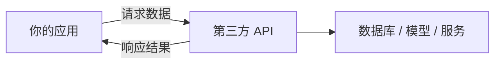
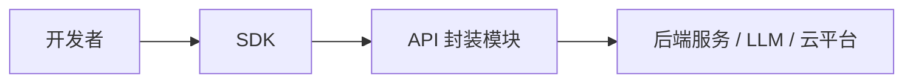

---
tags:
  - 入门
  - 实用
  - 平台生态
---
# **🔑 关键词提取**

- API（Application Programming Interface）
    
- SDK（Software Development Kit）
    
- 接口、封装、模块化
    
- 开发者平台
    
- 平台开放生态
    
- 插件系统、扩展能力

---

# **🧩 一、API 是什么？**

## **🔧 概念定义：**

> **API（应用程序编程接口）**是一个软件系统对外暴露的“功能调用接口”，允许其他程序访问其功能或数据。

## **🧠 通俗理解：**

- 把软件比作“饭店”，API 就是菜单。
    
- 你不需要了解厨房内部怎么做菜，只需要通过菜单（API）点菜（调用功能）即可。

## **🧱 结构组成（一般形式）：**

```
POST /login  
{
  "username": "your_name",
  "password": "your_pass"
}
```

包含：

- **接口地址（endpoint）**：访问的具体 URL。
    
- **方法（Method）**：GET / POST / PUT / DELETE 等。
    
- **参数（Parameters）**：输入数据格式。
    
- **返回值（Response）**：输出数据结构。

## **📦 功能示意图：**



---

# **🛠 二、SDK 是什么？**

## **🔧 概念定义：**

> **SDK（软件开发工具包）**是一组帮助开发者快速构建特定应用的“工具集合”，通常包括：API 封装库、文档、样例代码、测试工具等。

## **🧠 通俗理解：**

- SDK 就像一个“积木套装”，里面有说明书（文档）、零件（代码模块）、工具（调试器）等，帮助你快速搭建一座“房子”（应用）。

## **📂 典型 SDK 包含内容：**

|**模块**|**功能**|
|---|---|
|API 封装库|封装底层 API，简化调用|
|示例代码|快速上手使用范例|
|文档|参数说明与用法指南|
|工具|调试器、模拟器、UI 设计器等|
|依赖|包管理器配置文件、库引用等|

---

# **🔄 三、API 与 SDK 的关系与区别**

|**维度**|**API**|**SDK**|
|---|---|---|
|本质|功能访问接口|工具集合（包含 API）|
|形式|单独接口或一组接口|包含文档、库、代码等|
|使用门槛|需要了解协议与封装|提供现成模块，使用更简单|
|场景|Web API（如天气接口）|App SDK（如微信登录、支付）|



---

# **🚀 四、开放平台中的作用与意义**

## **✅ 为什么要开放 API / SDK？**

- 📦 **生态搭建**：吸引第三方开发者围绕平台构建插件、集成系统。
    
- 🧩 **模块复用**：降低开发门槛，提高开发效率。
    
- 🌐 **平台扩展性**：推动核心产品成为生态中心（如 Figma、Cursor、Notion、钉钉、微信）。
    
- 💡 **商业模式延伸**：通过 API 计费、SDK 授权实现商业闭环。

---

# **📌 五、实际应用举例**

|**产品**|**提供的 API/SDK**|**用途示例**|
|---|---|---|
|OpenAI|GPT API、Embedding API|创建聊天机器人、文本摘要|
|微信|JS SDK、小程序 SDK|登录、支付、分享等功能|
|Stripe|支付 SDK / REST API|实现信用卡收款系统|
|Cursor（潜力方向）|Cursor 编辑器 API / 插件 SDK|开发 AI 代码代理、企业插件集成|
