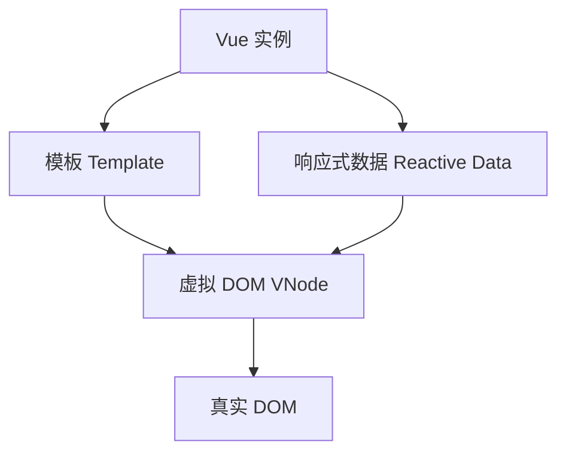

Vue.js 是一个用于构建用户界面的 **渐进式 JavaScript 框架**，由尤雨溪（Evan You）创建，尤其适用于开发**单页应用（SPA）**。它以轻量、灵活、易于上手著称，在国内外前端开发中应用广泛。

---

## **📚 基础概念**

**Vue.js 简述：**

> Vue.js 是一个关注“视图层”的 MVVM 框架，采用声明式编程和组件化开发，核心特点包括**响应式数据绑定**与**组件系统**。

---

## **✨ 核心特性**

|**功能点**|**简述**|
|---|---|
|响应式系统|使用 Object.defineProperty（Vue2）或 Proxy（Vue3）自动追踪依赖并响应数据变化。|
|组件化|将页面拆分为独立可复用的组件，使用 .vue 单文件组件进行开发。|
|模板语法|使用 HTML 结合特殊指令（如 v-if, v-for, v-bind, v-model）描述界面。|
|生命周期钩子|提供如 created, mounted, updated, destroyed 等生命周期函数。|
|虚拟DOM|利用虚拟DOM实现高效的DOM更新和渲染优化。|
|单向数据流|子组件不能直接修改父组件传来的 props，增强了数据流向可控性。|

---

## **🔧 技术架构图**



---

## **🛠 Vue生态系统**

|**工具 / 库**|**功能描述**|
|---|---|
|Vue Router|官方路由库，支持嵌套路由、动态路由、懒加载等。|
|Vuex / Pinia|状态管理工具，适合中大型项目中的全局状态维护。|
|Vue CLI / Vite|项目构建与开发工具，Vue3 推荐使用 Vite。|
|Nuxt.js|Vue 的 SSR（服务端渲染）框架，支持静态生成。|

---

## **🧠 对比其他框架（React / Angular）**

|**框架**|**特点**|
|---|---|
|Vue|上手快，文档清晰，适合中小项目和团队快速开发|
|React|JSX 写法自由灵活，生态成熟，适合构建大型复杂项目|
|Angular|企业级框架，功能全但学习曲线陡峭|

---

## **🏁 结语**

Vue 提供了一种清晰而高效的方式构建用户界面，适用于从简单的页面交互到复杂的前端工程。随着 Vue 3 的发布，其性能与类型系统支持也大幅提升，成为现代 Web 开发的重要选择。

如需进一步了解，可以查阅：[Vue官网](https://cn.vuejs.org/) 或开启实际项目练习。

## **📁 一级分类：🧪 技术方法**

🏷 #前端框架 #对比分析 #实用

---

# **✅ 技术方法 - Vue / React / Angular 框架对比分析**

---

## **📊 框架基础概况**

|**特性**|**Vue.js**|**React**|**Angular**|
|---|---|---|---|
|创始人|尤雨溪（Evan You）|Facebook（Meta）|Google|
|首次发布|2014年|2013年|2010年（2.0重写发布于2016年）|
|编程范式|MVVM + 响应式数据流|函数式编程 + 单向数据流|全功能式 MVC 框架|
|是否开箱即用|✅ 支持模板、路由、状态管理集成|❌ 需手动配置路由、状态管理等|✅ 自带完整开发工具链|
|学习曲线|🟢 上手简单，文档清晰|🟡 中等，JSX 需适应|🔴 陡峭，需要掌握TypeScript等概念|

---

## **🧠 核心设计理念对比**

|**维度**|**Vue**|**React**|**Angular**|
|---|---|---|---|
|**模板语法**|HTML + 特殊指令（如 v-if）|JSX（JavaScript + XML）|HTML + 指令（如 *ngIf、[ ]、( )）|
|**组件结构**|单文件组件（.vue）结构清晰|函数组件 + hooks，关注逻辑复用|类 + 装饰器，模块结构复杂|
|**数据流动**|响应式双向绑定（v-model） + 单向流|完全单向流动|默认单向，提供双向绑定语法|
|**状态管理**|Vuex（Vue2） / Pinia（Vue3）|Redux / MobX / Zustand|内建服务注入与依赖注入（DI）|
|**类型支持**|Vue2 支持弱，Vue3原生支持TypeScript|可选使用TypeScript|强制使用TypeScript|
|**指令系统**|v-bind, v-for, v-if等|无“指令”，完全自定义|丰富内置指令系统（如*ngFor, *ngIf等）|

---

## **🏗️ 架构生态比较**

|**框架**|**路由管理**|**状态管理**|**构建工具**|**SSR支持**|**社区与生态**|
|---|---|---|---|---|---|
|Vue|Vue Router（官方）|Vuex / Pinia（官方）|Vue CLI / Vite|Nuxt.js|国内社区活跃，插件多|
|React|React Router|Redux / MobX 等|Create React App / Vite|Next.js|全球最大生态圈，成熟丰富|
|Angular|内建 Router|内建 Service + RxJS|Angular CLI|Angular Universal|企业支持强，规范完备|

---

## **⚙️ 性能与优化**

|**维度**|**Vue**|**React**|**Angular**|
|---|---|---|---|
|DOM 操作|虚拟 DOM + 编译优化|虚拟 DOM + Fiber架构|真正 DOM + 变更检测（Zone.js）|
|响应式机制|Vue2：Object.definePropertyVue3：Proxy|手动管理状态更新，需调用setState|基于RxJS的响应流|
|编译优化|模板编译成渲染函数，tree-shaking|自动 diff 算法 + hooks优化|AOT 编译，打包体积较大|
|首屏加载体积|中等|轻量（可高度定制）|较大，适合大型企业项目|

---

## **🎯 使用场景推荐**

|**应用类型**|**Vue 推荐**|**React 推荐**|**Angular 推荐**|
|---|---|---|---|
|**中小型项目**|✅ 上手快、开发效率高|✅ 灵活配置、可扩展性强|❌ 复杂度略高|
|**大型项目**|✅ Nuxt + Pinia 可胜任|✅ Next.js / Redux 强适配|✅ 架构严谨，适合大型工程团队|
|**团队协作**|🟢 单文件组件逻辑分离清晰|🟡 JSX自由度大但规范要求高|🟢 内建模块与DI便于团队规范开发|
|**国内项目**|✅ 中文文档完善，生态活跃|✅ 多数大厂使用，生态通用|🟡 少数大厂使用，维护成本高|
|**移动端支持**|✅ 支持 Vue Native / uni-app|✅ React Native 社区成熟|🟡 Angular Native 较冷门|

---

## **🧭 总结：选择建议**

```
graph LR
A[想快速上手] --> Vue
B[重逻辑复用] --> React
C[工程规范化] --> Angular
Vue --> D[中小企业 / 个人项目]
React --> E[创业项目 / 大厂通用]
Angular --> F[政务 / 金融 / 企业后台]
```

---

### **✅ 建议选型思路：**

- **初学者**：推荐从 Vue 开始，语法易懂，上手快。
    
- **创业团队**：React 更具灵活性，配套工具成熟，适合构建 MVP。
    
- **大型企业开发**：Angular 提供全栈方案，适合高规范团队协作与长期维护。

---

如果你有具体的项目背景或使用场景，我可以再进一步推荐适配的技术栈和最佳实践。是否要我为你做一个选型决策树或评分表？