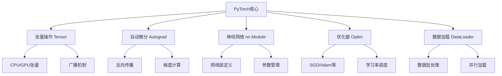

# PyTorch 深度学习框架

> **作用**：最主流的深度学习框架，支持动态计算图和灵活的研究开发
> **层级**：K3-工具平台与生态 → 深度学习框架
> **关联**：[[Transformer架构原理]]、[[大语言模型基础]]、[[CNN卷积神经网络]]、[[RNN循环神经网络]]

---

## 📌 概念定义

**PyTorch**是由Facebook（现Meta）开发的开源深度学习框架，以其动态计算图、Pythonic API和强大的GPU加速能力而闻名。它是目前学术研究和工业界应用最广泛的深度学习框架之一。

### 🎯 核心特点
- **动态计算图**：运行时构建计算图，便于调试和动态网络
- **Pythonic设计**：符合Python习惯的直观API
- **强大GPU支持**：CUDA深度集成，高效GPU计算
- **丰富生态**：庞大的预训练模型库和工具生态

---

## 🏗️ 核心架构

### 🔧 主要组件



### 💡 核心概念

#### 1️⃣ 张量（Tensor）
```python
import torch

# 创建张量
x = torch.tensor([1, 2, 3])
y = torch.randn(3, 4)  # 随机张量

# GPU操作
if torch.cuda.is_available():
    x = x.cuda()  # 移到GPU
    # 或者
    device = torch.device("cuda")
    y = y.to(device)
```

#### 2️⃣ 自动微分（Autograd）
```python
# 启用梯度追踪
x = torch.tensor(2.0, requires_grad=True)
y = x ** 2 + 3 * x + 1

# 反向传播
y.backward()
print(x.grad)  # 输出：tensor(7.0) = 2*x + 3
```

#### 3️⃣ 神经网络模块
```python
import torch.nn as nn

class SimpleNN(nn.Module):
    def __init__(self, input_size, hidden_size, output_size):
        super(SimpleNN, self).__init__()
        self.layer1 = nn.Linear(input_size, hidden_size)
        self.layer2 = nn.Linear(hidden_size, output_size)
        self.relu = nn.ReLU()
    
    def forward(self, x):
        x = self.relu(self.layer1(x))
        x = self.layer2(x)
        return x
```

---

## 🚀 实战应用

### 🔥 训练基本流程

```python
import torch
import torch.nn as nn
import torch.optim as optim
from torch.utils.data import DataLoader

# 1. 定义模型
model = SimpleNN(784, 128, 10)

# 2. 定义损失函数和优化器
criterion = nn.CrossEntropyLoss()
optimizer = optim.Adam(model.parameters(), lr=0.001)

# 3. 训练循环
for epoch in range(num_epochs):
    for batch_idx, (data, target) in enumerate(train_loader):
        # 清零梯度
        optimizer.zero_grad()
        
        # 前向传播
        output = model(data)
        loss = criterion(output, target)
        
        # 反向传播
        loss.backward()
        optimizer.step()
        
        if batch_idx % 100 == 0:
            print(f'Epoch: {epoch}, Loss: {loss.item():.4f}')
```

### 📊 数据处理

```python
from torch.utils.data import Dataset, DataLoader
import torchvision.transforms as transforms

# 自定义数据集
class CustomDataset(Dataset):
    def __init__(self, data, labels, transform=None):
        self.data = data
        self.labels = labels
        self.transform = transform
    
    def __len__(self):
        return len(self.data)
    
    def __getitem__(self, idx):
        sample = self.data[idx]
        if self.transform:
            sample = self.transform(sample)
        return sample, self.labels[idx]

# 数据变换
transform = transforms.Compose([
    transforms.ToTensor(),
    transforms.Normalize((0.5,), (0.5,))
])

# 数据加载器
dataset = CustomDataset(data, labels, transform)
dataloader = DataLoader(dataset, batch_size=32, shuffle=True)
```

---

## 🔗 与其他技术的集成

### 🤝 [[Transformer架构原理|Transformer]]实现

```python
import torch.nn as nn
import torch.nn.functional as F

class MultiHeadAttention(nn.Module):
    def __init__(self, d_model, num_heads):
        super().__init__()
        self.d_model = d_model
        self.num_heads = num_heads
        self.d_k = d_model // num_heads
        
        self.W_q = nn.Linear(d_model, d_model)
        self.W_k = nn.Linear(d_model, d_model)
        self.W_v = nn.Linear(d_model, d_model)
        self.W_o = nn.Linear(d_model, d_model)
    
    def forward(self, query, key, value, mask=None):
        batch_size = query.size(0)
        
        # Linear transformations
        Q = self.W_q(query)
        K = self.W_k(key)
        V = self.W_v(value)
        
        # Reshape for multi-head attention
        Q = Q.view(batch_size, -1, self.num_heads, self.d_k).transpose(1, 2)
        K = K.view(batch_size, -1, self.num_heads, self.d_k).transpose(1, 2)
        V = V.view(batch_size, -1, self.num_heads, self.d_k).transpose(1, 2)
        
        # Scaled dot-product attention
        scores = torch.matmul(Q, K.transpose(-2, -1)) / torch.sqrt(torch.tensor(self.d_k, dtype=torch.float32))
        
        if mask is not None:
            scores = scores.masked_fill(mask == 0, -1e9)
        
        attention = F.softmax(scores, dim=-1)
        context = torch.matmul(attention, V)
        
        # Concatenate heads
        context = context.transpose(1, 2).contiguous().view(batch_size, -1, self.d_model)
        
        # Final linear transformation
        output = self.W_o(context)
        return output
```

### 🛠️ 模型保存与加载

```python
# 保存模型
torch.save(model.state_dict(), 'model_weights.pth')
torch.save(model, 'complete_model.pth')

# 加载模型
model = SimpleNN(784, 128, 10)
model.load_state_dict(torch.load('model_weights.pth'))

# 加载完整模型
model = torch.load('complete_model.pth')
```

---

## 🎯 最佳实践

### ✅ 性能优化

1. **GPU内存管理**
```python
# 清理GPU缓存
torch.cuda.empty_cache()

# 检查GPU内存使用
print(f"已分配: {torch.cuda.memory_allocated() / 1024**2:.2f} MB")
print(f"已缓存: {torch.cuda.memory_reserved() / 1024**2:.2f} MB")
```

2. **混合精度训练**
```python
from torch.cuda.amp import GradScaler, autocast

scaler = GradScaler()

for data, target in dataloader:
    optimizer.zero_grad()
    
    # 自动混合精度
    with autocast():
        output = model(data)
        loss = criterion(output, target)
    
    # 梯度缩放
    scaler.scale(loss).backward()
    scaler.step(optimizer)
    scaler.update()
```

3. **数据并行化**
```python
# 单机多GPU
if torch.cuda.device_count() > 1:
    model = nn.DataParallel(model)

# 分布式训练
from torch.nn.parallel import DistributedDataParallel as DDP
model = DDP(model, device_ids=[local_rank])
```

### 🚫 常见陷阱

1. **梯度爆炸/消失**
```python
# 梯度裁剪
torch.nn.utils.clip_grad_norm_(model.parameters(), max_norm=1.0)

# 权重初始化
def init_weights(m):
    if isinstance(m, nn.Linear):
        torch.nn.init.xavier_uniform_(m.weight)
        m.bias.data.fill_(0.01)

model.apply(init_weights)
```

2. **内存泄漏**
```python
# 使用.detach()断开计算图
loss_value = loss.detach().cpu().item()

# 及时删除不需要的变量
del intermediate_result
```

---

## 📚 生态系统

### 🔧 重要库和扩展

| 库名 | 用途 | 说明 |
|------|------|------|
| **torchvision** | 计算机视觉 | 预训练模型、数据集、变换 |
| **torchaudio** | 音频处理 | 音频数据加载和处理 |
| **torchtext** | 文本处理 | NLP数据处理工具 |
| **Lightning** | 高级封装 | 简化训练循环的框架 |
| **Transformers** | NLP模型 | Hugging Face的[[Transformer架构原理|Transformer]]库 |
| **FastAPI + PyTorch** | 模型部署 | 构建推理服务 |

### 🌐 与[[大语言模型基础|大语言模型]]的结合

```python
# 使用Hugging Face Transformers
from transformers import AutoModel, AutoTokenizer
import torch

# 加载预训练模型
model_name = "bert-base-uncased"
tokenizer = AutoTokenizer.from_pretrained(model_name)
model = AutoModel.from_pretrained(model_name)

# 推理示例
text = "Hello, world!"
inputs = tokenizer(text, return_tensors="pt")

with torch.no_grad():
    outputs = model(**inputs)
    last_hidden_states = outputs.last_hidden_state
```

---

## 🔮 发展趋势

### 📈 技术演进

1. **编译优化**
   - TorchScript：模型序列化和优化
   - TorchDynamo：动态图编译加速
   - AOTAutograd：提前自动微分

2. **硬件适配**
   - 支持更多AI芯片（TPU、NPU）
   - 量化和压缩工具
   - 移动端部署优化

3. **易用性提升**
   - PyTorch Lightning的进一步集成
   - 自动化模型调优
   - 更好的调试工具

### 🚀 应用方向

- **科学计算**：PyTorch在物理仿真、生物信息学中的应用
- **边缘部署**：PyTorch Mobile和ONNX的深度整合
- **量子计算**：PennyLane等量子机器学习框架
- **联邦学习**：分布式隐私保护训练

---

## 📖 学习路径

### 🎓 推荐学习顺序

1. **基础概念**
   - 理解张量操作和自动微分
   - 掌握基本的神经网络构建

2. **深度学习模型**
   - 实现[[CNN卷积神经网络|CNN]]进行图像分类
   - 构建[[RNN循环神经网络|RNN]]处理序列数据
   - 学习[[Transformer架构原理|Transformer]]架构

3. **高级特性**
   - 自定义损失函数和优化器
   - 模型并行和数据并行
   - 混合精度训练

4. **实践项目**
   - 图像分类项目
   - 文本生成模型
   - 多模态应用开发

### 🛠️ 实用资源

- **官方文档**：https://pytorch.org/docs/
- **教程集合**：PyTorch官方教程
- **社区资源**：PyTorch论坛和GitHub
- **在线课程**：深度学习专项课程
- **实战项目**：Kaggle竞赛和开源项目

---

## 🎯 总结

PyTorch作为现代深度学习的核心工具：
- 🔥 **易用性**：直观的API设计，便于快速原型
- ⚡ **灵活性**：动态图特性，支持复杂模型架构
- 🚀 **生态丰富**：完整的工具链和社区支持
- 🎯 **产业应用**：从研究到生产的无缝对接

掌握PyTorch是现代AI开发的必备技能，它为[[Transformer架构原理|Transformer]]、[[大语言模型基础|大语言模型]]等前沿技术的实现提供了强大的基础平台。无论是学术研究还是工业应用，PyTorch都是连接AI理论与实践的重要桥梁。