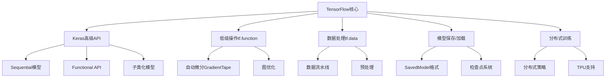

# TensorFlow 深度学习框架

> **作用**：Google开发的端到端开源机器学习平台，擅长生产部署和大规模训练
> **层级**：K3-工具平台与生态 → 深度学习框架  
> **关联**：[[PyTorch深度学习框架]]、[[Transformer架构原理]]、[[大语言模型基础]]、[[CNN卷积神经网络]]

---

## 📌 概念定义

**TensorFlow**是由Google开发的端到端开源机器学习平台，以其强大的生产部署能力、静态计算图优化和跨平台支持而闻名。TensorFlow 2.0引入了Eager Execution，使其兼具灵活性和性能优势。

### 🎯 核心特点
- **生产就绪**：专为大规模部署设计的成熟平台
- **跨平台支持**：从移动设备到分布式集群的全栈解决方案
- **静态+动态图**：Graph模式优化性能，Eager模式便于调试
- **完整生态**：TensorBoard、TensorFlow Serving等完整工具链

---

## 🏗️ 核心架构

### 🔧 主要组件



### 💡 核心概念

#### 1️⃣ Keras高级API
```python
import tensorflow as tf
from tensorflow import keras

# Sequential模型
model = keras.Sequential([
    keras.layers.Dense(128, activation='relu', input_shape=(784,)),
    keras.layers.Dropout(0.2),
    keras.layers.Dense(10, activation='softmax')
])

# 编译模型
model.compile(
    optimizer='adam',
    loss='sparse_categorical_crossentropy',
    metrics=['accuracy']
)
```

#### 2️⃣ 自定义训练循环
```python
import tensorflow as tf

# 使用GradientTape进行自定义训练
@tf.function
def train_step(x, y):
    with tf.GradientTape() as tape:
        predictions = model(x, training=True)
        loss = loss_fn(y, predictions)
    
    gradients = tape.gradient(loss, model.trainable_variables)
    optimizer.apply_gradients(zip(gradients, model.trainable_variables))
    
    return loss

# 训练循环
for epoch in range(epochs):
    for x_batch, y_batch in train_dataset:
        loss = train_step(x_batch, y_batch)
```

#### 3️⃣ 数据流水线
```python
# 高效的数据处理流水线
dataset = tf.data.Dataset.from_tensor_slices((x_train, y_train))
dataset = dataset.batch(32).shuffle(1000).prefetch(tf.data.AUTOTUNE)

# 数据增强
def augment(image, label):
    image = tf.image.random_flip_left_right(image)
    image = tf.image.random_brightness(image, 0.2)
    return image, label

dataset = dataset.map(augment, num_parallel_calls=tf.data.AUTOTUNE)
```

---

## 🚀 实战应用

### 🔥 Functional API构建复杂模型

```python
# 多输入多输出模型
inputs = keras.Input(shape=(784,))
dense = keras.layers.Dense(64, activation="relu")
x = dense(inputs)

# 分支1：分类
classification_output = keras.layers.Dense(10, activation="softmax", name="classification")(x)

# 分支2：回归
regression_output = keras.layers.Dense(1, name="regression")(x)

# 创建模型
model = keras.Model(inputs=inputs, outputs=[classification_output, regression_output])

# 编译多输出模型
model.compile(
    optimizer="adam",
    loss={
        "classification": "sparse_categorical_crossentropy",
        "regression": "mse"
    },
    metrics={
        "classification": "accuracy",
        "regression": "mae"
    }
)
```

### 📊 自定义层和模型

```python
# 自定义层
class MultiHeadAttention(keras.layers.Layer):
    def __init__(self, num_heads, d_model):
        super(MultiHeadAttention, self).__init__()
        self.num_heads = num_heads
        self.d_model = d_model
        
        assert d_model % self.num_heads == 0
        
        self.depth = d_model // self.num_heads
        
        self.wq = keras.layers.Dense(d_model)
        self.wk = keras.layers.Dense(d_model)
        self.wv = keras.layers.Dense(d_model)
        
        self.dense = keras.layers.Dense(d_model)
    
    def call(self, inputs, mask=None):
        batch_size = tf.shape(inputs)[0]
        
        q = self.wq(inputs)
        k = self.wk(inputs)
        v = self.wv(inputs)
        
        # 分割为多头
        q = self.split_heads(q, batch_size)
        k = self.split_heads(k, batch_size)
        v = self.split_heads(v, batch_size)
        
        # 缩放点积注意力
        attention = self.scaled_dot_product_attention(q, k, v, mask)
        attention = tf.transpose(attention, perm=[0, 2, 1, 3])
        
        concat_attention = tf.reshape(attention, (batch_size, -1, self.d_model))
        output = self.dense(concat_attention)
        
        return output
```

### 🛠️ 模型部署

```python
# 保存完整模型
model.save('my_model')

# 转换为TensorFlow Lite（移动端部署）
converter = tf.lite.TFLiteConverter.from_saved_model('my_model')
converter.optimizations = [tf.lite.Optimize.DEFAULT]
tflite_model = converter.convert()

with open('model.tflite', 'wb') as f:
    f.write(tflite_model)

# TensorFlow.js转换（Web部署）
# tensorflowjs_converter --input_format=tf_saved_model \
#                        --output_node_names='output' \
#                        my_model \
#                        web_model/
```

---

## 🔗 与其他技术的集成

### 🤝 [[Transformer架构原理|Transformer]]实现

```python
class TransformerEncoder(keras.layers.Layer):
    def __init__(self, num_heads, d_model, dff, rate=0.1):
        super(TransformerEncoder, self).__init__()
        
        self.mha = MultiHeadAttention(num_heads, d_model)
        self.ffn = keras.Sequential([
            keras.layers.Dense(dff, activation='relu'),
            keras.layers.Dense(d_model)
        ])
        
        self.layernorm1 = keras.layers.LayerNormalization(epsilon=1e-6)
        self.layernorm2 = keras.layers.LayerNormalization(epsilon=1e-6)
        
        self.dropout1 = keras.layers.Dropout(rate)
        self.dropout2 = keras.layers.Dropout(rate)
    
    def call(self, x, training, mask):
        attn_output = self.mha(x, mask=mask)
        attn_output = self.dropout1(attn_output, training=training)
        out1 = self.layernorm1(x + attn_output)
        
        ffn_output = self.ffn(out1)
        ffn_output = self.dropout2(ffn_output, training=training)
        out2 = self.layernorm2(out1 + ffn_output)
        
        return out2
```

### 📈 TensorBoard可视化

```python
# 设置TensorBoard回调
tensorboard_callback = keras.callbacks.TensorBoard(
    log_dir='./logs',
    histogram_freq=1,
    write_graph=True,
    write_images=True
)

# 训练时使用回调
model.fit(
    train_dataset,
    epochs=10,
    validation_data=val_dataset,
    callbacks=[tensorboard_callback]
)

# 自定义指标记录
with tf.summary.create_file_writer('./logs').as_default():
    tf.summary.scalar('custom_metric', value, step=epoch)
```

---

## 🎯 TensorFlow vs [[PyTorch深度学习框架|PyTorch]]

### 📊 关键对比

| 特性 | TensorFlow | [[PyTorch深度学习框架\|PyTorch]] |
|------|------------|---------|
| **学习曲线** | 较陡峭 | 相对平缓 |
| **调试** | TensorBoard强大 | 原生Python调试 |
| **部署** | 工业级成熟 | 快速发展中 |
| **移动端** | TF Lite成熟 | 支持有限 |
| **研究** | 适中 | 更受欢迎 |
| **工业应用** | 广泛采用 | 快速增长 |

### 🔄 选择指南

**选择TensorFlow的场景**：
- 需要生产部署到移动端或Web
- 团队有Google生态依赖
- 需要大规模分布式训练
- 重视模型优化和推理性能

**选择[[PyTorch深度学习框架|PyTorch]]的场景**：
- 研究导向的项目
- 需要频繁调试和实验
- 团队更熟悉Pythonic风格
- 快速原型开发

---

## 🚀 高级特性

### ⚡ 性能优化

1. **图优化**
```python
# 使用tf.function进行图编译
@tf.function
def train_step(x, y):
    with tf.GradientTape() as tape:
        predictions = model(x, training=True)
        loss = loss_fn(y, predictions)
    gradients = tape.gradient(loss, model.trainable_variables)
    optimizer.apply_gradients(zip(gradients, model.trainable_variables))
    return loss

# XLA加速编译
@tf.function(jit_compile=True)
def fast_function(x):
    return tf.nn.relu(tf.matmul(x, x))
```

2. **分布式训练**
```python
# 多GPU分布式策略
strategy = tf.distribute.MirroredStrategy()

with strategy.scope():
    model = create_model()
    model.compile(optimizer='adam',
                  loss=tf.keras.losses.SparseCategoricalCrossentropy(),
                  metrics=['accuracy'])

# TPU策略
resolver = tf.distribute.cluster_resolver.TPUClusterResolver()
tf.config.experimental_connect_to_cluster(resolver)
tf.tpu.experimental.initialize_tpu_system(resolver)
strategy = tf.distribute.TPUStrategy(resolver)
```

3. **混合精度训练**
```python
# 启用混合精度
policy = keras.mixed_precision.Policy('mixed_float16')
keras.mixed_precision.set_global_policy(policy)

# 构建模型时自动使用混合精度
model = create_model()  # 自动使用float16计算，float32存储权重
```

### 🔧 生产部署

```python
# TensorFlow Serving
# 1. 保存模型为SavedModel格式
tf.saved_model.save(model, 'model/1')

# 2. 启动TensorFlow Serving
# docker run -p 8501:8501 --mount type=bind,source=$(pwd)/model,target=/models/my_model 
#            -e MODEL_NAME=my_model -t tensorflow/serving

# 3. REST API调用
import requests
data = {"instances": [{"input": [1, 2, 3, 4]}]}
response = requests.post('http://localhost:8501/v1/models/my_model:predict', 
                        json=data)
```

---

## 📚 生态系统

### 🔧 TensorFlow生态工具

| 工具 | 用途 | 说明 |
|------|------|------|
| **TensorBoard** | 可视化调试 | 训练监控、模型可视化 |
| **TF Serving** | 模型服务 | 高性能推理服务 |
| **TF Lite** | 移动端部署 | 移动和嵌入式设备 |
| **TF.js** | Web部署 | 浏览器和Node.js |
| **TFX** | 生产流水线 | 端到端ML流水线 |
| **TensorFlow Hub** | 预训练模型 | 模型复用平台 |

### 🌐 与云平台集成

```python
# Google Cloud AI Platform
from google.cloud import aiplatform

aiplatform.init(project='your-project', location='us-central1')

# 部署模型
model = aiplatform.Model.upload(
    display_name='my-model',
    artifact_uri='gs://your-bucket/model/',
    serving_container_image_uri='gcr.io/cloud-aiplatform/prediction/tf2-cpu.2-8:latest'
)

endpoint = model.deploy(machine_type='n1-standard-4')
```

---

## 🔮 发展趋势

### 📈 技术演进

1. **TensorFlow 3.0展望**
   - 更简化的API设计
   - 更好的Keras集成
   - 增强的分布式支持

2. **硬件加速**
   - TPU v5等新硬件支持
   - 更多AI芯片适配
   - 边缘计算优化

3. **AI for Science**
   - TensorFlow Quantum量子计算
   - 科学计算专用优化
   - 物理仿真加速

### 🚀 应用方向

- **联邦学习**：TensorFlow Federated
- **推荐系统**：TensorFlow Recommenders
- **时间序列**：TensorFlow Time Series
- **强化学习**：TF-Agents

---

## 📖 学习路径

### 🎓 推荐学习顺序

1. **基础入门**
   - Keras Sequential API
   - 基本的训练和评估
   - 数据处理流水线

2. **进阶功能**
   - Functional API和自定义层
   - 自定义训练循环
   - 模型保存和部署

3. **高级特性**
   - 分布式训练策略
   - 性能优化技巧
   - 生产部署方案

4. **专业应用**
   - [[CNN卷积神经网络|计算机视觉]]项目
   - [[RNN循环神经网络|自然语言处理]]应用
   - 推荐系统开发

### 🛠️ 实用资源

- **官方教程**：https://www.tensorflow.org/tutorials
- **TensorFlow Hub**：预训练模型资源
- **TensorFlow Community**：社区支持论坛
- **Google Colab**：免费GPU/TPU环境
- **Coursera课程**：TensorFlow专项课程

---

## 🎯 总结

TensorFlow作为企业级深度学习平台：
- 🏭 **生产就绪**：成熟的部署和服务能力
- 🌍 **全栈支持**：从研究到生产的完整解决方案
- ⚡ **性能优异**：静态图优化和硬件加速
- 🔧 **工具完善**：丰富的生态系统和工具链

虽然在研究社区[[PyTorch深度学习框架|PyTorch]]更受欢迎，但TensorFlow在工业部署、移动端应用和大规模生产环境中仍具有显著优势。选择框架应根据项目需求、团队经验和部署要求来决定。