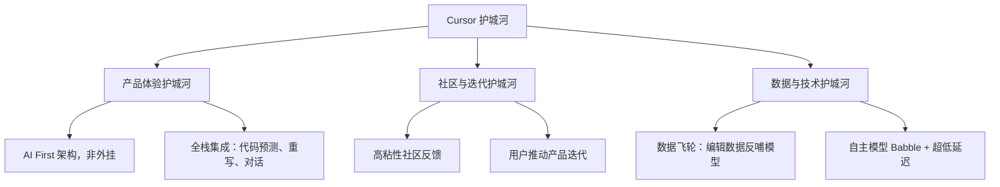
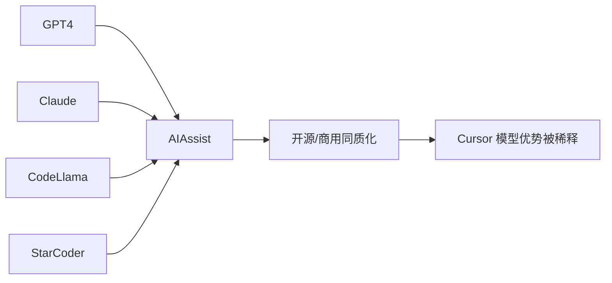

---
tags:
  - 趋势观察
  - 产品分析
  - AI编程工具
---
# **🔍 内容摘要**

## **🎯 核心问题**

- Cursor 是否具有“护城河”？如果有，是什么？
    
- Cursor 如何才能巩固或延伸其护城河？

---

# **🧱 护城河分析**

## 1.三重“护城河”构成

## **2.** **商业指标**

- 成立：2021年
    
- ARR 增速：2024年末 1 亿 → 2025年初 2 亿 → 现传闻超 3 亿美元
    
- 用户数：36 万 +
    
- 估值：100 亿美元
    
- 年度 MRR 曾达 400 万美元

## **3.** **战略优势**

- PLG 模式：社区 + 技术热潮 + FOMO 引爆
    
- 高留存：一旦习惯 AI 协同开发，难以回退

---

# **⚔ 面临挑战**
## **1.** **LLM 商品化**

- Claude、CodeLlama、StarCoder 等基于[[Transformer]]架构的竞品模型质量不断上升
    
- 核心“聪明”的部分可能被复制

## **2.** **功能同质化与平台依赖**

- VS Code / GitHub Copilot / Windsurf / Replit / CodeWhisperer 等正加速追赶
    
- Cursor 构建在 VS Code 基础之上，存在被断供或 API 限制风险
    
- 功能无明显独占性：聊天、补全、批量编辑可被复现

## **3.** **锁定能力弱**

- 用户关系非强社交型，切换成本低
    
- 巨头（GitHub + OpenAI）拥有更强数据飞轮

---

# **🔧 潜在护城河延展方向**

## **1. 协作生态平台化**

- 鼓励实时协作、社交编程
    
- 模仿 Figma 模型：成为开发者的“社交工作空间”

## **2. 企业化与 B2B 渗透**

- 为团队打造“AI 原生开发操作系统”
    
- 集成入工单、项目管理等 DevOps 系统

## **3. 专属模型训练与封闭数据飞轮**

- 通过[[SFT（Supervised Fine-Tuning，监督微调）]]和[[RLHF人类反馈强化学习]]技术微调专用模型，应对企业级定制需求

## **4. 平台开放性构建生态**

- 开放 API/SDK，吸引开发者构建插件与代理
    
- 形成更深层次网络效应

---

# **🧭 总结：护城河的未来在「结构性粘性」**

|**指标**|**当前表现**|**风险**|**潜力路径**|
|---|---|---|---|
|技术领先|Babble + 快速迭代|容易被复制|数据专属微调|
|用户粘性|UX 极佳、留存高|切换成本低|协作生态强化|
|数据优势|有成长性|不如巨头|深耕行为数据|
|商业壁垒|PLG 营销 + FOMO|同质化严重|平台+企业转型|
