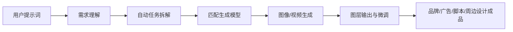

🏷 #多模态 #设计智能体 #趋势观察

## **📝 行业趋势 - Lovart 爆火现象全解析**

---

### **📌 一、事件概述**

| **项目** | **内容**                                                                                      |
| ------ | ------------------------------------------------------------------------------------------- |
| 爆火产品   | **Lovart**，由 Liblib 海外团队推出的多模态设计AI智能体                                                       |
| 上线平台   | 先在 X（原Twitter）爆火，随后蔓延至中文社交圈                                                                 |
| 功能定位   | 世界首个专为设计而生的多模态[[01-核心知识库/K2-技术方法与实现/模型架构/Agent]]，支持生成与编辑图像、品牌、广告、故事板等全流程内容                                               |
| 火爆程度   | 内测排队超2万人，闲鱼出现高价内测码转让                                                                        |
| 核心技术   | 自动调用多种 AI 模型（GPT image-1、Flux Pro、OpenAI-o3、Gemini Imagen 3、Kling AI、Tripo AI、Suno AI等）按需生成 |

---

### **🧠 二、核心能力拆解**

#### **📌 1. 多模态设计工作流全链打通**



- **文本驱动 → 场景还原 → 图层可编辑 → AI交互式创作 → 导出多格式资产**

#### **📌 2. 工具调用智能化**

|**AI模型**|**擅长领域**|
|---|---|
|GPT image-1|多轮创意生成|
|Flux Pro|真实感图像|
|Gemini Imagen 3|精细插画风格|
|Kling AI|视频生成|
|Suno AI|音频生成|
|Tripo AI|三维渲染建模|

#### **📌 3. 专业级创意资产输出**

- 一键生成品牌VI系统、广告海报、周边文创、科幻场景图、交互脚本
    
- 输出支持 SVG、PNG、分层PSD格式，直接接入Photoshop/AE流程

---

### **🧪 三、差异化价值点分析**

|**功能点**|**Lovart亮点**|**对比传统工具**|
|---|---|---|
|创意生成|提示词→自动联想情境+风格+画面构图|手动构思+素材寻找|
|工具集成|多AI模型智能调用|单一AI模型平台|
|编辑体验|图层可调、调光自动适应、支持微调|静态图，后期依赖PS|
|设计应用|周边、海报、品牌全覆盖|通常局限于图像生成|
|内容输出|支持PSD、SVG、PNG|一般仅输出JPG/PNG|

---

### **📈 四、爆火背后因素**

|**类型**|**内容**|
|---|---|
|技术积累|母公司 LiblibAI 在开源模型生态与模块化工具链深耕两年|
|创业背景|核心开发者王浩帆为 InstantID 核心贡献者，受 Yann LeCun 点赞|
|产品策略|海外独立品牌，旧金山Base地，执行团队国际化，产品体验国际化|
|市场节奏|X→中文社交→咸鱼交易→内测限量→形成社交裂变式传播|
|用户门槛|傻瓜式体验 + 专业能力延展，既适合普通用户，也适合设计师|

---

### **📊 五、从Lovart看AI行业趋势变化**

#### **1. 专业智能体时代加速到来**

- Lovart代表“专业垂类AI智能体”的高完成度方向。
    
- 不再仅生成内容，而是理解、规划并执行任务。

#### **2. 大模型平台化更新冲击下的“幸存者优势”**

- 大模型更新常常压垮外围应用，唯有**深耕专业、具备隐形资产**者才能存活。
    
- 如 Cursor（编程）、Lovart（设计）均属“韧性型”AI产品。

#### **3. 从“卖工具”到“卖结果”**

- 与红杉AI峰会共识呼应：**AI应用商业逻辑正从功能性工具转向结果导向收益**。
    
- Lovart不只是“能生成图”，而是“能帮你完成一个设计任务”。

---

### **📌 六、典型应用场景举例**

|**场景类型**|**具体功能**|**潜在用户群**|
|---|---|---|
|电商设计|产品图、店铺VI、周边视觉|品牌主、电商卖家|
|创意策划|海报、宣传片、文案脚本、配图|市场部、自媒体博主|
|内容创作|赛博世界脚本、山海经幻想、动画分镜|编导、编剧、动画人|
|平面与包装|包装设计、贴纸设计|文创设计师、周边开发团队|

---

### **🧾 七、后续观察建议**

|**观察点**|**说明**|
|---|---|
|是否公测开放注册|一旦开放，有望再次引爆朋友圈传播|
|是否推出企业版或API集成|企业定制能力将成为营收关键|
|用户反馈与产品演进节奏|是否持续吸收创作者需求完善功能|
|与大模型平台协同|是否支持用户自定义模型接入，或兼容更多大模型工具|

---

如需图表导入Obsidian Charts插件，请使用如下格式：

```chart
type: pie
labels: ["场景还原", "风格匹配", "构图/排版", "模型调用"]
series:
  - title: Lovart核心能力占比
    data: [30, 25, 25, 20]
```

---

如需为此写一段社交媒体推荐文案或设计主视觉脚本，也可以告诉我继续补充。