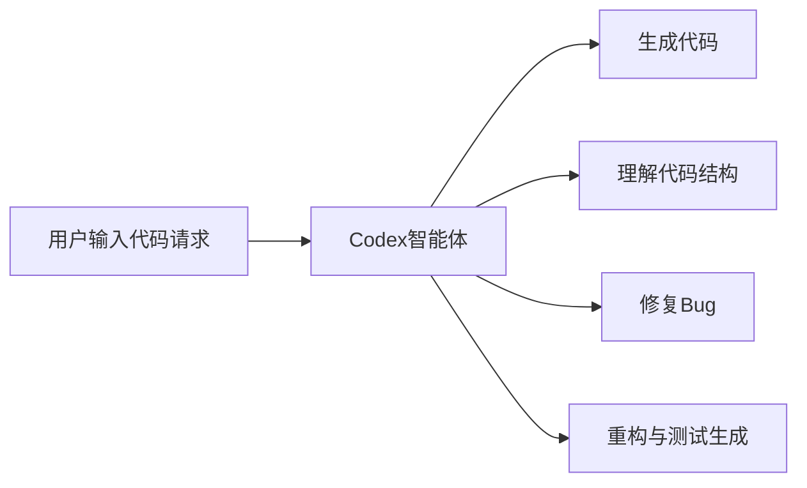

**标签：** #趋势观察 #模型架构 #AI编程智能体

---

## **🔶 [产业变动] 英伟达：未来不会再推出 Hopper 系列芯片**

- 🕒 时间：2025年5月16日
    
- 🧠 来源：黄仁勋在媒体采访中公开表示
    
- 📌 内容摘要：
    
    - 美国政府限制 **Hopper 架构 H20 芯片** 出口至中国。
        
    - 英伟达正在“**重新审视中国市场战略**”。
        
    - 明确表示 **未来不再推出 Hopper 系列芯片**。
        
    - 理由是架构已经定型，“**无法再调整以规避限制**”。

### **📉 潜在影响：**


---

## **🧠 [AI工具] OpenAI发布Codex：云端AI编程智能体**

- 🕒 时间：2025年5月16日
    
- 🌐 形式：云端运行
    
- ⚙ 功能结构：
    
    - “Ask”提问：理解代码逻辑、项目结构。
        
    - “Code”编码：生成、修改、重构、修复代码。
- 📍 实际用途：
    
    - 并行完成多个任务，如：
        
        - 自动重构代码
            
        - 生成测试用例
            
        - 处理错误修复

### **🛠 功能概览图：**



---

## **📄 [论文发布] DeepSeek V3 技术回顾论文发布**

- 👤 作者：梁文锋等
    
- 📘 论文标题：
    
    > _Insights into DeepSeek-V3: Scaling Challenges and Reflections on Hardware for AI Architectures_
    
- 🧩 关键创新概述：
    
    - **MLA（多头潜意识）**：优化内存效率。
        
    - **MoE（专家混合架构）**：在计算/通信间取得更好权衡。
        
    - **FP8混合精度训练**：释放硬件潜力。
        
    - **多平面网络拓扑**：减少集群级网络通信成本。

### **🔧 技术创新对比图：**

|**技术模块**|**功能**|**对应挑战**|**作用**|
|---|---|---|---|
|MLA|内存高效多头机制|显存瓶颈|提高模型规模承载能力|
|MoE|专家模型结构|推理效率低|提升训练速度与准确率|
|FP8|混合精度训练|能效比不高|降低成本，提高性能|
|多平面拓扑|网络通信优化|节点间延迟大|提高集群同步效率|

---

## **📢 [观点洞察] 蚂蚁集团CTO何征宇：大模型幻觉源于缺乏高质量数据**

- 🗓 时间：2025年5月17日，OceanBase开发者大会
    
- 🔊 核心观点：
    
    - **“没有数据，就没有AI。”**
        
    - 当前大模型幻觉根源是“**数据不足**”。
        
    - 廉价互联网数据几乎枯竭。
        
    - 行业级数据：稀缺、流动性差、多模态难处理。
        
    - 企业未来成功的关键是“**数据获取与使用能力**”。

### **🔍 数据稀缺与AI能力的关系图：**

```
flowchart TD
A[数据获取难] --> B[训练数据质量下降]
B --> C[大模型幻觉频发]
C --> D[AI实际效能受限]
D --> E[企业需建立数据闭环]
```

- 🧩 应对措施：
    
    - 蚂蚁将继续开源 OceanBase 数据库
        
    - 拓展在金融、医疗、生活等领域的 AI 数据闭环应用
Hopper 芯片（Hopper Architecture）是 **NVIDIA 英伟达** 于 2022 年推出的一代 **数据中心级 GPU 架构**，命名源自计算机编程先驱 **Grace Hopper**。这代芯片专为大规模 AI 和高性能计算（HPC）场景而设计，代表产品是 **H100 GPU**。

---

## **✅ Hopper芯片的核心特点**

| **特性**  | **说明**                                  |
| ------- | --------------------------------------- |
| 💠 架构代号 | Hopper（继承Ampere架构，后继为Blackwell架构）       |
| 🚀 主打芯片 | **NVIDIA H100 Tensor Core GPU**         |
| 🔧 主要用途 | AI训练、推理、科学模拟、大模型（如GPT-4）训练              |
| 📏 制程工艺 | TSMC 4N工艺（专为英伟达定制的台积电工艺）                |
| 🧠 核心组件 | Tensor Core（张量核心），FP8混合精度计算支持           |
| 📡 高速通信 | NVLink 第四代，支持GPU间高速互连                   |
| 🧩 架构创新 | [[Transformer]] Engine（专为LLM优化），多实例GPU（MIG） |

---

## **🔬 Hopper相比上一代（Ampere）的提升**

| **指标**       | **Ampere (A100)** | **Hopper (H100)** | **提升幅度** |
| ------------ | ----------------- | ----------------- | -------- |
| Tensor FLOPs | ~312 TFLOPs       | ~1000 TFLOPs（FP8） | 超过3倍     |
| 内存带宽         | 2.0 TB/s          | 3.35 TB/s         | 提升67%    |
| NVLink带宽     | 600 GB/s          | 900 GB/s          | 提升50%    |
| 支持精度         | FP32/TF32         | FP8/FP16/BF16     | 增加更轻量精度  |
| GPU划分        | 7个MIG             | 7个更强的MIG          | 多任务处理更灵活 |

---

## **📦 Hopper产品线举例**

|**产品型号**|**特点**|**应用场景**|
|---|---|---|
|**H100 PCIe**|插卡式，适用于常规服务器|AI推理和中等规模训练|
|**H100 SXM**|用于HGX系统，散热更强|超大规模训练|
|**H100 NVL**|双卡桥接，面向 LLM 推理|GPT、BERT、Claude等模型|

---

## **🔐 为什么Hopper H20在中国受限？**

H20是英伟达在美国对华出口管制下，**为中国市场特供的降配版 Hopper GPU**。但仍然因以下原因被美国政府限制出口：

- 仍具备较强AI训练能力；
    
- 被认为“**具备军用潜力**”；
    
- 限制技术转让给中国先进算力企业。

---

## **📌 总结：Hopper是什么？**

> Hopper 是英伟达推出的 **AI训练与高性能计算旗舰GPU架构**，其代表作 H100 支撑了 OpenAI、Meta、谷歌等训练多模态大模型（如GPT-4、LLaMA、Gemini）的核心算力。

它标志着英伟达在 AI 基础设施市场的技术领先，也因其能力过强，成为中美科技博弈中的一个关键出口限制对象。
