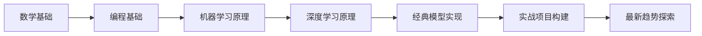
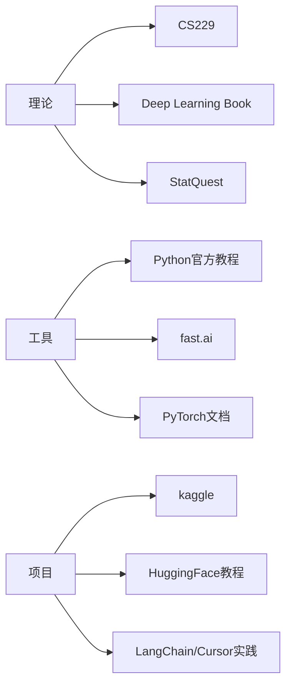

> ✅ 本路径以**原理驱动 + 实战能力**双轮推进，覆盖理论、工具、模型、项目实战多个层面。
### **一级分类：🧠 学习路线与实战**

### **🏷 标签：#入门 #进阶 #实用**

---

## **✅ 学习路径总览（底层 → 应用）**



---

## **🧩 Step by Step 分阶段学习建议**

### **1️⃣ 数学基础（打底）**

AI的根基是数学，重点掌握以下内容：

|**领域**|**推荐内容**|**推荐资源**|
|---|---|---|
|线性代数|矩阵、特征值分解、向量空间|MIT 18.06, 《线性代数及其应用》|
|概率论|条件概率、贝叶斯公式、分布|斯坦福CS109、《概率论与数理统计》|
|微积分|偏导数、链式法则、梯度|3Blue1Brown 视频、MIT OCW|
|优化方法|梯度下降、Lagrange乘子法|《Convex Optimization》|

---

### **2️⃣ 编程基础（工具）**

掌握AI必备语言和框架：

|**类型**|**学习目标**|**推荐工具**|
|---|---|---|
|编程语言|Python 语法、类与函数、NumPy/Pandas 使用|Python官方教程、廖雪峰的教程|
|可视化|matplotlib、seaborn|kaggle notebooks|
|工具栈|Jupyter、Git、环境管理|VSCode, GitHub, Conda|

---

### **3️⃣ 机器学习（ML）基础原理**

理解各种算法背后的机制：

|**类别**|**常见模型**|**推荐课程**|
|---|---|---|
|监督学习|线性回归、逻辑回归、SVM、决策树|Andrew Ng 的机器学习课程（Coursera）|
|非监督学习|KMeans、PCA|CS229|
|模型评估|Loss, Accuracy, Precision/Recall|sklearn文档实践|

---

### **4️⃣ 深度学习（DL）核心知识**

掌握神经网络的结构、训练与调优机制：

|**模块**|**关键内容**|**推荐资源**|
|---|---|---|
|神经网络基础|前向传播、反向传播、梯度下降|深度学习花书《Deep Learning》|
|框架实操|PyTorch / TensorFlow|fast.ai / 官方文档|
|模型结构|CNN、RNN、[[Transformer架构原理|Transformer]]|《The Illustrated [[Transformer架构原理|Transformer]]》|

---

### **5️⃣ 经典模型重构**

建议自己“从0实现”以下模型，加深理解：

|**模型**|**描述**|
|---|---|
|Linear Regression / Logistic Regression|用numpy实现训练过程|
|MLP|手写前向/反向传播|
|CNN|用PyTorch实现简单图像分类|
|[[Transformer架构原理|Transformer]]|复现Attention与多头机制（进阶）|

---

### **6️⃣ 项目实践**

你要学会从数据采集到模型部署的完整流程：

- 🔹 数据项目：泰坦尼克号生存预测、房价预测、MNIST手写数字识别
    
- 🔹 多模态项目：图像生成（Stable Diffusion）、聊天机器人（[[RAG检索增强生成技术详解|RAG]]/[[RLHF人类反馈强化学习|RLHF]]微调）
    
- 🔹 [[AI_Agent与多Agent系统架构全览|Agent]]构建：LangChain / OpenAI Function Calling 实战

---

### **7️⃣ 跟进前沿趋势（选学）**

|**方向**|**推荐内容**|
|---|---|
|大语言模型（LLM）|GPT架构、指令微调[[SFT（Supervised Fine-Tuning，监督微调）|SFT]]、[[RAG检索增强生成技术详解|RAG]]、[[LoRA低秩适应微调|LoRA]]|
|多模态学习|CLIP、BLIP、SAM、文生图模型|
|AI [[AI_Agent与多Agent系统架构全览|Agent]]|AutoGPT、Open Interpreter、ReAct架构|
|模型部署|Hugging Face、Gradio、ONNX、GPU云部署|

---

## **🧭 学习资源推荐地图**



---

## **💡 小贴士**

- 每天保持 2h-3h 的专注学习（刷题+复现+项目并行）
    
- 强烈建议写博客/笔记做知识输出（你可以继续用 Obsidian）
    
- 加入社区（知乎、B站、GitHub）进行交流与提问
    
- 使用 AI 工具反向学习（如让 ChatGPT 解释代码、Debug）
以下是我为你整理的系统化 AI 学习路线中推荐的核心课程和学习网站，涵盖数学基础、编程、机器学习、深度学习等关键阶段，适合从底层系统性学习 AI。

---

## **📚 学习资源导航**

### **🧮 数学基础**

- **MIT 18.06 线性代数**
    
    由 Gilbert Strang 教授讲授，包含完整的视频课程、讲义、作业和考试题，适合打好矩阵与向量空间等基础。
    
    🔗 [课程主页](https://ocw.mit.edu/courses/18-06-linear-algebra-spring-2010/)
    
    📺 [YouTube 视频合集](https://www.youtube.com/playlist?list=PLE7DDD91010BC51F8)
    
- **数学基础课程合集**
    
    Coursera 上的数学课程合集，涵盖线性代数、概率论、微积分等内容，适合系统学习 AI 所需的数学知识。
    
    🔗 [课程合集](https://www.coursera.org/collections/machine-learning)

---

### **💻 编程与工具**

- **Python for Everybody（University of Michigan）**
    
    从零开始学习 Python 编程，适合初学者打好编程基础。
    
    🔗 [课程链接](https://www.coursera.org/specializations/python)
    
- **Python 3 Programming（University of Michigan）**
    
    进阶 Python 编程课程，涵盖数据结构、网络编程等内容。
    
    🔗 [课程链接](https://www.coursera.org/specializations/python-3-programming)

---

### **🤖 机器学习基础**

- **Andrew Ng 的机器学习课程（Coursera）**
    
    经典的机器学习入门课程，涵盖监督学习、无监督学习等核心概念。
    
    🔗 [课程链接](https://www.coursera.org/learn/machine-learning)
    
- **机器学习专项课程（Andrew Ng）**
    
    更新版的机器学习课程，使用 Python 实现，适合希望深入学习的同学。
    
    🔗 [课程链接](https://www.coursera.org/specializations/machine-learning-introduction)
    
- **CS229: 斯坦福大学机器学习课程**
    
    由 Andrew Ng 教授讲授的斯坦福大学研究生课程，深入讲解机器学习理论。
    
    🔗 [课程主页](https://cs229.stanford.edu/)
    
    📺 [YouTube 视频合集](https://www.youtube.com/playlist?list=PLoROMvodv4rMiGQp3WXShtMGgzqpfVfbU)

---

### **🧠 深度学习进阶**

- **Deep Learning Specialization（DeepLearning.AI）**
    
    由 Andrew Ng 主导的深度学习专项课程，涵盖神经网络、CNN、RNN 等内容。
    
    🔗 [课程链接](https://www.coursera.org/specializations/deep-learning)
    
- **Practical Deep Learning for Coders（fast.ai）**
    
    注重实践的深度学习课程，从实战出发，适合有一定编程基础的学习者。
    
    🔗 [课程主页](https://course.fast.ai/)
    
    📺 [YouTube 视频合集](https://www.youtube.com/watch?v=8SF_h3xF3cE&list=PLfYUBJiXbdtR1qk0h8L0iTVvFfYpOB3ip)

---

### **📊 实战与项目**

- **Kaggle Learn**
    
    提供实战项目和微课程，涵盖数据科学、机器学习等多个主题，适合边学边做。
    
    🔗 [Kaggle Learn](https://www.kaggle.com/learn)
    
- **Dive into Deep Learning**
    
    一本开源的深度学习教材，结合理论与实践，适合深入学习。
    
    🔗 [在线阅读](https://d2l.ai/)

---

## **🧭 学习路径图**

```
graph TD
    A[数学基础]
    B[编程基础]
    C[机器学习]
    D[深度学习]
    E[实战项目]
    F[前沿探索]

    A --> B
    B --> C
    C --> D
    D --> E
    E --> F
```
