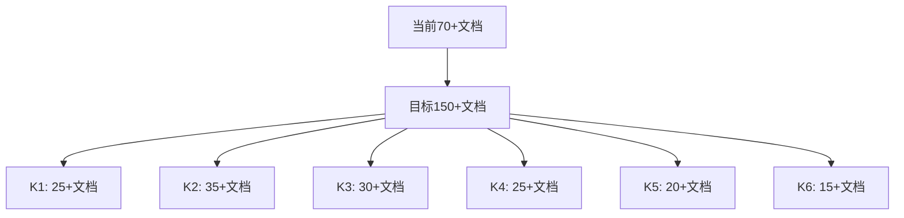

# 01-核心知识库 - AI知识体系管理说明

> 最后更新：2025年7月18日  
> 整理状态：已重新构建知识分类体系  
> 文档数量：70+ 个知识点

## 📊 知识库概览

**01-核心知识库**是奇绩知识库的核心组成部分，涵盖AI技术的基础理论、实现方法、工具生态、行业趋势等关键领域。经过系统化重组，现采用**K1-K6六大知识域**的分类体系，便于知识的系统学习和快速检索。

---

## 🗂️ 知识分类体系 (Knowledge Taxonomy)

### 📋 总体架构
```
01-核心知识库/
├── K1-基础理论与概念/         # 基础概念、学习范式、计算基础
├── K2-技术方法与实现/         # 模型架构、训练技术、优化方法
├── K3-工具平台与生态/         # 开发工具、AI平台、基础设施
├── K4-行业洞察与趋势/         # 产品分析、市场动态、技术趋势
├── K5-学习路径与实践/         # 系统路径、实战案例
├── K6-前沿观点与思考/         # 专家观点、哲学思辨、管理方案
└── README.md                  # 本文档
```

---

## 🧠 K1-基础理论与概念

**定位**：AI技术的理论基础与核心概念

### 目录结构
```
AI技术基础/                 # 🎯 AI入门必读基础知识
├── Transformer架构原理.md     # 现代AI核心架构
├── 监督学习与无监督学习对比.md # 机器学习基本范式
├── AI模型可解释性研究.md      # AI系统透明度
└── 计算机科学核心知识体系.md  # 计算基础理论 [4个文档]

K1-基础理论与概念/
├── 核心概念/              # AI高级概念解析
│   ├── RAG检索增强生成技术详解.md
│   ├── SOTA最新技术水平评估.md
│   ├── Transformer标准架构详解.md
│   └── Post-Training后训练技术.md [7个文档]
├── 学习范式/              # 机器学习进阶范式
│   ├── 半监督学习与自监督学习详解.md
│   └── Few-shot Learning小样本学习.md [2个文档]
└── 计算基础/              # 计算硬件与基础理论
    ├── 端侧AI芯片技术.md
    └── 存算一体芯片技术/ [8个文档]
```

### 关键知识点
| 类别 | 核心内容 | 推荐优先级 |
|------|----------|------------|
| **基础概念** | Transformer、RAG、SOTA、可解释性 | ⭐⭐⭐⭐⭐ |
| **学习范式** | 监督/无监督学习、Few-shot Learning | ⭐⭐⭐⭐ |
| **计算基础** | 芯片技术、计算架构 | ⭐⭐⭐ |

---

## ⚙️ K2-技术方法与实现

**定位**：AI技术的具体实现方法与优化策略

### 目录结构
```
K2-技术方法与实现/
├── 模型架构/              # 模型设计与架构
│   ├── AI_Agent与多Agent系统架构全览.md
│   ├── 扩散模型图像生成原理.md
│   └── VAE变分自编码器原理.md [3个文档]
├── 训练技术/              # 模型训练方法
│   └── 微调方法概述与实践.md [1个文档]
└── 优化方法/              # 性能优化技术
    ├── H2O缓存优化技术原理.md
    ├── 模型鲁棒性增强技术.md
    └── MCP协议与AI万物互联.md [6个文档]
```

### 技术深度矩阵
| 技术领域 | 理论深度 | 实践价值 | 前沿性 |
|----------|----------|----------|---------|
| **Agent系统** | ⭐⭐⭐⭐⭐ | ⭐⭐⭐⭐⭐ | ⭐⭐⭐⭐⭐ |
| **扩散模型** | ⭐⭐⭐⭐ | ⭐⭐⭐⭐ | ⭐⭐⭐⭐ |
| **缓存优化** | ⭐⭐⭐ | ⭐⭐⭐⭐⭐ | ⭐⭐⭐ |

---

## 🛠 K3-工具平台与生态

**定位**：AI开发工具、平台及基础设施

### 目录结构
```
K3-工具平台与生态/
├── 开发工具/              # 编程工具与框架
│   ├── API与SDK开发者生态基石.md
│   ├── Vue前端开发框架.md
│   └── GUI图形用户界面.md [3个文档]
├── AI平台/               # AI服务平台
│   ├── Rabbit_R1智能硬件平台.md
│   ├── SGLang结构化生成语言.md
│   └── Rabbit_R1与LAM系统架构详解.md [3个文档]
└── 基础设施/              # 云端基础设施
    ├── E2B云端代码执行环境.md
    └── E2B_AI_Agents运行时基础设施.md [2个文档]
```

### 生态发展程度
- **成熟工具**：API/SDK、Vue框架
- **新兴平台**：Rabbit R1、SGLang
- **基础设施**：E2B云端执行环境

---

## 📈 K4-行业洞察与趋势

**定位**：行业发展趋势、产品分析、市场动态

### 目录结构
```
K4-行业洞察与趋势/
├── 产品分析/              # 具体产品深度分析
│   ├── Cursor护城河分析与发展战略.md
│   ├── AI浏览器产品对比_Fellou_Operator_Manus_Dia.md
│   └── Fellou_AI浏览器发展潜力分析.md [4个文档]
├── 市场动态/              # 市场事件与现象
│   ├── OpenAI_Operator智能代理发布.md
│   ├── Sequoia_AI_Ascent_2025会议要点.md
│   └── Product_Hunt月榜精选_2024年10月.md [6个文档]
└── 技术趋势/              # 技术发展方向
    ├── WWDC25发布会要点与趋势分析.md
    └── 具身智能发展趋势.md [2个文档]
```

### 行业热点追踪
| 热点领域 | 文档数量 | 更新频率 | 关注价值 |
|----------|----------|----------|----------|
| **AI编程工具** | 2个 | 月度 | ⭐⭐⭐⭐⭐ |
| **AI浏览器** | 3个 | 季度 | ⭐⭐⭐⭐ |
| **智能代理** | 2个 | 月度 | ⭐⭐⭐⭐⭐ |
| **具身智能** | 1个 | 季度 | ⭐⭐⭐ |

---

## 🎯 K5-学习路径与实践

**定位**：系统化学习路径与实战案例

### 目录结构
```
K5-学习路径与实践/
├── 系统路径/              # 完整学习路径
│   └── 从底层开始学AI的系统化路径.md [1个文档]
└── 实战案例/              # 实际案例研究
    └── 奇绩学习小组访谈记录.md [1个文档]
```

### 学习路径特色
- **系统性**：从数学基础到前沿应用的完整路径
- **实践性**：结合具体项目和案例
- **进阶性**：支持不同水平的学习需求

---

## 💭 K6-前沿观点与思考

**定位**：前沿观点、哲学思考、管理方案

### 目录结构
```
K6-前沿观点与思考/
├── 专家观点/              # 行业专家观点
│   ├── AI行业发展的6个核心观点.md
│   └── 软件3.0时代_Karpathy观点解析.md [2个文档]
├── 哲学思辨/              # 深度思考
│   └── 高能动性High_Agency概念解析.md [1个文档]
└── 知识库建设管理方案与分类体系.md [1个文档]
```

### 思想层次
- **战略思考**：软件3.0时代、高能动性概念
- **行业洞察**：专家对AI发展的核心判断
- **管理实践**：知识库建设的方法论

---

## 🔍 知识检索指南

### 按学习阶段检索
| 学习阶段 | 推荐路径 | 核心文档 |
|----------|----------|----------|
| **入门阶段** | K1→K5→K6 | 计算机科学基础、AI学习路径 |
| **进阶阶段** | K2→K3→K4 | 技术实现、工具生态、行业趋势 |
| **专家阶段** | K6→K4→K2 | 前沿观点、深度分析、技术前沿 |

### 按关注领域检索
| 关注领域 | 主要目录 | 关键文档 |
|----------|----------|----------|
| **技术研发** | K1, K2, K3 | Transformer、Agent系统、开发工具 |
| **产品设计** | K3, K4 | AI平台、产品分析 |
| **行业分析** | K4, K6 | 市场动态、专家观点 |
| **学习成长** | K5, K1 | 学习路径、基础概念 |

### 按时效性检索
| 时效性 | 内容类型 | 更新策略 |
|--------|----------|----------|
| **基础知识** | K1, K2核心概念 | 年度更新 |
| **技术方法** | K2, K3工具 | 季度更新 |
| **行业动态** | K4市场趋势 | 月度更新 |
| **前沿观点** | K6专家观点 | 实时更新 |

---

## 📊 知识体系发展建议

### 🎯 短期发展建议 (3-6个月)

#### 1. 内容补充优先级
| 优先级 | 知识领域 | 具体行动 | 预期成果 |
|--------|----------|----------|----------|
| **P0 (急需)** | K2-技术方法 | 补充大模型训练、推理优化 | 技术实现更完整 |
| **P1 (重要)** | K4-行业趋势 | 增加创业案例、商业分析 | 行业洞察更深入 |
| **P2 (提升)** | K5-学习实践 | 扩充实战项目、代码案例 | 实践指导更具体 |

#### 2. 结构优化建议
- **K1-基础概念**：补充数学基础、统计学原理
- **K2-技术方法**：新增"部署优化"子目录
- **K3-工具生态**：增加"云服务平台"分类
- **K4-行业趋势**：细分"创业投资"子领域
- **K5-学习路径**：增加"项目实战"系列

#### 3. 质量提升计划
- **标准化模板**：统一文档格式和标签体系
- **交叉引用**：建立文档间的关联链接
- **版本管理**：重要文档标注更新时间和版本
- **质量评估**：定期Review文档的时效性和准确性

### 🚀 中期发展规划 (6-12个月)

#### 1. 知识体系扩展


#### 2. 新增知识模块
| 新模块 | 所属领域 | 内容规划 | 战略价值 |
|--------|----------|----------|----------|
| **AI安全与伦理** | K1 | 模型安全、数据隐私、AI伦理 | 技术责任 |
| **多模态技术** | K2 | 图像、语音、视频处理 | 技术前沿 |
| **企业AI应用** | K4 | 行业解决方案、ROI分析 | 商业价值 |
| **开源生态** | K3 | 开源模型、社区项目 | 生态参与 |

#### 3. 数字化升级
- **搜索功能**：基于RAG的智能搜索
- **标签系统**：多维度标签分类
- **可视化**：知识图谱和关系网络
- **协作功能**：支持团队共建共享

### 🌟 长期愿景 (1-2年)

#### 1. 成为AI知识权威平台
- **覆盖度**：AI技术全栈知识覆盖
- **深度**：从理论到实践的全链路
- **时效性**：实时跟踪技术前沿
- **实用性**：直接指导实际工作

#### 2. 知识影响力建设
- **开放共享**：部分内容对外开放
- **社区建设**：形成学习者社群
- **内容输出**：课程、报告、白皮书
- **行业声音**：参与标准制定和趋势引导

#### 3. 智能化知识服务
- **个性化推荐**：基于角色的知识推荐
- **学习路径规划**：动态调整学习计划
- **知识问答**：AI助手实时答疑
- **趋势预测**：基于知识库的趋势分析

---

## 📋 管理与维护规范

### 文档命名规范
```
[领域代码]_[具体主题]_[版本/时间标识]
例如：Transformer架构原理.md
    RAG检索增强生成技术详解.md
    Cursor护城河分析与发展战略.md
```

### 内容质量标准
| 质量维度 | 具体要求 | 评估标准 |
|----------|----------|----------|
| **准确性** | 事实准确、引用可靠 | 专家Review |
| **完整性** | 逻辑完整、结构清晰 | 模板检查 |
| **时效性** | 内容新鲜、追踪前沿 | 定期更新 |
| **实用性** | 能指导实践、解决问题 | 用户反馈 |

### 更新维护流程
1. **定期Review**：每季度全面检查
2. **即时更新**：重大技术突破实时补充
3. **版本控制**：重要修改保留历史版本
4. **质量保证**：新增内容需要专业审核

---

## 📚 推荐学习路径

### 🔰 初学者路径 (0-6个月)
```
1. K1-基础理论 → 计算机科学基础、核心概念
2. K5-学习路径 → 系统化学习指南
3. K1-学习范式 → 机器学习基础
4. K2-模型架构 → 了解主流模型
5. K4-行业趋势 → 建立行业认知
```

### 🚀 进阶者路径 (6-18个月)
```
1. K2-技术方法 → 深入实现细节
2. K3-工具生态 → 掌握开发工具
3. K4-产品分析 → 理解商业应用
4. K6-专家观点 → 拓展战略思维
5. K5-实战案例 → 项目实践经验
```

### 🏆 专家路径 (18个月+)
```
1. K6-前沿观点 → 引领技术趋势
2. K4-市场动态 → 把握行业脉搏
3. K2-优化方法 → 技术深度优化
4. 知识贡献 → 参与知识库建设
5. 社区影响 → 建立技术影响力
```

---

## 🎯 使用建议

### 日常学习建议
- **碎片时间**：浏览K4行业动态，保持信息敏感度
- **深度学习**：系统研读K1-K2技术文档
- **实践应用**：参考K3工具指南和K5实战案例
- **思维拓展**：品读K6前沿观点，培养战略思维

### 工作应用建议
- **技术选型**：参考K3工具平台对比分析
- **方案设计**：借鉴K2技术方法和最佳实践
- **行业研究**：利用K4市场分析和趋势判断
- **团队培训**：使用K5学习路径进行知识传递

### 知识贡献建议
- **及时反馈**：发现错误或过时信息及时反馈
- **内容补充**：贡献新的案例、工具、观点
- **质量改进**：提出文档结构和内容优化建议
- **社区建设**：参与知识讨论和经验分享

---

**知识库维护联系人**：产品运营团队  
**文档版本**：v3.0  
**下次全面Review时间**：2025年10月

---

*这个知识库将持续进化，欢迎所有使用者贡献智慧，共同建设AI时代的知识基础设施。*