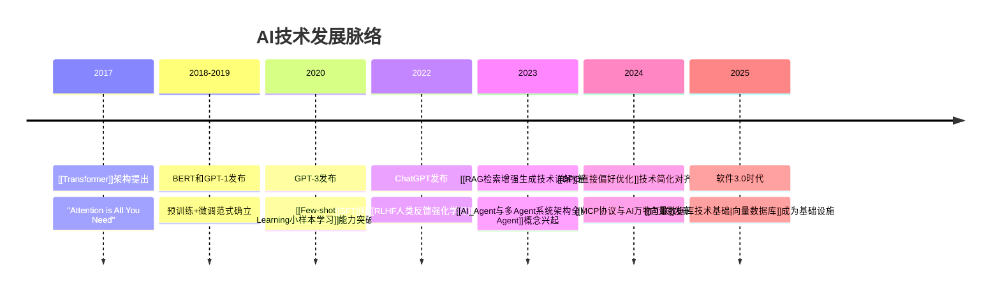

# 🗺️ AI技术知识地图 (Knowledge Map)

> **作用**：奇绩知识库的导航中心，展示核心概念的层次结构与关联关系  
> **更新时间**：2025年8月22日  
> **适用对象**：所有学习者，特别是需要理解AI技术全貌的用户

---

## 🌟 核心技术栈层次图

```mermaid
graph TD
    A[基础理论层] --> B[技术实现层]
    B --> C[工具平台层]
    C --> D[应用产品层]
    
    A --> A1[[[Transformer]]架构]
    A --> A2[机器学习范式]
    A --> A3[计算基础]
    
    A1 --> B1[[[RAG]]检索增强生成]
    A1 --> B2[[[SFT]]监督微调]
    A2 --> B3[Few-shot Learning]
    
    B1 --> C1[[[Agent]]智能代理]
    B2 --> C1
    C1 --> C2[[[MCP]]协议]
    
    C1 --> D1[AI浏览器]
    C1 --> D2[代码助手]
    C2 --> D3[智能工作流]
```

---

## 🔗 核心概念关联网络

### 🏗️ 架构基础 (K1)
- **[[Transformer架构原理]]** ← 现代AI的核心基础
  - 关联：[[Transformer标准架构详解]]
  - 应用：所有大语言模型的基础架构
  - 演进：GPT、BERT、T5等都基于此架构

### 🧠 智能增强 (K1→K2→K3)
- **[[RAG检索增强生成技术详解]]** ← 知识增强的关键技术
  - 基础：依赖[[Transformer]]进行编码和生成
  - 基础设施：需要[[向量数据库技术基础|向量数据库]]支持
  - 关联：[[可解释性]]、Deep Search概念
  - 应用：问答系统、知识管理、专业咨询

### 🎯 模型训练 (K1→K2)
- **[[SFT（Supervised Fine-Tuning，监督微调）]]** ← 模型对齐的第一步
  - 基础：在预训练[[Transformer]]基础上进行
  - 后续：需要配合[[RLHF人类反馈强化学习]]、[[DPO直接偏好优化]]等方法
  - 应用：ChatGPT等对话系统的训练流程

### 🤖 智能代理 (K2→K3)
- **[[AI_Agent与多Agent系统架构全览]]** ← 自主智能系统
  - 技术基础：[[Transformer]] + [[RAG]] + [[SFT]]
  - 核心能力：Function Calling、工具调用
  - 协议支持：[[MCP协议与AI万物互联]]

### 🔌 连接协议 (K2→K3)
- **[[MCP协议与AI万物互联]]** ← 统一接口标准
  - 服务对象：[[01-核心知识库/K2-技术方法与实现/模型架构/Agent]]系统
  - 优势：替代传统API的分散式集成
  - 未来：AI生态的基础设施标准

---

## 📚 分层学习路径

### 🔰 基础入门路径 (3-6个月)
```
1. [[计算机科学核心知识体系]] (理论基础)
   ↓
2. [[Transformer架构原理]] (技术核心)
   ↓
3. [[监督学习与无监督学习对比]] (学习范式)
   ↓
4. [[RAG检索增强生成技术详解]] (应用技术)
   ↓
5. [[从底层开始学AI的系统化路径]] (实践指导)
```

### 🚀 进阶发展路径 (6-18个月)
```
1. [[SFT（Supervised Fine-Tuning，监督微调）]] (训练技术)
   ↓
2. [[AI_Agent与多Agent系统架构全览]] (系统架构)
   ↓
3. [[MCP协议与AI万物互联]] (协议标准)
   ↓
4. [[H2O缓存优化技术原理]] (性能优化)
   ↓
5. 各类产品分析文档 (商业应用)
```

### 🏆 专家深化路径 (18个月+)
```
1. 前沿技术研究 (扩散模型、VAE等)
   ↓
2. 行业趋势分析 (市场动态、技术趋势)
   ↓
3. 产品设计思维 (从技术到产品)
   ↓
4. 知识体系构建 (成为领域专家)
```

---

## 🔍 知识空白识别

### ⚠️ 重要概念缺失
1. ✅ **[[RLHF人类反馈强化学习]]** - [[SFT]]后的关键环节 (已补充)
2. ✅ **[[DPO直接偏好优化]]** - RLHF的简化替代方案 (已补充)
3. ✅ **[[向量数据库技术基础|向量数据库]]** - [[RAG]]的技术基础 (已补充)
4. ✅ **[[LoRA低秩适应微调|LoRA微调技术]]** - 高效参数微调方法 (已补充)
5. ✅ **[[Prompt Engineering提示工程详解|Prompt Engineering]]** - 模型交互的核心技能 (已补充)
6. ✅ **[[Constitutional AI宪法AI|Constitutional AI]]** - AI对齐的自动化方法 (已补充)
7. ✅ **[[模型评估体系与方法论|模型评估体系]]** - 全面的AI模型质量保证 (已补充)
8. ✅ **[[具身智能技术架构|具身智能]]** - AI与物理世界的交互 (已补充)

### 📈 AI技术演进时间线



### 📈 其他建议补充方向
1. **性能评估体系** - 模型评估指标和方法
2. **部署运维指南** - 从研发到生产的完整流程
3. **安全伦理考量** - AI安全和伦理问题
4. **开源生态地图** - 重要开源项目和工具

---

## 🎯 使用指南

### 📖 初次使用者
1. 从**基础入门路径**开始
2. 重点关注概念间的**双向链接**
3. 结合**实战案例**进行实践

### 🔧 技术开发者
1. 重点学习**技术实现层**内容
2. 关注**优化方法**和**工具平台**
3. 跟踪**行业动态**和**产品分析**

### 📊 产品经理
1. 从**应用产品层**切入
2. 理解**核心技术能力边界**
3. 关注**市场趋势**和**竞品分析**

### 🎓 研究学者
1. 深入**前沿观点与思考**
2. 关注**技术演进规律**
3. 参与**知识体系建设**

---

## 🔄 知识更新机制

### 📅 定期更新
- **月度**：行业动态、产品分析
- **季度**：技术方法、工具平台
- **年度**：基础理论、框架体系

### 🔗 链接维护
- 新文档自动建立相关链接
- 定期检查并修复破损链接
- 优化链接层次和逻辑关系

### 📊 质量保证
- 技术准确性专家审核
- 内容时效性定期检查
- 用户反馈持续改进

---

## 📌 快速导航

### 🎯 按技术栈查找
- **基础架构**：[[Transformer架构原理]]、[[计算基础]]
- **增强技术**：[[RAG检索增强生成技术详解]]、[[SFT]]
- **智能系统**：[[AI_Agent]]、[[MCP协议]]
- **应用产品**：[[Cursor护城河分析]]、[[AI浏览器产品对比]]

### 🔍 按学习目标查找
- **快速入门**：K1-基础理论与概念
- **技术深入**：K2-技术方法与实现
- **工具使用**：K3-工具平台与生态
- **行业洞察**：K4-行业洞察与趋势
- **实践应用**：K5-学习路径与实践
- **前沿思考**：K6-前沿观点与思考

---

*这个知识地图将持续演进，欢迎所有学习者贡献智慧，共同建设更完整的AI知识体系。*